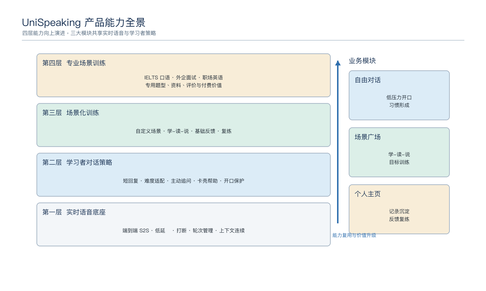
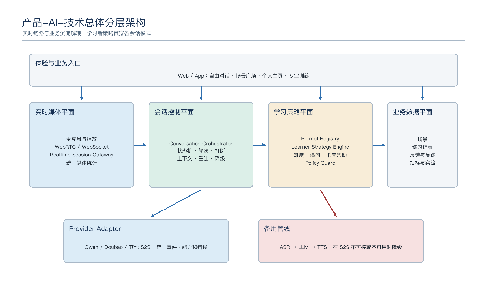
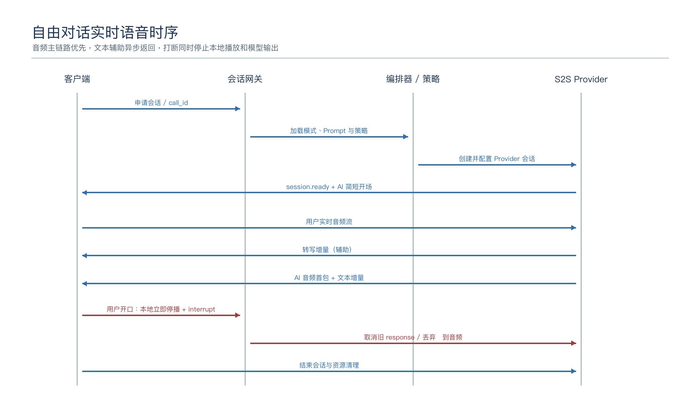
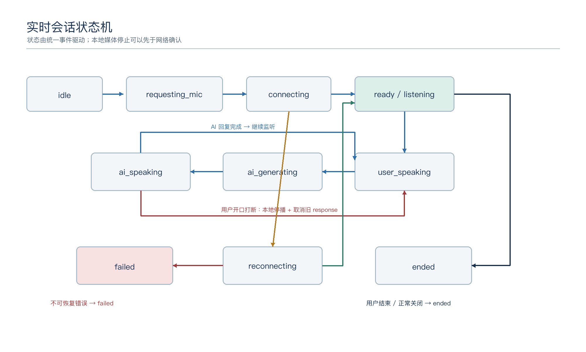
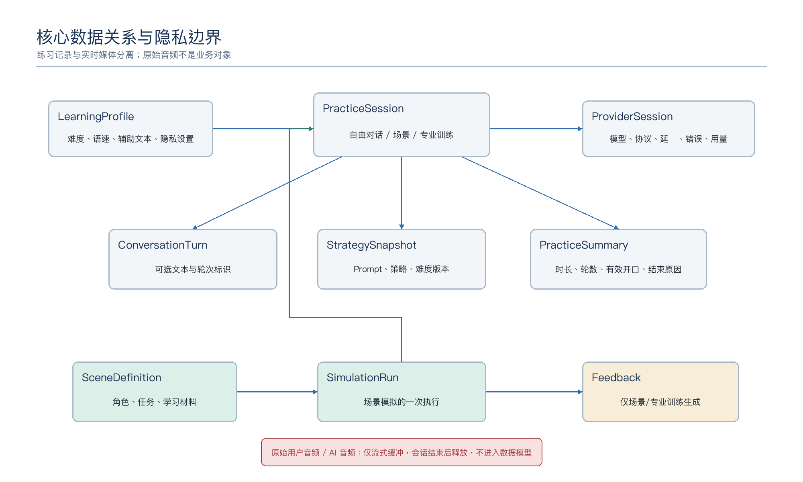
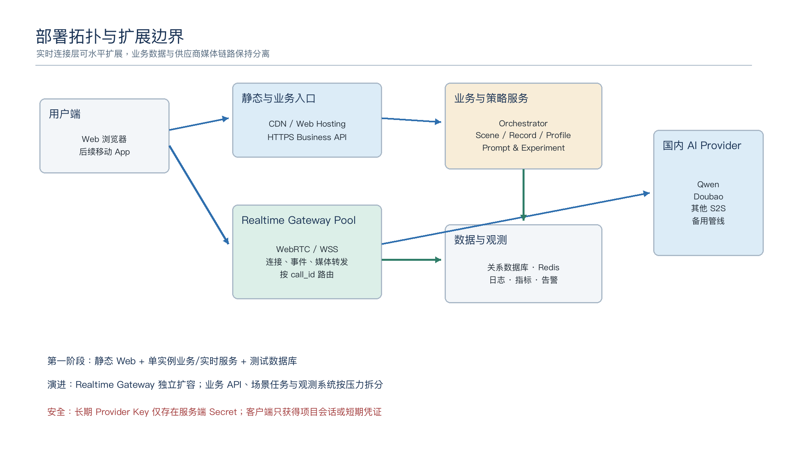
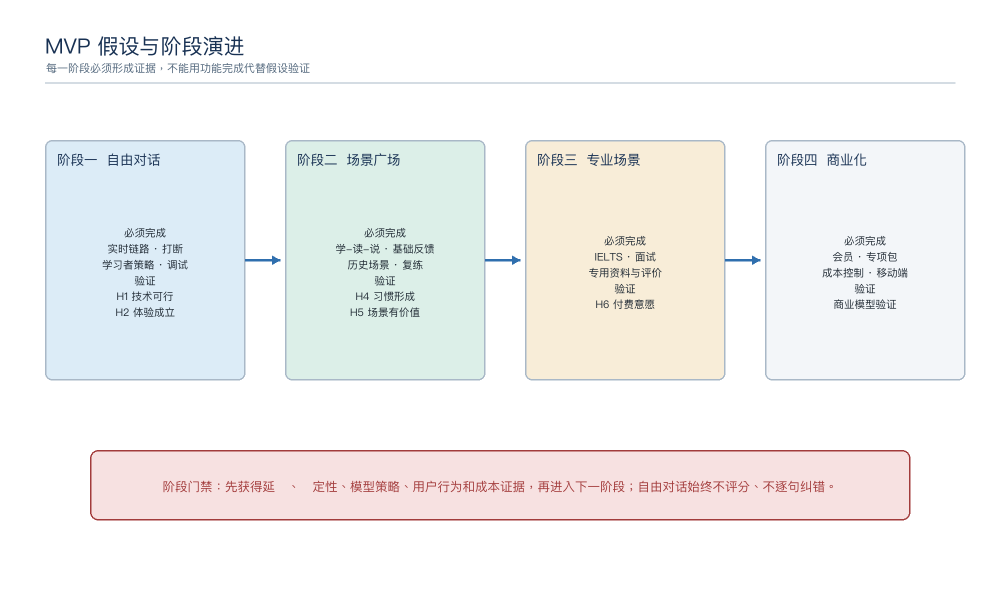

# UniSpeaking 产品-AI-技术总体架构设计基线

> 联合评审文档｜依据《UniSpeaking 产品计划书 v2》｜覆盖 MVP 到商业化演进

| 文档属性 | 内容 |
|---|---|
| 文档状态 | 架构基线 v1.0，供产品、AI、研发与测试联合评审 |
| 适用范围 | Web 优先的 AI 英语口语陪练产品，覆盖自由对话、场景广场、个人主页及专业场景扩展 |
| 当前实施重点 | 第一阶段自由对话：跑通国内端到端实时语音链路并验证学习者对话策略 |
| 内容事实源 | `/Users/mac/Documents/七牛云/UniSpeaking产品计划书_v2.md` |
| 参考结构 | 《码上好戏 AI 短剧全流程自动化创作系统架构设计基线文档》 |

## 架构结论

UniSpeaking 采用“**实时媒体平面 + 会话控制平面 + 学习策略平面 + 业务数据平面**”的总体架构。端到端 Speech-to-Speech（S2S）模型承担实时听说基础能力；会话网关和对话编排器负责连接、状态、打断、上下文与异常恢复；学习者策略引擎负责回复长度、难度、追问、卡壳帮助和低压力边界；场景与学习记录服务负责“学-读-说”、反馈、复练和后续专业训练。

第一阶段不建设大而全的平台。先用供应商适配层跑通自由对话主链路，以可观测事件和固定测试集验证 H1-H3。当前 WebSocket Demo 是便于调试的技术验证通道；面向产品体验的目标通道是 WebRTC。两种通道必须复用统一会话事件和供应商适配接口，浏览器不得持有长期供应商 API Key。



## 一、文档定位与架构目标

### 1.1 文档用途

本文档不是产品愿景介绍，也不是 API 字段、数据库 DDL 或页面原型说明。它用于把产品计划中的用户问题、能力分层、MVP 假设和长期边界翻译成可实现、可拆分、可观测、可验收的总体架构。

本文档应支持以下工作：

- 产品评审：确认自由对话、场景广场、个人主页和专业场景的职责不混淆。
- AI 评审：区分模型原生能力、Prompt 能力、策略能力和工程保障能力。
- 技术评审：确认实时链路、组件边界、数据生命周期、异常恢复和部署演进。
- 测试评审：将 H1-H6 映射为可执行的功能、模型、性能和稳定性验证。
- 后续拆分：可以据此继续编写 OpenSpec、接口契约、数据模型和阶段任务。

### 1.2 架构目标

| 目标 | 架构含义 | 第一阶段验证方式 |
|---|---|---|
| 低门槛开始 | 用户产生练习意愿后，尽可能在 10 秒内进入可说话状态 | 记录从点击开始到 `session.ready`、首次开口的耗时 |
| 自然连续对话 | 支持双向流式语音、自动轮次判断和用户打断 | 连续对话 3-10 分钟；验证打断和无手动录音按钮 |
| 用户说得更多 | AI 回复短、追问多、少讲课 | 固定模型测试集统计 1-3 句遵从率和用户输出占比 |
| 低压力 | 自由对话不评分、不逐句纠错、不生成学习报告 | Prompt 边界测试和人工体验评审 |
| 可演进 | 同一实时底座可服务自由对话、场景模拟和专业训练 | 模块和会话模式解耦，不复制实时链路 |
| 可替换 | 不被单一模型、协议或供应商事件格式锁定 | 统一供应商适配接口和内部事件契约 |
| 可定位问题 | 能区分麦克风、网络、会话、模型、Prompt、播放问题 | 统一 call_id、阶段延迟、错误码和调试日志 |

### 1.3 成功标准

总体架构成功不是“所有模块一次建完”，而是满足以下条件：

1. 第一阶段可独立验证 H1、H2、H3，失败时能够明确归因。
2. 自由对话主链路不依赖登录、会员、评分或复杂学习报告。
3. 后续场景训练复用同一会话底座，通过会话模式和策略配置扩展。
4. 产品规则不能只存在于提示词中；关键边界有工程兜底和测试证据。
5. 不保存用户原始录音，学习沉淀与实时媒体流分离。
6. 供应商切换不要求重写客户端主流程和业务模块。

## 二、产品输入、范围与架构约束

### 2.1 用户与关键使用时刻

首批用户是具备基础英语表达能力、约大学英语四级水平、愿意每周练习三次以上的成人学习者。他们需要的不是完整英语课程，而是一个随时可用、不会评价自己、能接住表达并推动继续说的练习对象。

典型使用时刻是通勤、午休、睡前等 5-15 分钟碎片时间。因此架构必须优先保障快速启动、弱前置流程、移动网络容错和会话可恢复，而不是优先建设复杂资料填写或学习报告。

### 2.2 四层产品能力

| 能力层 | 核心能力 | 架构责任 | 是否属于第一阶段 |
|---|---|---|---|
| 第一层：实时语音底座 | S2S、低延迟、打断、轮次管理、上下文连续 | 实时会话网关、供应商适配、音频播放、状态机 | 是 |
| 第二层：学习者对话策略 | 回复控制、难度适配、追问、卡壳帮助、开口保护 | Prompt 管理、策略引擎、会话编排、模型测试 | 是 |
| 第三层：场景化训练 | 自定义场景、“学-读-说”、基础反馈、复练 | 场景服务、内容生成、练习编排、反馈与记录 | 第二阶段 |
| 第四层：专业场景训练 | IELTS、外企面试、专用题库与评价 | 独立专业模块、专用规则、资料输入与合规声明 | 第三阶段 |

### 2.3 三大业务模块

| 模块 | 主要目标 | 核心输入 | 核心输出 | 不负责 |
|---|---|---|---|---|
| 自由对话 | 低压力开口和习惯形成 | 用户实时语音、当前会话上下文 | AI 实时语音、可选文本、会话元数据 | 评分、逐句纠错、CEFR、学习报告 |
| 场景广场 | 为具体生活/工作场景做准备 | 用户场景描述、目标角色、学习资料 | “学-读-说”练习、基础反馈、复练入口 | 代替 IELTS/面试等专业训练 |
| 个人主页 | 承接记录、回看和复练 | 会话元数据、场景结果、用户设置 | 练习概况、历史场景、反馈记录 | 复杂数据驾驶舱、原始录音管理 |

### 2.4 长期定位边界

系统长期不演进为完整英语课程平台、英语社交社区、真人外教平台或通用 AI 助手。自由对话长期保持不评分、不逐句纠错的低压力定位。专业场景中的评分只作为练习参考，不声称替代官方考试或专业认证。

## 三、架构原则与关键决策

### 3.1 架构原则

| 原则 | 设计要求 |
|---|---|
| 链路优先 | 第一阶段先证明“说进去、听得懂、回得快、播得出、能连续”，不被非核心业务阻塞 |
| 用户开口优先 | AI 输出控制、追问和卡壳帮助必须服务于提高用户有效开口时长 |
| 媒体与业务分离 | 实时音频不进入普通业务数据库；业务系统只接收必要事件、文本或聚合指标 |
| 状态归一 | 客户端只理解统一会话状态和事件，不直接耦合供应商事件名 |
| 能力分层 | 模型、Prompt、策略和工程兜底分别负责不同问题，避免把所有效果寄托于单个 Prompt |
| 最小数据 | 默认不保存原始录音；日志不记录 API Key、完整音频或不必要的个人敏感内容 |
| 先证据后扩展 | 每一阶段必须对应 H1-H6 的可观测证据，再进入下一阶段 |
| 可降级 | S2S 不稳定、不可控或不可用时，可以切换供应商或回退管线式方案，而不重写业务流程 |

### 3.2 关键架构决策

| 决策 | 基线选择 | 理由 | 边界与备选 |
|---|---|---|---|
| 语音模型架构 | S2S 端到端为主 | 延迟低、语音自然、适合打断和连续交流 | Prompt 遵从不足或供应商不可用时，保留 ASR→LLM→TTS 管线式适配器 |
| 产品目标协议 | WebRTC | 浏览器原生实时音频轨道，适合通话体验 | 需要实测不同国内供应商的接入成熟度 |
| MVP 诊断协议 | WebSocket | 事件透明、方便调试、便于快速跑通 | 不将当前 WebSocket Demo 等同于最终产品链路 |
| 客户端 | Web 优先，React + TypeScript | 迭代快、无需应用商店审核 | 后续 App 复用业务契约和会话状态，不强行复用全部 UI 代码 |
| 供应商 | 适配层下主备可配置 | 国内权限、地域、价格和模型效果具有不确定性 | 当前 Qwen 可作为已验证方向；豆包及其他方案需要实测 |
| API Key | 仅后端持有 | 防止泄露、滥用和费用风险 | WebRTC 直连只能使用后端参与 SDP 或供应商短期凭证 |
| 自由对话数据 | 原始音频不落盘 | 符合低数据、低风险原则 | 文本是否保存由产品开关和用户授权决定；默认只留元数据 |
| 规则执行 | Prompt + 策略 + 工程兜底 | 单靠 Prompt 无法稳定保证所有产品规则 | 强约束由状态机、过滤器、超时和测试门槛保障 |

## 四、总体架构

### 4.1 四个架构平面



| 平面 | 核心职责 | 关键组件 | 关键输出 |
|---|---|---|---|
| 实时媒体平面 | 采集、传输、接收和播放双向音频 | Web Audio/MediaStream、WebRTC/WS、实时会话网关、Provider Adapter | 用户音频流、AI 音频流、媒体统计 |
| 会话控制平面 | 会话建立、状态、轮次、打断、上下文和恢复 | Session Gateway、Conversation Orchestrator、统一事件总线、状态机 | 会话状态、轮次事件、错误与恢复动作 |
| 学习策略平面 | 控制 AI 如何陪学习者说话 | Prompt Registry、Learner Strategy Engine、Policy Guard、实验配置 | 策略配置、提示、难度、回复边界 |
| 业务数据平面 | 场景、练习记录、反馈、用户设置和指标 | Scene Service、Practice Record、Profile、Metrics、配置后台 | 学习资产、练习结果、产品指标 |

### 4.2 总体链路

```text
Web / App Client
  ├─ 实时音频、通话状态、打断、辅助文本
  └─ 场景学习、记录回看、用户设置
           │
           ├─ WebRTC（目标通道）
           ├─ WebSocket（MVP 诊断通道）
           └─ HTTPS（业务 API）
           ▼
Realtime Session Gateway
  ├─ 会话鉴权、call_id、连接、心跳、限流
  ├─ 统一事件转换、媒体转发、错误归一
  └─ 不保存原始音频
           ▼
Conversation Orchestrator ─── Learner Strategy Engine
  ├─ 会话模式、上下文、轮次、打断       ├─ Prompt 版本
  ├─ 状态机、超时、重连、降级           ├─ 难度与卡壳策略
  └─ 业务事件投递                       └─ 边界与实验配置
           ▼
Realtime Provider Adapter
  ├─ Qwen / Doubao / 其他 S2S
  └─ ASR + LLM + TTS 备用管线
           │
           └─ 结构化事件 → Metrics / Practice Record / Scene Service
```

### 4.3 组件职责

| 组件 | 主要职责 | 主要输入 | 主要输出 | 不负责 |
|---|---|---|---|---|
| Client Call Runtime | 麦克风、播放、UI 状态、打断、辅助文本 | 用户操作、音频轨道、统一事件 | 音频流、控制事件、体验指标 | 供应商鉴权、长期存储 |
| Realtime Session Gateway | 建立会话、连接代理、事件归一、心跳和限流 | 客户端媒体/事件、供应商事件 | 统一会话事件、媒体流、错误码 | 学习策略判断、业务报告 |
| Conversation Orchestrator | 会话模式、轮次、上下文、状态机、恢复和降级 | 统一事件、策略配置、场景上下文 | Provider 指令、会话结果、业务事件 | 直接依赖具体供应商字段 |
| Learner Strategy Engine | 回复长度、难度、追问、卡壳帮助、边界执行 | 用户表现信号、模式、Prompt 版本 | 策略指令、Prompt、后续动作 | 传输音频、保存业务事实 |
| Provider Adapter | 屏蔽鉴权、协议、采样率、事件和错误差异 | 统一会话配置、用户媒体、控制指令 | 统一文本/音频/状态事件 | 决定产品规则 |
| Scene Service | 生成并管理“学-读-说”所需内容和任务 | 用户场景、模板、模型生成结果 | SceneDefinition、表达材料、角色任务 | 实时连接管理 |
| Practice Record Service | 保存练习元数据、场景结果和复练关系 | 会话结束事件、反馈、用户授权文本 | 练习记录、统计、复练入口 | 保存原始录音 |
| Prompt & Experiment Registry | 管理 Prompt、策略参数、模型和实验版本 | 配置、发布审批 | 可追溯版本、灰度配置 | 在运行时绕过审批直接改正式规则 |
| Observability | 关联日志、指标、错误、成本与测试证据 | call_id、阶段事件、Provider usage | 面板、告警、对比报告 | 收集完整用户音频 |

## 五、业务领域架构

### 5.1 领域边界

| 领域 | 聚合对象 | 领域职责 | 与实时会话的关系 |
|---|---|---|---|
| 对话领域 | PracticeSession、ConversationTurn、SessionMode | 管理一次练习及其轮次和结束原因 | 实时事件的业务承接点 |
| 学习策略领域 | StrategyProfile、PromptVersion、DifficultyState | 决定 AI 回复方式和动态调整 | 在每次会话创建和关键轮次注入 |
| 场景领域 | SceneDefinition、SceneMaterial、SceneTask | 管理自定义场景与“学-读-说”资产 | “说”阶段启动场景模式会话 |
| 反馈领域 | SimulationResult、FeedbackItem、RetryPlan | 场景任务完成度、表达建议和复练 | 仅场景/专业模式产生结构化反馈 |
| 学习档案领域 | LearningProfile、PracticeSummary、HistoryEntry | 练习概况、历史记录和设置 | 接收会话聚合结果，不接收原始媒体 |
| 专业训练领域 | ExamModule、InterviewBrief、Rubric | IELTS/面试等专用流程和规则 | 复用实时底座，不复用通用反馈规则 |

### 5.2 模块关系

自由对话负责建立开口习惯，是产品入口；场景广场把模糊练习意愿转成具体任务；个人主页把练习结果沉淀为可回看、可复练的记录。专业训练在第三阶段进入，通过独立的题型、评价和资料规则复用实时语音底座，不应把自由对话改造成考试模式。

## 六、AI 能力架构

### 6.1 能力责任分层

| 能力层 | 负责内容 | 示例 | 验证方式 |
|---|---|---|---|
| 模型原生能力 | 语音识别、语义理解、语音生成、多轮上下文、基础 VAD/打断 | 能否听懂错误英语、中英混说和长输入 | P0 最小 Prompt + 重复人工测试 |
| Prompt 能力 | 角色、语气、1-3 句、追问、不评分、不纠错 | P1/P2 对短回复和角色边界的改善 | P0/P1/P2 对照测试 |
| 策略引擎能力 | 根据停顿、短回答、中文占比、请求翻译动态调整 | 提供关键词、选项或句子开头 | 触发信号与动作日志 + 用例测试 |
| 工程保障能力 | 状态、超时、截断、打断、恢复、供应商切换、内容边界 | AI 超时、重复、断连或越界时兜底 | 自动化状态测试 + 故障注入 |
| 产品评估能力 | 定义什么是“有效开口”和“低压力” | 用户输出占比、有效时长、复练率 | 用户研究、埋点和阶段复盘 |

### 6.2 学习者策略基线

| 策略 | 输入信号 | 默认动作 | 工程兜底 | 第一阶段状态 |
|---|---|---|---|---|
| 回复长度 | AI 输出句数/词数 | 1-3 句，尽量短于 35 词 | 超长标记并计入不合格；必要时管线模式截断 | 必测 |
| 主动追问 | 最近轮次、用户最新信息 | 每次最多一个相关追问 | 多问题检测进入模型质量日志 | 必测 |
| 难度适配 | 停顿、短答、中文、请求简化 | 更短句、更常用词，并保持数轮 | 策略状态显式记录，防止下一轮立即恢复难度 | 必测 |
| 卡壳帮助 | 沉默、`I don't know`、重复失败 | 一个关键词、一个选择或一个句子开头 | 超时触发由编排器管理，不只依赖模型猜测 | 必测 |
| 隐性纠错 | 用户存在可理解错误 | 先回应语义，在回复中自然示范 | 禁止自动切入逐句纠错模式 | 必测 |
| 话题连续 | 当前主题和已确认事实 | 使用相关事实推进，不突然换题 | 事实更新采用最新值，缺失信息不编造 | 必测 |
| 开口保护 | 用户表达意愿、失败次数 | 平静鼓励，不夸张表扬，不评分 | 边界 Guard 拒绝评分/CEFR/报告请求 | 必测 |

### 6.3 Prompt 版本与发布

Prompt 作为受控配置，不写死为无法追踪的长字符串。每个正式会话必须记录 `prompt_version`、`strategy_version`、`model` 和 `provider`。建议保留三类测试版本：

- P0 `model_baseline`：最小角色，只测模型原生能力。
- P1 `product_baseline`：产品正式基线，包含短回复、追问、低压力和边界。
- P2 `product_enhanced`：定向增强规则，用于验证失败项能否通过 Prompt 稳定改善。

一次实验只改变一个主要变量。切换 Prompt、模型、VAD 或音色后必须创建新会话，结果不能混在同一通话中。

### 6.4 供应商与降级

Provider Adapter 至少抽象以下能力：会话创建、配置更新、音频输入、转写事件、AI 文本、AI 音频、语音开始/结束、打断、用量、错误和关闭。供应商缺少某个能力时必须显式声明 capability，不允许用空事件假装支持。

降级顺序：

1. 同供应商会话重建，仅用于可重试网络或临时错误。
2. 切换同协议备用 S2S 供应商，需要用户确认重新连接。
3. 回退 ASR→LLM→TTS 管线，保留产品策略但允许延迟上升。
4. 无可用语音能力时结束通话并给出明确提示，不自动转为普通文字聊天。

## 七、实时语音链路设计

### 7.1 自由对话时序



1. 用户点击开始，客户端请求麦克风权限。
2. 客户端向后端申请会话；后端生成 `call_id`，加载会话模式、Prompt、策略和 Provider 配置。
3. WebRTC 目标通道完成 SDP/ICE；WebSocket 诊断通道完成浏览器到网关、网关到 Provider 的双连接。
4. Provider 会话 ready 后，AI 发送简短开场；此时开始通话计时。
5. 用户语音流进入模型；转写作为辅助事件异步返回，不阻塞音频主链路。
6. 用户停止说话后，模型或编排器确认轮次结束，开始 AI 回复。
7. AI 音频首包到达后立即播放，文本可按需展开。
8. 用户开口打断时，客户端立即停止本地播放，同时向网关发送 interrupt；网关停止或取消 Provider 当前回复。
9. 用户结束通话后依次停止媒体轨道、播放队列、Provider 会话和网关连接，并生成不含原始音频的会话摘要。

### 7.2 WebRTC 与 WebSocket 双通道

| 项目 | WebRTC 目标通道 | WebSocket 诊断通道 |
|---|---|---|
| 使用场景 | 产品体验、低延迟双向音频 | MVP 跑通、事件调试、供应商 POC |
| 浏览器媒体 | 原生 MediaStream 音轨 | Web Audio 转 PCM 分片 |
| 后端职责 | SDP/短期凭证、会话控制、DataChannel 事件 | 双向代理音频和统一事件 |
| 优势 | 更像电话，媒体链路成熟 | 日志清楚，故障定位容易 |
| 风险 | SDP、ICE、浏览器兼容和供应商实现复杂 | TCP 队头阻塞、分片和播放队列增加延迟 |
| 一致性要求 | 复用同一内部事件和状态机 | 复用同一内部事件和状态机 |

### 7.3 供应商只支持 WebSocket 时

```text
Browser microphone
  -> PCM 16 kHz mono chunks
  -> Project Realtime Gateway WebSocket
  -> Provider WebSocket
  -> Provider transcript/text/audio events
  -> Gateway unified events
  -> Browser text rendering + PCM playback
```

浏览器与供应商之间不直连。网关持有长期 API Key，完成鉴权、会话配置、事件映射和错误脱敏。浏览器只知道本项目的会话 ID 和统一事件，不能收到 Provider Key、Workspace Secret 或内部连接地址。

### 7.4 统一会话事件

| 事件类别 | 统一事件 | 含义 |
|---|---|---|
| 会话 | `session.created`、`session.ready`、`session.ended`、`session.failed` | 会话生命周期 |
| 用户语音 | `user.speech.started`、`user.speech.stopped` | VAD 或客户端检测到的用户轮次 |
| 用户文本 | `user.transcript.delta`、`user.transcript.final` | 辅助转写，不作为音频链路完成条件 |
| AI 回复 | `ai.response.started`、`ai.text.delta`、`ai.audio.delta`、`ai.response.done` | AI 文本和音频的流式输出 |
| 打断 | `interrupt.requested`、`interrupt.accepted` | 用户打断及系统确认 |
| 质量 | `metric.first_transcript`、`metric.first_ai_audio` | 阶段延迟和诊断信息 |
| 错误 | `error.recoverable`、`error.fatal` | 归一后的可重试/不可重试错误 |

内部事件必须带 `call_id`、时间戳、事件序号和来源；文本增量还应带 turn/response 标识，避免异步回调覆盖错误轮次。

## 八、会话状态机与异常恢复



### 8.1 状态定义

| 状态 | 进入条件 | 允许动作 | 退出条件 |
|---|---|---|---|
| `idle` | 页面可用、未开始 | 开始对话 | 用户点击开始 |
| `requesting_mic` | 请求麦克风权限 | 允许、拒绝、取消 | 获得媒体流或失败 |
| `connecting` | 创建本地和 Provider 会话 | 取消、等待 | `session.ready` 或连接失败 |
| `ready/listening` | 会话可用且等待用户 | 说话、静音、结束 | 检测到用户说话 |
| `user_speaking` | 用户音频有效输入 | 继续说、结束 | VAD 判定停止或手动结束 |
| `ai_generating` | 用户轮次结束、等待 AI 首包 | 打断、结束 | AI 音频首包或错误 |
| `ai_speaking` | 正在播放 AI 音频 | 打断、结束 | 回复完成或用户打断 |
| `reconnecting` | 可恢复网络/Provider 中断 | 等待、结束 | 重连成功或超时 |
| `failed` | 不可恢复错误 | 重试、返回 | 新会话或离开 |
| `ended` | 用户或系统结束 | 重新开始 | 新会话 |

### 8.2 打断规则

打断是两个动作，不可只依赖供应商取消：

1. 客户端检测到用户开口后，立即清空或暂停本地 AI 播放队列。
2. 网关向 Provider 发送取消/截断指令，并丢弃属于旧 response_id 的迟到音频。

目标是 AI 被打断后 300ms 内停止播报。该指标需要分别测量本地停止延迟、控制事件往返和 Provider 取消确认，不能只记录一个总值。

### 8.3 错误分类与处理

| 错误类别 | 典型原因 | 用户提示 | 系统动作 |
|---|---|---|---|
| 麦克风错误 | 拒绝权限、无设备、设备被占用 | 指明如何检查权限或设备 | 停留在未开始，不创建 Provider 会话 |
| 项目连接错误 | 本地 WebSocket/HTTPS 失败 | “无法连接服务，请重试” | 关闭残留连接，允许新会话 |
| Provider 鉴权/权限 | Key、Workspace、地域、模型权限不匹配 | “实时语音服务配置不可用” | 记录脱敏错误码，不自动无限重试 |
| Provider 临时错误 | 限流、服务繁忙、网络抖动 | “服务繁忙，正在重连” | 有上限重连，失败后可切备用 Provider |
| 音频格式错误 | 采样率、声道、编码不匹配 | 通用服务错误，调试面板显示细节 | 终止当前会话，记录配置快照 |
| VAD 异常 | 过早截断、迟迟不结束 | 提示用户重说或继续 | 记录语音时长、静音和 VAD 参数 |
| AI 无回复 | 回复事件未映射、生成超时 | “AI 没有回复，请再说一次” | 超时取消 response，允许重试当前轮 |
| 播放错误 | AudioContext 未解锁、格式不支持 | “声音播放失败” | 文本仍可显示，允许重新朗读或重连 |

## 九、核心数据架构



### 9.1 核心对象

| 对象 | 含义 | 关键关系 | 数据保留原则 |
|---|---|---|---|
| LearningProfile | 用户难度偏好、语速、辅助文本和隐私设置 | 拥有 PracticeSession、策略偏好 | 登录前可使用匿名本地配置；后续账号化 |
| PracticeSession | 一次自由对话、场景模拟或专业训练 | 拥有 Turn、ProviderSession、PracticeSummary | 保存模式、时长、结束原因和版本信息 |
| ConversationTurn | 一轮用户输入与 AI 回复 | 属于 PracticeSession | 自由对话默认不长期保存完整文本，按授权配置 |
| ProviderSession | 与供应商连接的诊断记录 | 属于 PracticeSession | 只保存模型、地域、延迟、错误和用量，不保存 Key |
| StrategySnapshot | 会话使用的 Prompt/策略/难度快照 | 属于 PracticeSession | 用于复现实验和质量问题 |
| SceneDefinition | 用户要练习的场景、角色和任务 | 拥有 SceneMaterial、SimulationRun | 可复练、可版本化 |
| SceneMaterial | “学”和“读”的词汇、短语、表达 | 属于 SceneDefinition | 记录生成版本和用户完成状态 |
| SimulationRun | 场景“说”的一次模拟对话 | 关联 PracticeSession 和 Feedback | 保存任务结果，不保存原始录音 |
| Feedback | 场景/专业训练的结构化反馈 | 属于 SimulationRun | 自由对话不生成该对象 |
| PracticeSummary | 练习时长、轮数、有效开口、场景完成等聚合 | 属于 PracticeSession | 个人主页的主要数据来源 |
| MetricEvent | 启动、延迟、打断、错误和模型质量事件 | 关联 call_id/session_id | 脱敏、限制保留期、不可包含音频 |

### 9.2 数据生命周期

| 数据类型 | 运行时 | 会话结束后 | 默认是否长期保存 |
|---|---|---|---|
| 原始麦克风音频 | 内存/网络流中短暂存在 | 立即释放 | 否 |
| AI 音频 | 播放缓冲区短暂存在 | 播放完成后释放 | 否 |
| 自由对话文本 | 用于页面辅助显示和上下文 | 根据用户授权保存或丢弃 | 默认否 |
| 场景模拟文本 | 用于任务判断和反馈 | 可保存为练习记录 | 是，需可删除 |
| 会话元数据 | 状态、时长、轮数、版本、错误 | 写入 PracticeSummary/ProviderSession | 是 |
| 调试日志 | 本地和服务端临时记录 | 按环境设置短期保留 | 是，脱敏且限期 |
| API Key/Secret | 仅服务端运行环境 | 不写入日志和数据库 | 否 |

### 9.3 数据一致性

实时会话状态以 Session Gateway/Orchestrator 为准，业务数据库只接收阶段结果和最终摘要。断连时通过 `call_id + event_seq` 保证事件幂等；迟到事件如果属于已结束会话或旧 response_id，应丢弃并记录诊断，不得重新打开会话状态。

## 十、三条核心业务流程

### 10.1 自由对话

```text
开始 → 麦克风授权 → 会话 ready → AI 简短开场
  → 用户说话 → AI 短回复与追问 → 多轮连续交流
  → 用户可查看文本/翻译/重新朗读
  → 用户主动结束 → 清理媒体 → 仅生成练习摘要
```

自由对话不要求用户选择话题、等级或学习目标；AI 从简单日常话题开始。结束后不弹评分和纠错报告，个人主页只展示时长、日期、轮数等低压力记录。

### 10.2 场景“学-读-说”

```text
用户输入场景
  → 场景解析与澄清
  → 生成核心词汇、短语和常用表达（学）
  → 跟读关键表达并完成轻量准备（读）
  → 创建角色、任务和完成条件
  → 复用实时会话底座进行模拟（说）
  → 生成基础反馈和 1-2 个复练建议
  → 写入历史场景与复练入口
```

普通场景反馈只回答任务是否完成、哪些表达自然、建议复练什么，不输出考试分数。生成失败时允许只重试当前阶段，已确认的学习材料不应全部丢失。

### 10.3 会话结束与学习沉淀

会话结束事件触发摘要聚合：通话时长、用户发言轮数、有效开口时长、打断次数、模型/Prompt/策略版本、结束原因和场景结果。原始音频不进入该流程。自由对话不生成 Feedback；场景模拟和专业训练按照各自规则生成可回看的反馈。

## 十一、接口、事件与责任边界

### 11.1 外部接口类别

| 接口类别 | 示例能力 | 责任边界 |
|---|---|---|
| 会话控制 API | 创建会话、结束会话、查询可用能力 | 返回本项目会话信息，不返回长期 Provider Key |
| 实时媒体通道 | WebRTC SDP/ICE 或项目 WebSocket | 只承载当前通话媒体与事件，不承担历史查询 |
| 场景 API | 创建场景、读取材料、开始模拟、获取反馈 | 不直接操作 Provider 连接 |
| 练习记录 API | 列表、详情、删除、复练 | 读取业务摘要，不访问原始音频 |
| 配置发布 API | Prompt、策略、Provider、实验版本 | 仅内部管理使用，需审计和回滚 |
| 内部事件 | 会话结束、指标、场景结果、错误 | 至少一次投递时由消费者幂等处理 |

### 11.2 内部契约原则

- 统一事件使用产品语义命名，不暴露 `response.audio_transcript.delta` 等供应商专有名称。
- 文本和音频增量必须带稳定 response/turn 标识。
- 错误至少包含内部错误码、严重级别、是否可重试、脱敏 Provider 错误摘要。
- 客户端状态由服务端事件驱动，但本地媒体停止必须可以立即执行，不能等待网络确认。
- 接口字段和 JSON Schema 在后续 OpenSpec 中定义，本基线只锁定类别和责任。

## 十二、安全、隐私与合规基线

| 领域 | 基线要求 | 第一阶段做法 |
|---|---|---|
| 密钥 | 长期 Key 只存在服务端 Secret/环境变量 | `.env` 不提交；日志和健康检查不回显值 |
| 传输 | 浏览器和服务端、服务端和 Provider 使用安全协议 | 部署环境使用 HTTPS/WSS；本地仅允许 localhost |
| 音频 | 默认不录制、不落盘、不进入日志 | 仅内存缓冲，结束和异常时都清理 |
| 文本 | 按模式和授权最小化保存 | Demo 不保存；场景正式版可保存并提供删除 |
| 日志 | 不记录 Key、完整音频和不必要的个人信息 | 使用 call_id、错误码、阶段耗时和版本信息 |
| 权限 | 内部配置和调试信息不能暴露给普通用户 | 调试面板仅开发/测试环境开启 |
| 删除 | 用户可删除练习记录及关联文本 | 数据对象保留删除状态和清理任务接口 |
| 内容边界 | 专业评价需声明练习参考，不作认证 | 专业场景上线前独立评审 |

## 十三、性能、日志、监控与成本

### 13.1 关键性能指标

| 指标 | 定义 | 基线目标 |
|---|---|---|
| 会话准备耗时 | 点击开始到 `session.ready` | 支持用户 10 秒内进入对话；分阶段记录 |
| AI 首句语音延迟 | 用户停止说话到 AI 音频首包可播放 | P50 ≤ 1.5s；是否稳定达到需要实测 |
| 打断停止延迟 | 用户开口到本地 AI 播放停止 | ≤ 300ms |
| 连续会话稳定性 | 普通网络下无致命断连的持续时间 | 3-10 分钟 |
| 首次转写延迟 | 用户开始说话到首个转写增量 | 记录基线，不作为音频主链路阻塞条件 |
| 首次开口成功率 | AI 开场后用户产生有效语音的会话比例 | 第一阶段建立基线 |
| 有效开口时长 | 用户实际说英语的累计时长 | 北极星指标 |
| 打断成功率 | 触发打断后旧回复停止且新轮次成立 | 第一阶段建立基线 |

### 13.2 调试信息

每次会话至少记录：`call_id`、Provider、模型、地域、协议、Prompt/策略版本、状态迁移、连接是否成功、首转写延迟、首 AI 音频延迟、发送/接收音频块数量、打断耗时、断连原因、通话时长、错误码和重试次数。

调试面板分两部分：上方为当前状态快照，下方为按时间排列的事件流水。正式用户界面不展示 Provider 地址、Workspace、内部异常堆栈或其他敏感配置。

### 13.3 监控与告警

| 监控维度 | 指标 | 触发后的行动 |
|---|---|---|
| 可用性 | 会话创建成功率、Provider 鉴权失败、致命断连率 | 检查权限/地域，切备用 Provider 或暂停入口 |
| 延迟 | 会话准备、首转写、首 AI 音频、打断 P50/P95 | 分解客户端、网关、Provider 和播放耗时 |
| 质量 | 1-3 句遵从率、追问率、重复率、越界率 | 进入 Prompt/模型对照测试，不直接凭单次案例改规则 |
| 稳定性 | 3/5/10 分钟会话完成率、重连次数 | 复现网络/浏览器/Provider 条件 |
| 成本 | 每分钟/每会话模型费用、重试浪费 | 调整免费时长、并发和 Provider 路由 |
| 业务 | 有效开口时长、首次开口、次日复用、场景完成率 | 用于 H2-H5 决策，不混同技术可用性 |

## 十四、开发、测试与部署架构

### 14.1 环境分层

| 环境 | 用途 | 数据与配置要求 |
|---|---|---|
| Local | 单人开发和 Provider POC | 本地 `.env`，测试账号，调试面板开启，不持久化录音 |
| Test | 模型/Prompt/链路固定用例测试 | 固定模型、Prompt、VAD、音色和网络记录，测试数据隔离 |
| Staging | 联合验收和小范围体验 | 使用与生产一致的安全协议、监控和限流 |
| Production | 正式用户 | Secret 管理、灰度、告警、备份、删除和成本控制 |

### 14.2 部署拓扑



第一阶段可采用 Web 静态资源 + 单实例应用后端/实时网关的最小部署。随着实时并发增长，Session Gateway 应成为可水平扩展的有状态连接层；业务 API、配置、记录和场景任务可以独立扩展。会话状态优先留在连接实例，必要的路由/短期状态进入 Redis；长期事实数据进入关系数据库；模型测试报告和监控进入观测系统。

### 14.3 测试体系

| 测试层 | 主要对象 | 关键内容 |
|---|---|---|
| 纯逻辑测试 | 状态机、事件归一、消息合并、策略触发 | 迟到事件、null/ref 竞态、错误转换、幂等 |
| Provider 合约测试 | Adapter | 供应商事件到统一事件映射、错误和 capability |
| 链路集成测试 | 浏览器→网关→Provider→播放 | 麦克风、转写、AI 音频、结束清理 |
| 故障注入 | 网络、限流、权限、断连、音频格式 | 明确提示、有限重试、无资源泄漏 |
| 模型能力测试 | P0/P1/P2、模型版本 | 36 条人工用例、三次重复、模型/链路分离归因 |
| 体验测试 | 目标用户 | 3-10 分钟自然度、开口压力、用户输出占比 |
| 隐私测试 | 音频、文本、日志、密钥 | 不落盘、不回显、删除和环境隔离 |

模型用例失败时先判断转写/VAD/网络是否有效；只有输入正确而 AI 回答错误时才归因模型或 Prompt。P1 三次仅 0-1 次完整通过后，才使用单变量 P2 重测；P2 仍不稳定时转为策略或工程方案，不继续无限叠加提示词。

## 十五、H1-H6 与阶段演进



| 阶段 | 架构目标 | 必须完成 | 验证假设 | 明确不做 |
|---|---|---|---|---|
| 第一阶段：自由对话 | 证明实时链路和学习者策略成立 | Web 通话、S2S、打断、文本辅助、Prompt/策略版本、日志和固定测试 | H1、H2、H3 | 登录、会员、评分、CEFR、发音评测、完整主页、录音保存 |
| 第二阶段：场景广场 | 建立“学-读-说”和复练闭环 | 场景生成、学习材料、跟读准备、角色模拟、基础反馈、历史场景 | H4、H5 | IELTS/面试专业评分、复杂商业后台 |
| 第三阶段：专业场景 | 验证高价值需求与付费意愿 | IELTS/面试独立模块、专用题库/资料、专用评价和免责声明 | H6 | 用普通自定义场景替代专业设计 |
| 第四阶段：商业化 | 稳定交付和商业模型 | 会员/专项包、配额、成本控制、移动端、运营配置 | 商业模型 | 无关的大功能扩张 |

### 15.1 阶段门禁

- H1 门禁：关键链路稳定运行，延迟、打断、断连和成本有实测数据。
- H2 门禁：目标用户能够自然持续说 3-10 分钟，首次开口和结束操作清楚。
- H3 门禁：P1/P2 相比 P0 能稳定提高短回复、追问和边界遵从，且用户输出占比有改善信号。
- H4/H5 门禁：用户愿意回来复练，且“学-读-说”完成率和场景任务完成率可测。
- H6 门禁：专业场景的专业性和付费价值由真实用户验证，不以通用聊天满意度代替。

## 十六、风险与备选方案

| 风险 | 影响 | 可执行应对 | 决策触发条件 |
|---|---|---|---|
| 国内服务权限/地域不匹配 | 会话握手失败，Demo 无法开始 | 建立账号、Key、Workspace、地域、模型权限检查表；保留脱敏响应体 | 同配置连续握手失败即停止盲目重试 |
| WebRTC 调试复杂 | SDP/ICE/浏览器兼容拖慢 MVP | WebSocket 先跑通统一事件，WebRTC 在目标体验阶段替换媒体通道 | WS 链路稳定且指标可测后进入 WebRTC |
| 麦克风权限失败 | 用户无法开始 | 开始前检查权限状态，提供浏览器/系统级指导，失败不创建 Provider 会话 | 权限拒绝或无设备立即回到可重试状态 |
| 延迟过高 | 对话不自然，H1/H2 失败 | 分段计时，优化分片/VAD/播放；对比协议、地域和 Provider | P50 无法接近 1.5s 时评估 WebRTC/Provider 切换 |
| 英语识别不稳定 | 模型被错误输入误导 | 固定口音/噪声用例；分离 ASR 与对话评分；必要时显式重说 | 转写错误率持续影响核心用例时切模型或管线 |
| Prompt 遵从不足 | AI 长篇、评分或纠错 | P0/P1/P2 对照；策略引擎和 Guard 兜底；必要时管线式 LLM | P2 仍无法稳定通过关键边界用例 |
| 供应商锁定 | 价格、权限或质量变化导致重构 | 统一 Provider capability、事件和错误；至少保留一个备用适配验证 | 主供应商重大变更或质量/成本超阈值 |
| 成本失控 | 免费对话难以持续 | 记录每会话成本、限制免费时长/并发、避免无效重试 | 单次有效开口成本超过业务可承受范围 |
| 数据隐私 | 音频或文本泄露 | 原始音频不落盘、日志脱敏、文本按授权、提供删除 | 任何音频被持久化视为高优先级缺陷 |
| 指标误导 | 把聊天时长当学习效果 | 同时看有效开口、用户输出占比、复练和任务完成 | 评审必须展示技术、模型、体验、业务四类指标 |

## 十七、全期不做事项

| 不做 | 架构约束 |
|---|---|
| 完整英语课程平台 | 不建设课程编排、教材体系和刷题主链路 |
| 自由对话评分/逐句纠错 | 自由对话领域不得依赖评分服务才能结束会话 |
| 英语社交社区 | 不建设用户匹配、动态和社交关系 |
| 真人外教平台 | 不建设预约、教师供给和课时交易 |
| 通用 AI 助手 | 不扩展与口语训练无关的写作、搜索和通用办公能力 |
| 默认保存录音 | 数据模型不把 AudioRecording 作为练习必备对象 |
| 用通用场景替代专业模块 | IELTS/面试必须有独立规则和专业性验证 |
| 声称官方考试评分 | 所有评价明确为练习参考 |

## 十八、验收标准

### 18.1 第一阶段可验证标准

1. 用户可以在支持的浏览器中授予麦克风权限并开始会话；拒绝权限时页面不黑屏且有明确提示。
2. 后端能够在不向浏览器暴露长期 API Key 的情况下创建 Provider Realtime 会话。
3. 会话 ready 后 AI 主动使用简单英语开场，用户无需先选择话题或等级。
4. 用户语音能够连续发送，页面可按需显示用户最终转写。
5. AI 能够返回流式语音并在前端播放，同时可显示 AI 辅助文本。
6. 用户可以在 AI 播放中开口打断；本地旧音频停止，旧 response 的迟到音频不会继续播放。
7. 用户可以主动结束会话；麦克风轨道、播放队列、浏览器连接和 Provider 会话均被释放。
8. 稳定网络下可以连续对话 3-10 分钟，不需要每轮按住录音按钮。
9. 用户停止说话到 AI 首句语音开始的 P50 目标为 1.5 秒以内；未达到时必须给出分段耗时证据。
10. AI 被打断后停止播报目标为 300ms 以内，并分别记录本地和 Provider 控制耗时。
11. P1 固定测试集中，AI 主要保持 1-3 句、多追问、少讲课；失败项可以通过 P0/P1/P2 区分模型、Prompt 和工程责任。
12. AI 不为自由对话给出数字评分、CEFR、发音评测或学习报告，也不自动进入逐句纠错。
13. 麦克风、项目连接、Provider 鉴权、限流、断连、无回复和播放错误均映射为可理解提示和可定位错误码。
14. 调试日志可以通过同一 `call_id` 关联浏览器、网关和 Provider 阶段，不包含 Key 或原始音频。
15. 原始用户音频和 AI 音频在会话结束后不落盘；刷新、异常和主动结束均执行清理。
16. 更换 Provider Adapter 时，客户端主状态机、自由对话业务流程和学习策略接口不需要重写。

### 18.2 第二阶段及以后验收方向

- 用户能够创建普通场景并完成“学-读-说”三步。
- 场景模拟复用同一实时语音底座，并具备角色、任务和完成条件。
- 只有场景/专业训练生成结构化反馈；自由对话仍保持低压力结束。
- 个人主页能够区分自由对话记录、场景反馈和专业训练结果，并支持删除与复练。
- IELTS/面试模块有独立规则、资料来源、评价维度和练习参考声明。

## 十九、开发拆分基线

| 工作包 | 交付结果 | 前置依赖 | 完成证据 |
|---|---|---|---|
| A0 统一契约 | 会话状态、事件、错误、Provider capability | 本文档评审通过 | 契约测试和示例事件 |
| A1 实时链路 | 麦克风→Provider→AI 音频→播放→结束 | A0、供应商权限 | 3-10 分钟链路录像/日志和性能数据 |
| A2 打断与恢复 | 本地停止、Provider cancel、重连和资源清理 | A1 | 打断/断连/迟到事件测试 |
| A3 学习者策略 | P1、P2、策略触发、边界 Guard、版本记录 | A1、36 条模型用例 | P0/P1/P2 对比结果 |
| A4 场景闭环 | 场景生成、“学-读-说”、基础反馈 | A1-A3 | 场景端到端验收 |
| A5 学习沉淀 | 会话摘要、历史、复练、隐私删除 | A4 或自由对话元数据 | 数据生命周期和删除测试 |
| A6 专业场景 | IELTS/面试独立模块 | A4-A5、专业规则 | 专用验收集和用户验证 |
| A7 商业化与规模 | 配额、会员、成本、移动端和扩容 | H1-H6 阶段证据 | 商业实验和容量报告 |

## 附录 A：架构决策记录

| ADR | 决策 | 状态 | 复审条件 |
|---|---|---|---|
| ADR-001 | S2S 为主，管线式为备 | 已确认 | S2S 延迟、可控性或成本无法满足 |
| ADR-002 | WebRTC 为产品目标，WebSocket 为 MVP 诊断通道 | 已确认 | 目标 Provider WebRTC 不可用或体验无优势 |
| ADR-003 | 使用统一 Provider Adapter 和内部事件 | 已确认 | 不适用；属于长期架构约束 |
| ADR-004 | 自由对话不评分、不逐句纠错 | 已确认 | 产品定位发生正式变更时才可复审 |
| ADR-005 | 原始音频默认不持久化 | 已确认 | 仅在明确用户授权和合规评审后讨论 |
| ADR-006 | Prompt、策略和模型版本必须可追踪 | 已确认 | 不适用；属于质量审计要求 |

## 附录 B：术语

| 术语 | 含义 |
|---|---|
| S2S | Speech-to-Speech，端到端语音理解与语音生成 |
| VAD | Voice Activity Detection，语音活动检测 |
| Barge-in | 用户在 AI 说话时开口并打断当前回复 |
| Provider Adapter | 屏蔽不同模型供应商协议、事件、错误和能力差异的适配层 |
| Conversation Orchestrator | 管理会话模式、轮次、状态、上下文、策略和恢复的编排组件 |
| 有效开口时长 | 用户在一次练习中实际使用英语表达的累计时长 |
| P0/P1/P2 | 模型最小基线、产品基线、定向增强 Prompt 版本 |

---

本基线确认后，下一层文档应按顺序产出：统一事件与状态 OpenSpec、Provider Adapter 合约、实时链路实施任务、数据保留与隐私规则、阶段验收用例。任何实现如果偏离 ADR 或阶段边界，应先更新架构决策记录，而不是在代码中形成隐性分叉。
