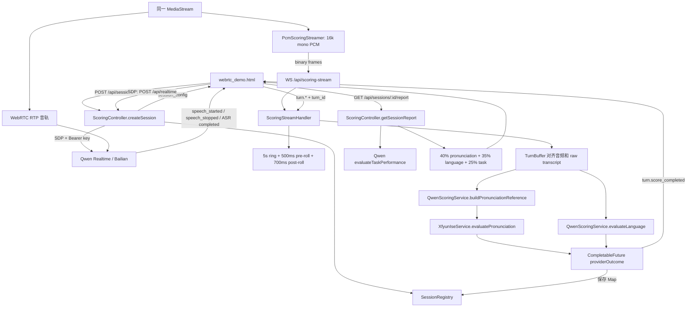
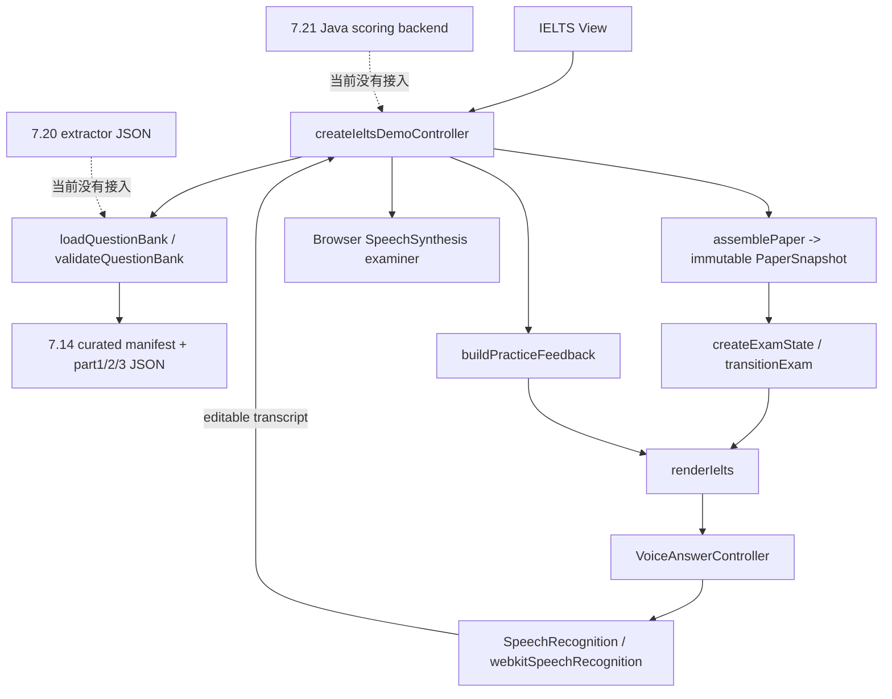

# IELTS Speaking Scoring MVP Implementation Plan

> **For agentic workers:** REQUIRED SUB-SKILL: Use `superpowers:subagent-driven-development` (recommended) or `superpowers:executing-plans` to implement this plan task-by-task. Steps use checkbox (`- [ ]`) syntax for tracking.

**Goal:** 在不破坏现有自由对话评分、不改写现有 IELTS 题库源格式和考试状态机的前提下，把现有 IELTS 前端接入 Qwen Realtime、评分音频 WebSocket、科大讯飞 ISE、非 Realtime `qwen-plus` 和确定性 Java Band 规则，形成可运行的三 Part 雅思口语评分 MVP。

**Architecture:** 继续让 Qwen Realtime 负责考官语音、ASR 和 VAD；新建独立 IELTS Attempt 与评分流，以题目快照和逻辑回答边界对齐 PCM、ASR chunk 与 `turn_id`。ISE 只输出 Pronunciation Evidence，非 Realtime 千问只输出四维子标准的结构化证据和报告文字，Java 负责验证证据、计算四项 Band、计算 Overall Band，并判定完整、部分或不可评分。

**Tech Stack:** Java 21、Spring Boot 3.3.1、Spring WebSocket、Java `HttpClient`、Jackson、`CompletableFuture`、Qwen Realtime WebRTC、DashScope OpenAI-compatible Chat Completions、科大讯飞流式 ISE、原生 ES Modules、Node `node:test`。

## Global Constraints

- 除发音专项评测必须使用科大讯飞 ISE 外，其他模型全部使用阿里千问。
- 实时考官、ASR 和 VAD 继续使用现有 Qwen Realtime。
- IELTS 语言分析、整体 Judge 和报告生成使用可配置的非 Realtime 千问模型，MVP 默认 `qwen-plus`。
- 四项 Band 和 Overall Band 必须由确定性 Java 规则代码计算，模型不得输出最终分项 Band 或 Overall Band。
- 不引入其他模型厂商。
- 不修改 `7.20/ielts-question-extractor/json-output` 中的题库源文件格式。
- 不改变现有 IELTS 状态机的既有状态和转换语义；只允许在外围增加运行时事件映射。
- 必须保持现有自由对话 REST、WebSocket、逐轮评分和报告功能可用。
- 严格模考期间不得显示逐轮分数、纠错、建议表达或薄弱词，报告只在结束后展示。
- 必须保留原始 ASR、发音参考文本、题目快照、Part、Question ID、Turn ID、音频元数据、Provider 原始结果、Prompt 版本、Model 版本和数据质量状态。
- 缺失结果使用 `null`/`unavailable`，不得用零分补齐。
- MVP 只使用进程内 Attempt Registry 和异步 `CompletableFuture`；不建设身份、账单、数据库、对象存储、消息队列或分布式 Job。

---

## 1. 分析范围与事实基线

### 1.1 已阅读的实际文件

- 实际生效的目录约束是 `7.21/AGENTS.md`。用户指定的 `7.21/demo_freechat_scoring/AGENTS.md` 当前不存在。
- `7.21/demo_freechat_scoring/docs/对话评分链路实现说明.md`
- `7.21/demo_freechat_scoring/docs/UniSpeaking_雅思口语专属评分机制设计文档.md`
- `7.21/demo_freechat_scoring/README.md`
- `QwenScoringService.java`
- `XfyunIseService.java`
- `ScoringStreamHandler.java`
- `ScoringController.java`
- `SessionState.java`
- `7.14/UniSpeaking_Complete_UI/src/ielts/` 下的题库、组卷、考试状态机、Demo Controller、语音回答控制器和测试
- `7.14/UniSpeaking_Complete_UI/src/views/ielts.mjs`、`src/app.mjs` 以及现有 Realtime client/state/API
- `7.20/ielts-question-extractor/json-output` 下的 P1 和 P2&P3 原始提取 JSON

### 1.2 当前可验证基线

- `7.14/UniSpeaking_Complete_UI` 的 `npm test`：79 个测试通过，0 失败。
- Java `./mvnw test`：当前机器没有可用 JDK，命令在 Maven 启动前失败；这不是代码测试失败，但实施前必须安装/配置 Java 21 并重新建立基线。
- `backend_java/src/test` 当前没有 Java 测试文件，因此即使能编译，也缺少评分规则和 Provider 降级的回归保护。

### 1.3 文档与代码漂移

1. `README.md` 仍描述 Python 后端，但当前重点目录中真正存在和运行的是 Java/Spring 后端。
2. 实现说明称 `qwen-plus` 可配置，代码却在 `QwenScoringService.callJson()` 中硬编码模型名。
3. 设计文档要求 IELTS 自由表达适用的 ISE 模式，当前 `XfyunIseService` 固定为 `read_sentence`。
4. 设计文档允许 `partial_audio_only` 和 `partial_text_only`，当前 `ScoringStreamHandler` 只有音频 ready 且非空转写同时满足时才启动评分。
5. 设计文档描述完整评分状态机和后台 Job，当前只有内存 `SessionState`、逐轮 Future 和同步 `GET report` 聚合。
6. IELTS UI 当前没有接入生产 Realtime：考官是浏览器 `SpeechSynthesis`，ASR 是 Web Speech API，录音开关只记录用户选择，不上传音频。
7. IELTS UI 的小型题库是面向 Demo 的规范化格式；`7.20` 原始提取题库是另一套 schema。评分接入不能假设二者可直接互换。

---

## 2. 当前实现分析

## 2.1 当前自由对话评分真实调用关系



真实行为补充：

- PCM 二进制帧与控制事件走同一个 WebSocket；浏览器只申请一次麦克风。
- 后端一次只维护一个 `active` TurnBuffer。若旧 turn 尚处于 post-roll 时新 `speech_started` 到达，`active` 会被覆盖，这是长回答、多 chunk 和快速接续时的风险。
- 前端也只有一个 `activeScoringTurnId`；上一段 ASR final 未到而下一段 speech start 已到时存在错绑风险。
- 发音分支先调用千问生成保守参考文本，再调用 ISE；语言分支从原始转写直接调用千问，两者并行。
- 1–2 个英语词跳过语言评分但仍可做发音证据；非英语跳过。
- Streaming 路径支持 Provider 独立失败；遗留 multipart `/turns/{turnId}/score` 路径的语义不同，仍要求两个 Provider 都成功才标为 `scored`，而且不走参考文本纠正。
- `GET report` 临时调用一次任务完成度模型，并继续使用自由对话三维 100 分公式；它不是 IELTS Band。
- `QwenScoringService.boundedInt()` 对缺失字段默认写成 0；该解析方式不能用于 IELTS。
- `XfyunIseService.parseIseXml()` 预填零值并在解析异常时返回零值 Map；该行为不能用于 IELTS 缺失证据。

## 2.2 当前 IELTS 前端真实调用关系



实际状态机为：

```text
ready
  -> part1_answering
  -> part2_preparing
  -> part2_answering
  -> part2_rounding_off
  -> part3_answering
  -> completed

异常终态：abandoned、technical_interrupted
```

它已经保证完整模考不允许 pause/retry/next，Part 2 准备结束后锁笔记，并由 `SUBMIT_ANSWER` 确定性推进题目。当前“结束本轮回答”是权威逻辑回答边界，不能被普通 VAD 直接替换。

## 2.3 两套题库的关系

- `7.20` P1 原始文件：72 个 topic、357 个 question，保留来源页、warnings、`needs_review`、`draft` 状态。
- `7.20` P2&P3 原始文件：104 个联合 topic、104 个 P2 prompt、422 个 cue point、607 个 P3 question；部分 `topic_cluster` 为 `null`，没有当前 UI schema 强制要求的 rounding-off question。
- `7.14` UI 题库：小型、人工规范化的 `manifest + part1 + part2 + part3`，有 `active`、`topic_cluster`、rounding-off question，现有 loader/assembler/tests 可直接消费。
- MVP 评分后端只消费前端冻结后的 `PaperSnapshot`，不直接解释或改写任何源题库。因此既保持题库格式不变，也让未来题库适配工作与评分链路解耦。
- 将完整 `7.20` 原始题库接入当前 UI 需要单独确定 `draft/needs_review` 发布策略、`topic_cluster` 生成规则和 rounding-off 来源；不应在评分 MVP 中暗自发明这些数据。

---

## 3. 方案比较与选择

### 方案 A：把 IELTS UI 和状态机复制进 `webrtc_demo.html`

- 优点：可以最快复用当前 PCM streamer 和自由对话 WebRTC 代码。
- 缺点：复制题库、状态机和视图，形成第二套 IELTS 实现；2823 行单文件会继续膨胀；最难保证自由对话不回归。

### 方案 B：保留两个现有边界，用 IELTS Runtime 桥接到 Java（推荐）

- 保留 `7.14` 的题库、PaperSnapshot、状态机、Controller 和 View。
- 新增 IELTS Session Runtime，一次申请麦克风，同时连接 Qwen Realtime 和新 IELTS 评分 WS。
- 保留 `7.21` 现有自由对话接口；新建 `/api/ielts/**` Attempt、WS、评分与报告服务。
- 只抽取或扩展 Qwen JSON 和 ISE Provider 的可复用能力，不复用自由对话的评分公式和 `SessionState`。

该方案边界清晰，回归面最小，也是本计划采用的方案。

### 方案 C：重写为统一后端驱动考试系统

- 优点：长期可统一题库、考试状态、评分任务与持久化。
- 缺点：会重写当前前端状态机和 Realtime 架构，超出 MVP；容易把身份、数据库、队列和部署带入本轮。

---

## 4. 可直接复用的类、接口和数据结构

## 4.1 Java 后端

| 现有实现 | 复用方式 | 不能复用的部分 |
|---|---|---|
| `ScoringWebSocketConfig` | 复用 Spring WebSocket 注册方式和 allowed-origin 模式 | 新 IELTS path 绑定独立 Handler，不把协议塞进原 Handler |
| `ScoringStreamHandler` | 复用 PCM 连续上传、ring buffer、pre/post-roll、turn ID 对齐、并行 Future、独立降级的实现经验 | 不能复用单一 `active` TurnBuffer、自由对话 turn 结束语义和 100 分公式 |
| `QwenScoringService` | 复用 DashScope compatible-mode、JSON-only、低温度、异步 HTTP、ASR 参考文本硬校验 | 模型名硬编码、Map/零默认解析、自由对话 Prompt 必须隔离 |
| `XfyunIseService` | 复用签名鉴权、流式 PCM 上传、Base64/XML 解码、word alignment 原始数据 | `read_sentence` 固定模式、零值错误回退和现有结果类型不能直接作为 IELTS Band |
| `SessionRegistry` | 复用 `ConcurrentHashMap` 进程内 registry 模式 | IELTS 使用独立 `IeltsAttemptRegistry`，不扩张 `SessionState` |
| `ScoringController.realtimeProxy` | 复用服务端 SDP 代理和现有 Qwen Realtime 配置来源 | IELTS 需要独立考官 Prompt、PaperSnapshot 和 Attempt 绑定 |
| `CompletableFuture.handle/providerOutcome` | 复用 Provider 独立失败、超时和合并模式 | 失败结果必须是 typed status/null，不能是 0 |

## 4.2 IELTS 前端

| 现有实现 | 复用方式 |
|---|---|
| `question-bank.mjs` | 继续校验当前发布用题库，不改变 schema |
| `paper-assembler.mjs` | 继续生成不可变 `PaperSnapshot`，作为 Attempt 的原题快照 |
| `exam-state-machine.mjs` | 状态与转换保持不变；外围把状态变化映射为评分事件 |
| `demo-controller.mjs` | 继续控制 Part、题序、Part 2 计时、笔记锁定、完成/放弃 |
| `currentExamItem()` | 生成 `question.asked`、`turn.opened` 的权威 Question ID/Text |
| `views/ielts.mjs` | 保留页面结构，增加连接/报告状态，不在严格模考显示中间评分 |
| `realtime-client.mjs` | 复用 WebRTC/DataChannel 事件处理模式和 Qwen 事件名称 |
| `realtime-state.mjs` | 复用 transcript/speech/response 事件归一化经验 |
| IELTS tests | 继续作为状态机、组卷、严格模考与视图回归基线 |

## 4.3 可复用的数据结构

- `PaperSnapshot`：`paperId`、`bankVersion`、`schemaVersion`、`mode`、`selectedPart`、`parts`、`assemblyPolicy`。
- Question Snapshot：`questionId`/`cardId`、`version`、`renderedText`/`topicSentence`、`probes`、`topicCluster`。
- Realtime 标识：`session_id`、`item_id`、`response_id`。
- Scoring 标识：`turn_id`、`realtime_item_id`、`turn_index`。
- 音频格式：16 kHz、mono、signed 16-bit PCM。
- Provider outcome：成功结果与错误独立承载的模式；IELTS 版本改为 enum + nullable payload。

---

## 5. 目标调用链

```mermaid
sequenceDiagram
    participant U as Candidate
    participant UI as IELTS View/Controller
    participant RT as IELTS Session Runtime
    participant J as Java IELTS API
    participant QR as Qwen Realtime
    participant WS as IELTS Scoring WS
    participant ISE as iFlytek ISE
    participant QP as qwen-plus
    participant BC as Java Band Calculator

    UI->>J: POST /api/ielts/attempts + frozen PaperSnapshot
    J-->>UI: attempt_id + realtime config + WS URL
    RT->>RT: getUserMedia once
    RT->>QR: WebRTC audio + session.update
    RT->>WS: same MediaStream -> 16k PCM binary
    UI->>WS: question.asked + turn.opened

    loop Each answer
        QR-->>RT: speech_started/stopped + ASR completed(item_id)
        RT->>WS: turn.speech_* + turn.transcript_chunk
        UI->>WS: turn.completed (logical boundary)
        WS->>WS: align question + PCM + raw transcript + chunk timing
        par evidence collection
            WS->>WS: deterministic acoustic features
            WS->>QP: conservative pronunciation reference per speech chunk
            WS->>ISE: chunk PCM + reference text
        end
    end

    Note over UI,WS: Part 2 stays one logical long turn; VAD creates internal chunks only
    UI->>J: POST /api/ielts/attempts/{id}/finalize
    J->>QP: whole-attempt descriptor evidence JSON
    QP-->>J: criterion levels + cited evidence, no dimension/overall band
    J->>BC: validated criterion evidence + eligibility
    BC->>BC: calculate FC/LR/GRA/P then Overall
    J->>QP: narrative report request with Java-owned scores
    QP-->>J: narrative JSON, no score fields
    J-->>UI: scoring.status / report.ready
    UI->>J: GET /api/ielts/attempts/{id}/report
```

### 5.1 权威边界

- 考试状态机决定“当前是什么题”和“何时进入下一题”。
- Qwen Realtime VAD 决定声学 chunk 的开始/停止，不决定 Part 2 回答结束。
- Qwen Realtime ASR 是 `raw_transcript` 的唯一评分文本源；用户编辑文本只能成为 `display_transcript_override`，不能覆盖 raw。
- `qwen-examiner-adapter` 把现有 Controller 的 `speak(exactText)` 实现为受控 Realtime 输出：先发送只允许朗读 `exactText` 的 `session.update`，收到 `session.updated` 后发送 `response.create`。用户语音触发的非受控自动 response 一律 `response.cancel`，远端音轨只在受控 response 窗口取消静音；状态机仍是唯一出题者。
- IELTS WS 根据 `attempt_id + turn_id + question_id + realtime_item_id` 对齐数据。
- ISE 输出发音事实；千问输出 descriptor evidence；Java 输出四项 Band 与 Overall。

---

## 6. Part 1、Part 2、Part 3 的音频和转写进入方式

## 6.1 共用机制

1. `IeltsSessionRuntime` 只调用一次 `getUserMedia({audio:true})`。
2. 同一个 `MediaStream` 的音轨加入 Qwen Realtime `RTCPeerConnection`。
3. 同一个流进入 `PcmScoringStreamer`，下采样为 16 kHz mono PCM，持续发送到 IELTS WS。
4. Controller 在考官提出题目后发送 `question.asked`，并在考生回答入口打开时发送 `turn.opened`。
5. Realtime `speech_started/stopped` 只生成 `speech_chunk` 边界；`conversation.item.input_audio_transcription.completed` 生成 `raw_transcript_chunk`。
6. Controller 的“结束本轮”、Part 2 时间上限或确定性的 `That's all` 规则发送 `turn.completed`。
7. 后端按 chunk 的 `audio_start_ms/audio_end_ms`、`item_id` 和 `turn_id` 排序拼接原始转写，不使用 UI 可编辑文本。

## 6.2 Part 1

- 每道题对应一个逻辑 `IeltsTurn`。
- `turn.opened` 绑定当前 `questionId` 和题目快照。
- 一次回答可以包含一个或多个 VAD chunk；所有 chunk 都归入该逻辑 turn。
- Part 1 的 1–2 词有效短答保留为语境证据，不按自由对话现有规则直接跳过整项语言分析。
- 点击“结束本轮回答”后等待最终 ASR 最多 5 秒；超时则保留音频并标记 `TRANSCRIPT_MISSING`。

## 6.3 Part 2

- `part2.preparation_started` 期间 PCM 可以继续传输，但后端不创建正式回答、不评分自言自语。
- 状态进入 `part2_answering` 时发送 `part2.speaking_started` 和 `turn.opened(turn_type=PART2_LONG_TURN)`。
- 后端从逻辑 long turn 开始到完成持续保存一个完整音频区间，并记录其中所有 `speech_chunks` 和 transcript chunks。
- 每个有效 speech chunk 可独立提交 ISE，避免 2 分钟音频受单次流式超时、参考文本长度和 100-word/字节限制影响；Pronunciation Evidence 按有效语音时长聚合。
- Acoustic Evidence 使用完整 long turn，包含 chunk 之间的真实停顿，因此能计算连续表达、沉默比例、长停顿和最长连续发言。
- Part 2 follow-up 单独创建普通 `IeltsTurn`，不能合并进 long turn。

## 6.4 Part 3

- 每个题库主问题是独立 turn。
- 若 MVP 使用已有 `probes` 做一次追问，追问必须生成独立 Question Snapshot：`question_source=PROBE`、`parent_question_id` 指向主问题。
- Part 3 转写与语言证据保留题目上下文，用于抽象表达、比较、因果、复杂语法和词汇精确度判断。

---

## 7. Part 2 如何避免被普通 VAD 错误切断

### 7.1 核心规则

```text
VAD speech_stopped = speech chunk ended
PART2 turn.completed = long answer ended
两者不是同一个事件
```

Part 2 逻辑回答只在以下条件之一发生时结束：

1. 用户点击现有“结束本轮回答”；
2. `PaperSnapshot.parts.part2.answerMaxSeconds` 达到上限（当前正式配置 120 秒）；
3. 最终 ASR chunk 以确定性短语结尾：`that's all` 或 `that is all`，且该 chunk 已 final；
4. 技术中断/用户退出，结束原因分别为 `TECHNICAL_INTERRUPTION`/`ABANDONED`，结果不得伪装为完整。

普通 800 ms 静音、任意 `speech_stopped`、ASR 分段或一个短 filler 都不能触发结束。

### 7.2 Realtime 防抢话

- Qwen WebRTC 官方能力只支持 `server_vad`/`semantic_vad`，不支持 Manual VAD；因此不能把 WebRTC 切成手动 commit 作为唯一方案。
- Part 2 的 Realtime `silence_duration_ms` 配为供应商允许的高值（MVP 建议 6000 ms），但该参数只是降低误触发概率，不是逻辑结束条件。
- 在 `PART2_LONG_TURN` 未完成时，前端对 Realtime 自动产生的 `response.created` 发送 `response.cancel`，并保持考官播放静音/不推进状态。
- Part 2 完成后才允许状态机触发下一个确定性考官动作。
- 以上行为必须先用真实 Qwen Realtime 账号做 capability spike；官方参考：[Qwen Realtime](https://help.aliyun.com/zh/model-studio/realtime)、[Client events](https://help.aliyun.com/zh/model-studio/client-events)。

### 7.3 服务端长回答缓冲

- 不使用现有单一 `active` + 700 ms post-roll 的 turn 完成逻辑。
- `IeltsTurnAssembler` 允许一个逻辑 turn 下有多个 chunk，并持续记录绝对 PCM offset。
- 逻辑 long turn 的 PCM 上限按 130 秒防御性限制，约 4.16 MB；超过后停止写入并标记 `AUDIO_TRUNCATED`，状态降为部分评分。
- 二进制 PCM 仍进入 5 秒 ring buffer；每个 chunk 使用 500 ms pre-roll/700 ms post-roll，但聚合时按 offset 去重，避免重复音频被多次计权。

---

## 8. ISE 在 IELTS 中的严格定位

### 8.1 输出只能是 Pronunciation Evidence

`IeltsPronunciationEvidenceService` 允许输出：

- Provider/模式/请求 ID/原始结果；
- accuracy、fluency、integrity 等原始 Provider 指标；
- word/syllable/phone 级结果；
- omission/insertion/repetition/substitution；
- rejection、coverage、音频质量和对齐质量；
- 按 chunk 和整场聚合的证据摘要。

它禁止输出：

- `ielts_band`；
- `pronunciation_band`；
- `overall_band`；
- “ISE 80 = Band 8”一类直接映射。

### 8.2 Provider 模式

- 官方流式 ISE 支持英文 `topic` 自由题，但自由说/口头作文等能力可能要求定制试卷或特定套餐。实施第一阶段必须用当前账号验证 entitlement，不得仅靠文档假设可用。
- 若账号已开通 `topic`，优先使用并保存 `provider_mode=topic`。
- 若未开通，MVP 降级为“按 Realtime VAD chunk + 保守 ASR reference 的 ISE 句/篇章评测”，保存真实 `provider_mode` 并降低 Pronunciation 置信度；报告必须说明声学证据覆盖有限。
- 官方参考：[科大讯飞流式 ISE](https://www.xfyun.cn/doc/Ise/IseAPI.html)。

### 8.3 缺失与失败

- XML 解析失败、Provider reject、空结果、超时都返回 `status != SUCCESS` 和 nullable 字段，不返回零分。
- ISE 全部失败时 Pronunciation 通常为 `null`；FC 仍可保留文字连贯和部分时序诊断，LR/GRA 仍可评分。
- ISE 部分 chunk 成功时，按有效语音毫秒聚合并记录 `coverage_ratio`；低于 0.60 时 P 只能是 provisional 或 null。

---

## 9. `qwen-plus` 结构化证据设计

## 9.1 调用拆分

1. `pronunciation-reference-v1`：每个 ISE chunk 的保守 ASR 参考文本纠正；继续使用现有 Java 硬校验。
2. `ielts-language-evidence-v1`：考试结束后读取整场原始转写和题目，提取 FC/LR/GRA 的语言事实、错误模式与 turn 引用；不输出 Band。
3. `ielts-holistic-judge-v1`：读取 Language、Acoustic、ISE 和数据质量摘要，输出四维 16 个子标准的 descriptor evidence；禁止输出分项最终 Band 和 Overall。
4. `ielts-report-v1`：读取 Java 已确定的状态和 Band 以及引用证据，输出中文报告文字；Schema 中没有任何可覆盖 Java 分数的字段。

四类调用都使用配置项 `qwen.scoring.model`，默认 `qwen-plus`，温度 0–0.2，`response_format={"type":"json_object"}`，并保存 model、prompt version、request status。官方 JSON mode 参考：[DashScope compatible Chat Completions](https://help.aliyun.com/zh/model-studio/qwen-api-via-openai-chat-completions)。

## 9.2 Judge 不返回最终分数

Judge 返回 16 个固定子标准的 `descriptor_level`，每个值只能是 `0.0–9.0` 的 0.5 步长或 `null`：

| 维度 | 子标准 |
|---|---|
| FC | `continuity`, `coherence`, `development`, `hesitation_and_repair` |
| LR | `range`, `precision`, `appropriacy_and_collocation`, `flexibility_and_paraphrase` |
| GRA | `range`, `accuracy`, `error_persistence`, `communication_impact` |
| P | `intelligibility`, `segmental_control`, `stress_control`, `rhythm_and_intonation_control` |

模型只做“每个子标准与 descriptor 的匹配”，不聚合维度。每个子标准必须携带：

```json
{
  "criterion": "coherence",
  "descriptor_level": 6.5,
  "confidence": 0.78,
  "positive_evidence": [
    {
      "source_type": "RAW_TRANSCRIPT",
      "turn_id": "turn_p3_01",
      "quote": "There are two main reasons...",
      "explanation": "Uses an explicit structure and develops both reasons."
    }
  ],
  "limiting_evidence": [
    {
      "source_type": "ACOUSTIC_FEATURE",
      "source_id": "turn_p2_long:long_pause_count",
      "explanation": "Several long pauses interrupt idea development."
    }
  ],
  "unavailable_reason": null
}
```

Java 校验：

- `criterion` 必须来自白名单且每项最多出现一次；
- `descriptor_level` 必须是 0.5 步长；
- transcript quote 必须能在对应 `raw_transcript` 中归一化匹配；
- Provider evidence `source_id` 必须真实存在；
- 模型不得引用 `corrected_expression` 作为 LR/GRA/FC 评分证据；
- P 的文字说明必须明确它没有直接听音频，只是在解释 ISE/Acoustic Evidence；
- JSON 中出现 `dimension_band` 或 `overall_band` 视为 schema violation，不采信该响应。

## 9.3 Pronunciation 综合证据

`qwen-plus` 收到的是：

- ISE chunk coverage、reject、word/syllable/phone error 分布；
- 保守参考文本及其变更；
- speech rate、articulation rate、停顿、连续发言、音频质量；
- 原始转写和问题上下文。

它可判断“哪些观察支持/限制 intelligibility、segmental、stress、rhythm/intonation descriptor”，但不能声称听到了音频中未被 Provider 提供的特征。证据不足的子标准必须返回 `null + unavailable_reason`。

---

## 10. 最终四项 Band 与 Overall 的确定性 Java 规则

## 10.1 分项 Band

每个维度四个子标准等权：

```text
criterion_weight = 0.25
coverage = 非 null 子标准权重之和

coverage < 0.75:
    dimension_band = null

coverage >= 0.75:
    raw_dimension = Σ(descriptor_level × weight) / coverage
    dimension_band = round_half_up(raw_dimension)
    provisional = coverage < 1.00
```

`round_half_up(x)` 使用 Java `BigDecimal`，等价于：

```java
BigDecimal.valueOf(x)
    .multiply(BigDecimal.valueOf(2))
    .setScale(0, RoundingMode.HALF_UP)
    .divide(BigDecimal.valueOf(2));
```

示例：

- `[6.0, 6.0, 6.5, 7.0]` → raw `6.375` → `6.5`
- `[6.0, 6.0, 6.0, null]` → `6.0`，但 `provisional=true`，不能参与完整 Overall
- 两个或更多子标准缺失 → 该维度 `null`

### 为什么采用该规则

- 四项 IELTS 官方维度仍然等权；内部子标准也用等权，避免在没有人工校准数据时伪造复杂权重。
- 模型不输出分项最终值，Java 结果对相同证据完全确定。
- 缺一个子标准时允许展示 provisional dimension，但完整 Overall 要求四个维度均非 provisional。

## 10.2 Overall Band

只有 `result_status=COMPLETE` 且 FC/LR/GRA/P 四项都非 null、非 provisional 时计算：

```text
raw_overall = (FC + LR + GRA + P) / 4
overall_band = round_half_up(raw_overall)
```

边界用例：

- `6.0 + 6.0 + 6.0 + 7.0 = 25.0 / 4 = 6.25` → `6.5`
- `6.5 + 6.5 + 6.5 + 7.5 = 27.0 / 4 = 6.75` → `7.0`
- 任一维度 `null` 或 provisional → Overall `null`
- 非 0.5 步长、<0 或 >9 的输入 → validation error，不截断、不补零

## 10.3 Part 证据关系

- 不设置公开或内部固定 `Part 1/2/3` 分数权重。
- Judge 必须跨 Part 引用证据；每个子标准同一 turn 最多贡献两条引用，防止 Part 2 极长回答淹没其他证据。
- Part 1 提供快速自然反应，Part 2 提供长程组织，Part 3 提供抽象论证；这些是证据类型，不是第五维度。
- Cue Card 覆盖、切题度和任务完成度进入 `training_diagnostics`，不进入任何 Band 公式。

---

## 11. 完整评分、部分评分和不可评分

评分执行状态和结果完整度分开：

```text
pipeline_status:
NOT_STARTED -> COLLECTING -> FINALIZING_INPUT -> EXTRACTING_EVIDENCE
-> HOLISTIC_JUDGING -> CALCULATING_BAND -> GENERATING_REPORT
-> READY | FAILED

result_status:
COMPLETE | PARTIAL | UNSCORABLE
```

## 11.1 可评分基础门槛

先计算：

```text
question_mapping_reliable = 至少 2 个 turn 有合法 question snapshot 和稳定 turn_id
text_evidence_available = 至少 2 个 raw transcript turn 且总英文词数 >= 20
audio_evidence_available = 至少 2 个可用 audio turn 且有效语音 >= 10 秒
```

若 `question_mapping_reliable=false`，或文字/音频两种证据都不可用，则为 `UNSCORABLE`。

## 11.2 COMPLETE

MVP 完整模拟考试同时满足：

- `mode=full_mock` 且考试状态机终态为 `completed`；
- Part 1 至少 2 个有效回答；
- Part 2 long turn 有效语音不少于 45 秒且不少于 50 个英文词；
- Part 3 至少 2 个有效回答；
- 总英文词数不少于 100；
- 计划题目的 transcript coverage ≥ 0.80；
- 计划题目的 audio coverage ≥ 0.80；
- FC/LR/GRA/P 均非 null、非 provisional；
- 没有 `TURN_ID_COLLISION`、`QUESTION_MISMATCH`、`AUDIO_FORMAT_INVALID` 等阻断性质量错误。

输出四项 Band、Overall、区间、置信度和完整报告。

这些阈值是 accelerated MVP 的明确初始配置，不声称是官方 IELTS 标准；后续必须用人工评分样本校准。阈值进入 `application.properties`，不散落在业务代码中。

## 11.3 PARTIAL

已达到可评分基础门槛，但出现以下任一情况：

- 专项 Part 练习而非 full mock；
- 某 Part 未完成或用户中断；
- Part 2 过短；
- ISE、Qwen 或某些 chunk 失败；
- 音频或 transcript coverage 不足；
- 至少一个维度为 null/provisional；
- 总体数据质量为 DEGRADED。

输出可用维度、训练诊断、缺失原因和低/中置信度；`overall_band=null`。禁止根据现有三项平均出伪 Overall。

## 11.4 UNSCORABLE

- 未达到基础门槛；或
- 四项 Band 全部为 null；或
- turn/question 对齐无法信任；或
- 几乎无有效英语，且只有噪声/空白音频。

输出 `overall_band=null`、四项 nullable、明确 `reason_codes` 和重试建议，不输出 0 分。

---

## 12. 数据结构

以下为 MVP 进程内对象；不建数据库表。

### 12.1 Attempt

```json
{
  "attempt_id": "att_01",
  "mode": "full_mock",
  "exam_status": "part2_answering",
  "completion_kind": null,
  "paper_snapshot": {},
  "realtime_session_id": "rt_01",
  "scoring_stream_id": "ss_01",
  "pipeline_status": "COLLECTING",
  "result_status": null,
  "started_at": "2026-07-21T10:00:00Z",
  "completed_at": null,
  "termination_reason": null,
  "turns": [],
  "data_quality": {}
}
```

### 12.2 Turn 与 transcript chunk

```json
{
  "turn_id": "turn_p2_long_01",
  "attempt_id": "att_01",
  "turn_type": "PART2_LONG_TURN",
  "part": 2,
  "question_id": "p2_person_001",
  "question_index": 0,
  "question_snapshot": {},
  "realtime_item_ids": ["item_01", "item_02"],
  "raw_transcript": "...",
  "raw_transcript_chunks": [
    {
      "realtime_item_id": "item_01",
      "text": "...",
      "audio_start_ms": 1200,
      "audio_end_ms": 14200,
      "source": "QWEN_REALTIME",
      "final": true
    }
  ],
  "display_transcript_override": null,
  "pronunciation_reference_chunks": [],
  "opened_at_ms": 0,
  "completed_at_ms": 95000,
  "completion_reason": "USER_FINISH",
  "input_status": "READY",
  "data_quality": {}
}
```

### 12.3 Audio metadata

```json
{
  "audio_segment_id": "aud_01",
  "turn_id": "turn_p2_long_01",
  "format": "PCM_S16LE",
  "sample_rate": 16000,
  "channels": 1,
  "byte_length": 3040000,
  "duration_ms": 95000,
  "pre_roll_ms": 500,
  "post_roll_ms": 700,
  "speech_chunks": [
    {
      "chunk_id": "chunk_01",
      "realtime_item_id": "item_01",
      "start_offset_ms": 1200,
      "end_offset_ms": 14200
    }
  ],
  "quality_status": "GOOD",
  "quality_flags": []
}
```

### 12.4 Acoustic Evidence

```json
{
  "answer_duration_ms": 95000,
  "speech_duration_ms": 74000,
  "silence_duration_ms": 21000,
  "silence_ratio": 0.221,
  "word_count": 156,
  "speech_rate_wpm": 98.5,
  "articulation_rate_wpm": 126.5,
  "response_latency_ms": 1800,
  "pause_count": 10,
  "long_pause_count": 3,
  "avg_pause_ms": 910,
  "max_pause_ms": 3200,
  "longest_continuous_speech_ms": 19000,
  "feature_version": "acoustic-v1",
  "status": "SUCCESS"
}
```

MVP 的停顿来自 Realtime VAD chunk offset；无法可靠从 PCM 内部重做全量 VAD 时，不伪造更细停顿。filler/repetition/self-correction 可由 `qwen-plus` 标注，但必须注明 `source=MODEL_TEXT_EVIDENCE`。

### 12.5 Pronunciation Evidence

```json
{
  "provider": "XFYUN_ISE",
  "provider_mode": "topic",
  "status": "SUCCESS",
  "coverage_ratio": 0.86,
  "accuracy_score": 78.2,
  "fluency_evidence": 73.0,
  "integrity_score": 91.0,
  "word_results": [],
  "raw_provider_result": "...",
  "provider_request_id": "...",
  "model_version": "provider-reported-or-configured",
  "evidence_version": "ise-evidence-v1"
}
```

此结构没有 Band 字段。

### 12.6 Dimension 与报告

```json
{
  "dimension": "FLUENCY_COHERENCE",
  "band": 6.5,
  "raw_value": 6.375,
  "provisional": false,
  "coverage": 1.0,
  "confidence": 0.78,
  "positive_evidence": [],
  "limiting_evidence": [],
  "rule_version": "band-rule-v1",
  "judge_model": "qwen-plus",
  "judge_prompt_version": "ielts-holistic-judge-v1"
}
```

```json
{
  "attempt_id": "att_01",
  "result_status": "COMPLETE",
  "overall_band": 6.5,
  "dimensions": {
    "fluency_coherence": {},
    "lexical_resource": {},
    "grammatical_range_accuracy": {},
    "pronunciation": {}
  },
  "training_diagnostics": {},
  "missing_reasons": [],
  "disclaimer": "本报告由 AI 根据本次训练音频和转写生成，仅用于学习参考，不代表 IELTS 官方成绩、认证考官评分或考试结果。"
}
```

---

## 13. API 与 WebSocket 事件

## 13.1 REST API

### 创建 Attempt

```http
POST /api/ielts/attempts
Content-Type: application/json

{
  "mode": "full_mock",
  "locale": "zh-CN",
  "paper_snapshot": {},
  "client_exam_state_version": 1
}
```

返回 `201`：

```json
{
  "attempt_id": "att_01",
  "scoring_ws_url": "/api/ielts/scoring-stream?attempt_id=att_01",
  "realtime_session_config": {},
  "scoring_status": "COLLECTING"
}
```

### Realtime SDP

继续复用：

```http
POST /api/realtime?session_id={attemptId}
Content-Type: application/sdp
```

MVP 中 `session_id` 允许指向 free-chat session 或 IELTS attempt，代理本身不改变 Provider。后续若需更严格隔离再增加专用 path。

### Attempt 查询/结束/报告

```http
GET  /api/ielts/attempts/{attemptId}
POST /api/ielts/attempts/{attemptId}/finalize
POST /api/ielts/attempts/{attemptId}/abandon
GET  /api/ielts/attempts/{attemptId}/scoring-status
GET  /api/ielts/attempts/{attemptId}/report
DELETE /api/ielts/attempts/{attemptId}
```

- `finalize` 幂等，首次返回 `202`；重复调用返回同一状态。
- `report` 未就绪返回 `202 + pipeline_status`，就绪返回 `200`，Attempt 不存在返回 `404`。
- `DELETE` 只清理进程内音频、Future 和报告；不代表生产级数据删除承诺。

## 13.2 前端发送给评分 WS

所有文本事件包含 `event_id`、`attempt_id`、单调递增 `sequence`；后端按 `event_id` 幂等。

```text
stream.start
part.started
question.asked
turn.opened
turn.speech_started
turn.speech_stopped
turn.transcript_chunk
turn.completed
part2.preparation_started
part2.speaking_started
part2.speaking_completed
stream.end
```

关键事件：

```json
{
  "type": "turn.opened",
  "event_id": "evt_101",
  "attempt_id": "att_01",
  "turn_id": "turn_p2_long_01",
  "turn_type": "PART2_LONG_TURN",
  "part": 2,
  "question_id": "p2_person_001",
  "question_index": 0,
  "client_exam_state_version": 4,
  "timestamp_ms": 10000
}
```

```json
{
  "type": "turn.transcript_chunk",
  "event_id": "evt_108",
  "attempt_id": "att_01",
  "turn_id": "turn_p2_long_01",
  "realtime_item_id": "item_abc",
  "text": "The person I would like to describe is...",
  "audio_start_ms": 12000,
  "audio_end_ms": 24500,
  "source": "QWEN_REALTIME",
  "final": true
}
```

```json
{
  "type": "turn.completed",
  "event_id": "evt_130",
  "attempt_id": "att_01",
  "turn_id": "turn_p2_long_01",
  "reason": "TIME_LIMIT",
  "timestamp_ms": 130000
}
```

## 13.3 后端返回给前端

```text
stream.ready
stream.warning
stream.error
turn.accepted
turn.input_ready
turn.input_partial
scoring.status
report.ready
```

严格模考中不发送 `turn.evidence_completed` 的证据内容；可以发送无分数的状态事件：

```json
{
  "type": "scoring.status",
  "attempt_id": "att_01",
  "status": "HOLISTIC_JUDGING",
  "progress": 70
}
```

练习模式本 MVP 也默认考后展示，避免第一版维护两套隐私/展示策略。

---

## 14. 修改文件清单

### 14.1 `7.21/demo_freechat_scoring`

| 文件 | 修改内容 |
|---|---|
| `backend_java/src/main/resources/application.properties` | 增加可配置 scoring model、Qwen endpoint、Prompt/规则版本、IELTS 阈值、Provider timeout 和 ISE mode；默认模型仅在配置中写 `qwen-plus` |
| `.env.example` | 增加 `QWEN_SCORING_MODEL`、ISE IELTS mode/timeout 等占位配置，不写真实凭据 |
| `backend_java/src/main/java/com/example/unispeaking/service/QwenScoringService.java` | 改为使用共享可注入 JSON client 和配置模型；原自由对话方法签名/结果保持兼容 |
| `backend_java/src/main/java/com/example/unispeaking/service/XfyunIseService.java` | 增加 typed request/mode 与原始结果接口；原 `evaluatePronunciation(byte[], String)` 继续委托旧 `read_sentence` 行为 |
| `backend_java/src/main/java/com/example/unispeaking/config/ScoringWebSocketConfig.java` | 在保留 `/api/scoring-stream` 的同时注册 `/api/ielts/scoring-stream` |
| `backend_java/src/main/java/com/example/unispeaking/controller/ScoringController.java` | 只在需要时把 SDP 代理抽到共享服务；所有现有 URL、请求和响应保持不变 |
| `README.md` | 实施完成后纠正 Java/Python 漂移，补充 IELTS 本地启动和内存态限制 |

明确不修改：

- `ScoringStreamHandler.java` 的现有 free-chat 协议和公式；
- `SessionState.java` 的现有字段语义；
- `webrtc_demo.html` 的自由对话流程，除非回归测试暴露共享 API 兼容问题。

### 14.2 `7.14/UniSpeaking_Complete_UI`

| 文件 | 修改内容 |
|---|---|
| `src/app.mjs` | 用 IELTS Session Runtime 替换 IELTS 路径下的浏览器 TTS/Web Speech wiring；自由对话 wiring 不变 |
| `src/ielts/demo-controller.mjs` | 注入 runtime callbacks，在既有状态转换前后发送 Attempt/Question/Turn 事件；不改变题序和状态名称 |
| `src/views/ielts.mjs` | 显示连接、finalizing、三态报告和 nullable Band；严格模考隐藏中间反馈；raw transcript 不可编辑 |
| `src/runtime-config.mjs` | 增加本地 Java IELTS API base URL 配置，不放 Provider secret |
| `README.md` | 更新 IELTS 已接入 Qwen/Java 的真实边界和启动方式 |
| `tests/ielts-demo-controller.test.mjs` | 增加 runtime 事件顺序、finalize 和严格模考隐藏反馈测试 |
| `tests/ielts-view.test.mjs` | 增加 COMPLETE/PARTIAL/UNSCORABLE 报告和 nullable 分数测试 |

原则上不修改：

- `src/ielts/exam-state-machine.mjs`；
- `src/ielts/question-bank.mjs`；
- `src/ielts/paper-assembler.mjs`；
- `7.20/ielts-question-extractor/json-output/**/*.json`。

只有接口接入测试证明状态机缺少必要通知时，才允许增加不改变转换结果的 observer/event metadata；不得新增模型驱动的状态跳转。

---

## 15. 新增文件清单

## 15.1 Java 主代码

```text
backend_java/src/main/java/com/example/unispeaking/client/QwenJsonClient.java
backend_java/src/main/java/com/example/unispeaking/model/ielts/IeltsAttempt.java
backend_java/src/main/java/com/example/unispeaking/model/ielts/IeltsTurn.java
backend_java/src/main/java/com/example/unispeaking/model/ielts/IeltsEvidence.java
backend_java/src/main/java/com/example/unispeaking/model/ielts/IeltsReport.java
backend_java/src/main/java/com/example/unispeaking/model/ielts/IeltsEnums.java
backend_java/src/main/java/com/example/unispeaking/service/ielts/IeltsAttemptRegistry.java
backend_java/src/main/java/com/example/unispeaking/service/ielts/IeltsTurnAssembler.java
backend_java/src/main/java/com/example/unispeaking/service/ielts/IeltsScoringStreamHandler.java
backend_java/src/main/java/com/example/unispeaking/service/ielts/IeltsAcousticFeatureService.java
backend_java/src/main/java/com/example/unispeaking/service/ielts/IeltsPronunciationEvidenceService.java
backend_java/src/main/java/com/example/unispeaking/service/ielts/IeltsLanguageEvidenceService.java
backend_java/src/main/java/com/example/unispeaking/service/ielts/IeltsHolisticEvidenceService.java
backend_java/src/main/java/com/example/unispeaking/service/ielts/IeltsEvidenceValidator.java
backend_java/src/main/java/com/example/unispeaking/service/ielts/IeltsBandCalculator.java
backend_java/src/main/java/com/example/unispeaking/service/ielts/IeltsScoringEligibilityService.java
backend_java/src/main/java/com/example/unispeaking/service/ielts/IeltsScoringOrchestrator.java
backend_java/src/main/java/com/example/unispeaking/service/ielts/IeltsReportService.java
backend_java/src/main/java/com/example/unispeaking/controller/IeltsAttemptController.java
```

职责边界：

- `IeltsScoringStreamHandler` 只接协议和二进制帧；不写 Band 规则。
- `IeltsTurnAssembler` 只做逻辑 turn/chunk/offset/文本对齐。
- `IeltsPronunciationEvidenceService` 只封装 ISE evidence。
- `IeltsLanguageEvidenceService` 只封装 qwen-plus JSON evidence。
- `IeltsHolisticEvidenceService` 只把语言/声学/ISE evidence 匹配到 16 个 descriptor 子标准，不计算最终 Band。
- `IeltsBandCalculator` 是纯函数，不调用 Provider、不读 Registry。
- `IeltsScoringEligibilityService` 只判定 COMPLETE/PARTIAL/UNSCORABLE。
- `IeltsScoringOrchestrator` 编排 Future 和状态，不解析 WebSocket。
- `IeltsReportService` 不能改变 Java 分数。

## 15.2 Java 测试

```text
backend_java/src/test/java/com/example/unispeaking/service/QwenScoringServiceCompatibilityTest.java
backend_java/src/test/java/com/example/unispeaking/service/XfyunIseServiceCompatibilityTest.java
backend_java/src/test/java/com/example/unispeaking/service/ielts/IeltsTurnAssemblerTest.java
backend_java/src/test/java/com/example/unispeaking/service/ielts/IeltsPart2LongTurnTest.java
backend_java/src/test/java/com/example/unispeaking/service/ielts/IeltsAcousticFeatureServiceTest.java
backend_java/src/test/java/com/example/unispeaking/service/ielts/IeltsEvidenceValidatorTest.java
backend_java/src/test/java/com/example/unispeaking/service/ielts/IeltsBandCalculatorTest.java
backend_java/src/test/java/com/example/unispeaking/service/ielts/IeltsScoringEligibilityServiceTest.java
backend_java/src/test/java/com/example/unispeaking/service/ielts/IeltsScoringOrchestratorTest.java
backend_java/src/test/java/com/example/unispeaking/controller/IeltsAttemptControllerTest.java
backend_java/src/test/java/com/example/unispeaking/FreeChatRegressionTest.java
```

## 15.3 前端主代码与测试

```text
7.14/UniSpeaking_Complete_UI/src/services/ielts-api.mjs
7.14/UniSpeaking_Complete_UI/src/ielts/ielts-session-runtime.mjs
7.14/UniSpeaking_Complete_UI/src/ielts/pcm-scoring-streamer.mjs
7.14/UniSpeaking_Complete_UI/src/ielts/qwen-examiner-adapter.mjs
7.14/UniSpeaking_Complete_UI/tests/ielts-api.test.mjs
7.14/UniSpeaking_Complete_UI/tests/ielts-session-runtime.test.mjs
7.14/UniSpeaking_Complete_UI/tests/ielts-pcm-scoring-streamer.test.mjs
7.14/UniSpeaking_Complete_UI/tests/ielts-qwen-examiner-adapter.test.mjs
```

---

## 16. 分阶段实施计划与测试方案

### Phase 0：供应商能力与基线门禁

**Deliverable:** 不改业务行为，确认 JDK、Qwen Realtime Part 2 控制和 ISE 模式可运行。

- [ ] 安装/配置 Java 21，运行 `cd 7.21/demo_freechat_scoring/backend_java && ./mvnw test`；预期 `BUILD SUCCESS`。
- [ ] 运行 `cd 7.14/UniSpeaking_Complete_UI && npm test`；预期 79 个现有测试全部通过。
- [ ] 用真实 Qwen Realtime 测试 `semantic_vad`、`silence_duration_ms=6000` 和 `response.cancel`，记录 Part 2 中短暂停顿是否会产生可听回复。
- [ ] 用当前讯飞账号测试 `topic` entitlement、最长音频、参考文本要求、最终 XML 节点和实际返回字段。
- [ ] 若 `topic` 不可用，验证 chunked `read_sentence/read_chapter` 降级路径；在配置中记录真实模式，不更换 Provider。

**测试：**

- 自动：Java/Node 基线。
- 手工：10 秒说话 + 2 秒/5 秒停顿 + 继续说话；确认 logical Part 2 不推进。
- 手工：分别提交 10 秒和 40 秒 ISE PCM；确认成功、超时、reject 都可区分。

**停止条件：** 若 Qwen WebRTC 无法在 Part 2 抑制自动考官输出，MVP 不得宣称严格模考可用；需选择“Part 2 单独 Realtime 会话”或“改用官方支持 Manual 的 Realtime WebSocket”后更新本计划。

### Phase 1：共享 Provider client 与自由对话保护

**Deliverable:** 模型配置可注入、Provider 可 mock，现有自由对话结果不变。

- [ ] 先写 `QwenScoringServiceCompatibilityTest`，固定现有语言/参考文本/任务结果字段。
- [ ] 新建 `QwenJsonClient`，注入 base URL、API key、model、timeout；默认 model 从配置读取 `qwen-plus`。
- [ ] 修改 `QwenScoringService` 委托 client，保留所有 public method。
- [ ] 先写 `XfyunIseServiceCompatibilityTest`，固定现有 `evaluatePronunciation` 请求的 `read_sentence` 行为。
- [ ] 为 Xfyun 增加 typed mode/result 接口，旧方法继续委托兼容路径。
- [ ] 增加 `FreeChatRegressionTest`，覆盖 `/api/sessions`、旧 WS path 注册和旧 report key。

**测试命令：**

```bash
cd 7.21/demo_freechat_scoring/backend_java
./mvnw test
```

预期：新增 compatibility tests 通过；不调用真实 Qwen/ISE；现有 API JSON key 不变。

### Phase 2：Attempt、数据模型、三态和确定性 Band

**Deliverable:** 不接 Provider 也可通过 fixture 生成确定性 COMPLETE/PARTIAL/UNSCORABLE 结果。

- [ ] 为 `IeltsAttemptController` 写创建/查询/finalize 幂等测试。
- [ ] 实现 `IeltsAttempt`、`IeltsTurn`、evidence/report records 与 enum。
- [ ] 实现进程内 `IeltsAttemptRegistry`；显式记录重启丢失限制。
- [ ] 先写 Band 参数化测试：half-up 边界、缺失、provisional、非法步长、范围错误。
- [ ] 实现纯函数 `IeltsBandCalculator`。
- [ ] 先写三态测试：完整三 Part、Part 2 过短、缺音频、缺文本、立即退出、全 Provider 失败。
- [ ] 实现 `IeltsScoringEligibilityService` 和 reason codes。

**关键断言：**

```text
6.25 -> 6.5
6.75 -> 7.0
missing criterion coverage < 0.75 -> dimension null
provisional dimension -> overall null
missing dimension -> overall null
invalid score -> validation error, never zero
practice_part -> PARTIAL, never complete overall
```

### Phase 3：IELTS WS、turn 对齐与 Part 2 long turn

**Deliverable:** 使用合成 PCM 和事件 fixture，可正确保存 P1/P2/P3 输入，Part 2 任意 VAD 分段都仍是一个 turn。

- [ ] 为 `IeltsTurnAssembler` 写事件乱序测试：transcript 先到/音频先到/finish 后 final ASR 到达。
- [ ] 写 turn ID collision、重复 `event_id`、错误 question ID、错误 state version 测试。
- [ ] 写 Part 2 测试：3 个 speech chunk、两个 2–5 秒停顿、一个 long turn、完整停顿指标。
- [ ] 写 120 秒上限、`that's all`、用户结束、technical interruption 四种完成原因测试。
- [ ] 实现 `IeltsScoringStreamHandler` 和 `IeltsTurnAssembler`。
- [ ] 注册新 WS path，确认旧 `/api/scoring-stream` 仍由原 Handler 服务。
- [ ] 实现最小 Acoustic Evidence：总时长、speech 时长、silence、rate、chunk pause、response latency、longest continuous speech。

**测试命令：**

```bash
cd 7.21/demo_freechat_scoring/backend_java
./mvnw test -Dtest='IeltsTurnAssemblerTest,IeltsPart2LongTurnTest,IeltsAcousticFeatureServiceTest,FreeChatRegressionTest'
```

预期：Part 2 多次 `speech_stopped` 后状态仍为 collecting，只有 `turn.completed` 令 logical audio ready。

### Phase 4：ISE/Qwen evidence、Judge 校验和编排

**Deliverable:** Provider 全部 mock 时可完成异步 evidence → Judge → Band → report；任一 Provider 失败可降级。

- [ ] 为 pronunciation reference 写“最多两词、≥0.90、禁止语法修正、失败回 raw”测试。
- [ ] 为 ISE typed result 写 XML fixture：success、reject、空 final、malformed、部分 chunk success。
- [ ] 实现 `IeltsPronunciationEvidenceService`，明确无 Band 字段。
- [ ] 写 `IeltsEvidenceValidatorTest`：非法 criterion、假 turn ID、quote 不存在、Provider source 不存在、模型输出 band 字段。
- [ ] 实现 `IeltsLanguageEvidenceService` 和固定 `ielts-language-evidence-v1` schema。
- [ ] 实现 `IeltsHolisticEvidenceService` 和固定 `ielts-holistic-judge-v1` schema。
- [ ] 实现 `IeltsEvidenceValidator`，验证 16 个 criterion 和所有引用。
- [ ] 实现 `IeltsScoringOrchestrator`：Acoustic/ISE 并行，finalize 后 Judge、Java calculator、report。
- [ ] 实现 `IeltsReportService`；报告模型只能返回叙述字段。
- [ ] 测试严格模考 WS 只发送 status，不发送逐轮 score/evidence。

**Provider mock 矩阵：**

| Qwen Judge | ISE | 输入 | 预期 |
|---|---|---|---|
| 成功 | 成功 | 完整三 Part | COMPLETE + Overall |
| 成功 | 失败 | 完整文本 | PARTIAL，P null 或 provisional，Overall null |
| 失败 | 成功 | 完整音频 | PARTIAL/UNSCORABLE，绝不根据 ISE 直接出 Overall |
| 成功 | 部分成功 | Part 2 chunk coverage 0.7 | PARTIAL 或低置信 P，Overall null |
| 超时 | 超时 | 数据少 | UNSCORABLE |

### Phase 5：IELTS 前端双链路接入

**Deliverable:** 现有 IELTS 状态机驱动真实 Qwen Realtime 考官和评分 WS，同一麦克风无重复授权。

- [ ] 先写 `ielts-api.test.mjs`，覆盖 create/finalize/status/report/abandon。
- [ ] 写 `ielts-pcm-scoring-streamer.test.mjs`，覆盖 16 kHz mono PCM、socket 未 open 不发送、stop 释放资源。
- [ ] 写 `ielts-session-runtime.test.mjs`，断言只调用一次 `getUserMedia`，同一 stream 同时传给 peer 与 streamer。
- [ ] 实现 `ielts-api.mjs`、`pcm-scoring-streamer.mjs`、`ielts-session-runtime.mjs`。
- [ ] 实现 `qwen-examiner-adapter.mjs`，把 Realtime VAD/ASR 事件映射成 IELTS WS chunk 事件。
- [ ] 修改 `demo-controller.mjs`，在现有转换周围发 `part/question/turn` 事件，不修改转换规则。
- [ ] 修改 `app.mjs`，IELTS 路径使用新 runtime；非 IELTS 自由对话 client 不变。
- [ ] 修改 View：strict mock raw transcript 只读，考试中不渲染 score/evidence，结束时显示生成中。

**前端测试命令：**

```bash
cd 7.14/UniSpeaking_Complete_UI
npm test
```

预期：原 79 个测试和所有新增测试通过；状态机既有测试完全不需要改预期。

### Phase 6：报告、端到端验收与文档

**Deliverable:** 完整三 Part 实际走通，并能展示三态之一；报告可追溯到题目、turn、raw transcript 和 Provider evidence。

- [ ] 用固定 fixture 做无网络端到端：创建 Attempt → 推 PCM/events → finalize → report。
- [ ] 用真实 Qwen Realtime、qwen-plus、ISE 完成 accelerated full mock。
- [ ] 验证 Part 2 2 秒和 5 秒停顿不会结束回答或播放考官抢话。
- [ ] 验证最后一轮先 `stream.end` 后 ASR final 的竞态不会丢失。
- [ ] 分别断开 ISE、Qwen scoring、评分 WS，确认 Realtime 考试仍可继续且报告正确降级。
- [ ] 验证严格模考 DOM、WS message 和控制台中都没有中间分数/纠错。
- [ ] 重新运行全量 Java/Node tests，记录真实数量和结果。
- [ ] 更新 README，列出 changed files、测试结果、当前 ISE mode、模型配置和内存态限制。

**浏览器验收矩阵：**

```text
Desktop Chrome: full mock + Part 2 long pause + complete report
Mobile width 390px: Part 2 cue card + recording + finalizing + report
Permission denied: attempt 不启动正式评分或明确 UNSCORABLE
Scoring WS unavailable: Realtime 可继续，最终 PARTIAL/UNSCORABLE
Network interruption: abandon/technical_interrupted，Overall null
```

---

## 17. 最小可运行 MVP 边界

包含：

- 现有 curated IELTS 题库与 PaperSnapshot；
- 现有 Part 1/2/3 状态机；
- 一次麦克风授权、Qwen Realtime + PCM 双链路；
- Part 2 logical long turn；
- 进程内 Attempt/turn/audio/evidence/report；
- ISE Pronunciation Evidence；
- qwen-plus structured evidence/Judge/report；
- Java 四项/Overall 规则；
- 三态结果和严格模考考后报告；
- Provider mock、规则测试和一条真实端到端路径。

明确不包含：

- 用户身份、组织、权限、账单、配额；
- 数据库、对象存储、Redis、消息队列、分布式锁；
- 跨进程恢复、重试队列、生产 SLA、监控告警；
- 完整 `7.20` 原始题库的发布清洗和 schema 转换；
- 多 Judge、人工校准平台、官方成绩承诺；
- 练习中实时纠错；
- 新模型厂商或离线 ASR Provider。

---

## 18. 风险与未决问题

| 风险/问题 | 当前事实 | MVP 处理 |
|---|---|---|
| Qwen WebRTC 仅支持服务端 VAD | 官方文档明确不支持 Manual WebRTC | 用 logical turn + max silence + `response.cancel`；Phase 0 实测，失败则停门禁 |
| Part 2 自动 response 抢话 | 当前自由对话在 VAD end 后自动响应 | Part 2 未完成时取消/静音，不推进状态机 |
| ISE `topic` entitlement | 官方说明自由说可能依赖定制服务 | Phase 0 核验；不具备则用 ISE chunk 降级并降置信度 |
| ISE 不是 IELTS Band | 当前有 0–100 分，且 `read_sentence` 受参考文本影响 | 仅保存 evidence；P/Overall 只能由 Judge criterion + Java rule 形成 |
| qwen-plus 不能直接听音频 | 非 Realtime文本模型只看到结构化声学/ISE结果 | P 只引用 Provider/Acoustic source；不可观察项返回 null |
| descriptor level 仍由模型判断 | 这是 AI 预估的核心不确定性 | Java 固定验证/聚合；保存 prompt/model/version；后续人工校准 |
| 当前后端 Map/默认 0 | 会把缺失误写成低分 | IELTS 全部使用 typed nullable records，不复用 `boundedInt`/零初始化 |
| 当前 Handler 单 active turn | 快速下一 chunk 可覆盖旧 turn | IELTS 使用独立多-chunk assembler，不修改旧 Handler |
| ASR final 迟到 | `stream.end` 与 final transcript 有竞态 | FINALIZING_INPUT 等待窗口 + event idempotency + explicit partial reason |
| UI 当前允许编辑 transcript | 评分会混淆原始表达 | raw 只来自 Qwen；UI override 分字段保存且不评分 |
| 两套题库 schema 不同 | 原始 extractor JSON 不能直接过当前 validator | 本 MVP 只传冻结 PaperSnapshot；题库发布适配单独立项 |
| Java 基线未运行 | 当前机器无 JDK | Phase 0 安装 Java 21，未成功前不开始实现 |
| 没有人工标注校准 | 初始阈值和 descriptor prompt 未校准 | 报告声明 AI 训练评估；阈值 versioned；不声称官方准确度 |
| 内存音频增长 | 2 分钟约 3.84 MB，整场会更高 | 每 turn/attempt 上限，报告完成或 DELETE 后释放；重启即丢失 |

### 必须在 Phase 0 回答的两个问题

1. 当前讯飞账号是否真正支持英文 `topic`，具体试卷格式、最大时长和返回字段是什么？
2. 当前 Qwen Realtime WebRTC 在 `semantic_vad + response.cancel` 下，Part 2 多次停顿是否能做到用户听不到抢话且会话仍可继续？

二者不阻止完成纯 mock 的规则和协议开发，但会阻止“真实严格模考端到端已完成”的结论。

---

## 19. 验收清单

- [ ] 自由对话 create session、Realtime SDP、旧 scoring WS、逐轮结果和旧 report 全部仍可用。
- [ ] IELTS PaperSnapshot 与原题文本/ID/version 一致，源题库 JSON 未改变。
- [ ] IELTS 状态机既有测试无预期变化。
- [ ] 同一 MediaStream 同时进入 Qwen Realtime 和评分 PCM，只有一次麦克风授权。
- [ ] P1/P2/P3 每个回答都有 attempt/part/question/turn/item/audio 对齐。
- [ ] Part 2 多次普通停顿不结束 logical turn。
- [ ] ISE 结果结构中不存在 IELTS Band。
- [ ] qwen-plus Judge 响应中不存在 dimension final band 和 Overall。
- [ ] Java 对四维子标准进行确定性聚合，并正确 half-up 到 0.5。
- [ ] Java 只在 COMPLETE 且四项完整时计算 Overall。
- [ ] 缺失维度保持 null，从未用 0 补齐。
- [ ] COMPLETE/PARTIAL/UNSCORABLE 三态都有自动测试和 UI 展示。
- [ ] 严格模考期间不展示/推送中间评分、纠错、表达建议和薄弱词。
- [ ] Provider mock 测试不访问真实网络。
- [ ] Java 21 全量测试与 Node 全量测试通过。
- [ ] 至少一次真实 Qwen Realtime + qwen-plus + ISE accelerated full mock 已验证，才可宣称端到端完成。

---

## 20. 实施顺序总结

```text
Phase 0 供应商和工具链门禁
  -> Phase 1 Provider 可配置/可 mock + free-chat 回归保护
  -> Phase 2 Attempt/typed data/三态/Band 纯规则
  -> Phase 3 PCM/turn 对齐 + Part 2 long turn
  -> Phase 4 ISE/Qwen evidence + Judge + orchestrator
  -> Phase 5 IELTS 前端双链路接入
  -> Phase 6 真实端到端、降级、报告和文档
```

每个 Phase 必须独立通过测试后再进入下一阶段；任何阶段都不得用“模型返回的 Overall”或“ISE 分数直接换 Band”绕过规则层。
