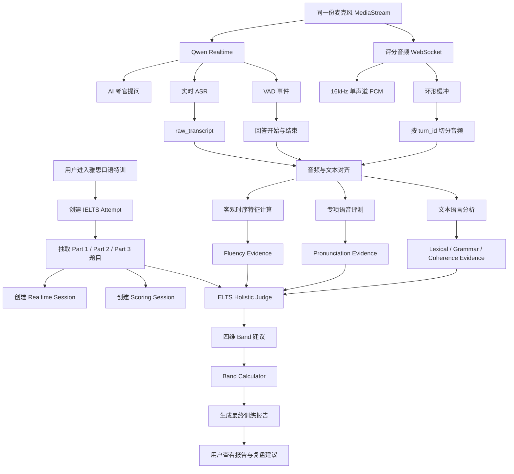
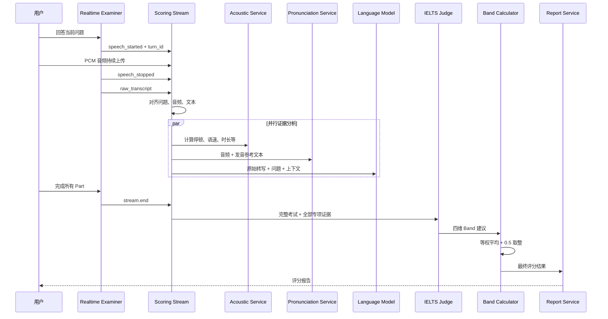

# UniSpeaking 雅思口语专属评分机制设计文档

> 文档状态：方案设计  
> 版本：v1.0  
> 日期：2026-07-21  
> 适用范围：UniSpeaking 雅思口语特训场景  
> 评分性质：AI 训练评估，不代表 IELTS 官方考试成绩

---

## 1. 文档目的

本文档定义 UniSpeaking 雅思口语特训从用户开始训练、完成 Part 1/Part 2/Part 3，到系统完成音频分析、语言分析、四维评分和报告展示的完整流程。

本文档主要解决以下问题：

1. 雅思训练过程中，Realtime 模型、评分后端、语音评测模型和文本模型分别负责什么。
2. 用户音频、ASR 转写、题目、回答和评分结果如何关联。
3. 雅思四个评分维度如何采集证据、生成分数并计算最终 Band。
4. Part 1、Part 2、Part 3 如何参与整体评分。
5. 评分服务失败、音频缺失、考试中断时如何降级。
6. 现有 `7.21/demo_freechat_scoring` 中哪些能力可以复用，哪些必须为 IELTS 重做。
7. MVP 第一阶段应该实现到什么程度。

---

## 2. 核心结论

雅思口语评分不应由 Realtime 模型独立完成。

推荐使用以下组合架构：

```text
Qwen Realtime
负责：考官语音、问题提问、ASR、VAD、实时交互

评分音频 WebSocket
负责：保存 PCM 音频、切分回答、对齐 turn_id、提取时序数据

专项语音评测服务
负责：发音准确度、单词级结果、语速和部分流利度证据

非 Realtime 文本模型
负责：词汇、语法、连贯性、回答展开度和上下文理解

IELTS Holistic Judge
负责：根据官方评分描述、完整考试内容和专项证据生成四维 Band 建议

确定性 Band Calculator
负责：校验分数、四项等权平均、0.5 档位取整和置信度控制
```

最终分工可以概括为：

```text
Realtime Model = AI Examiner
Speech Engine = Pronunciation Evidence Provider
Text Model = Language Evidence Provider
IELTS Judge = Descriptor-based Evaluator
Rule Engine = Final Band Calculator
```

---

## 3. 设计原则

### 3.1 考试与评分分离

考试链路优先保证：

- 低延迟
- 稳定提问
- 不打断用户
- Part 流程正确
- 考官角色稳定

评分链路优先保证：

- 评分证据完整
- 模型输出结构化
- 评分结果可追踪
- 部分服务失败时可降级
- 不阻塞用户继续考试

因此，用户回答后可以立即进入下一题，评分任务在后台异步执行；严格模考模式下，考试过程中不向用户展示分数。

### 3.2 原始数据不可被覆盖

系统必须永久区分：

```text
raw_transcript
原始 ASR 转写

pronunciation_reference_text
仅用于发音对齐的参考文本

corrected_expression
仅用于考后教学建议的改写文本
```

雅思词汇和语法评分必须基于 `raw_transcript`，不能基于纠正后的表达。

### 3.3 证据与 Band 分离

专项服务输出的 0–100 分只是评分证据，不可直接换算为 IELTS Band。

例如：

```text
讯飞发音 80 分 ≠ IELTS Pronunciation Band 8
Qwen 语法 70 分 ≠ IELTS Grammar Band 7
```

最终 Band 必须依据四项评分描述、整场表现和多项证据综合生成。

### 3.4 四项等权

最终评分维度为：

1. Fluency and Coherence
2. Lexical Resource
3. Grammatical Range and Accuracy
4. Pronunciation

四项权重相等：

```text
Overall Speaking Band
= (FC + LR + GRA + P) / 4
```

任务完成度、回答切题度和 Cue Card 覆盖度可以作为训练诊断，但不单独加入最终 Band。

### 3.5 全程评分，而不是单题决定

正式报告基于整场考试表现生成。

系统可以为每个回答保存局部证据，但不能用单道题的评分直接代表最终能力。

---

## 4. 系统整体架构



---

## 5. 关键服务与职责

### 5.1 `IeltsAttemptService`

负责：

- 创建一次雅思训练记录
- 绑定用户
- 绑定抽取的整套题目
- 保存题目快照
- 记录训练模式
- 记录当前考试状态
- 管理考试开始、完成、中断和放弃状态

### 5.2 `IeltsPaperAssembler`

负责：

- 从 Part 1 题组中抽取一组题
- 从 P2&P3 联合题库中抽取一个完整话题对象
- 保证 Part 2 和 Part 3 主题一致
- 避免近期重复题目
- 保存本次题目快照
- 生成本次考试的固定题目顺序

### 5.3 `IeltsExamController`

负责：

- 控制 Part 1、Part 2、Part 3 的状态流转
- 控制每次只问一道题
- 控制是否允许追问
- 控制 Part 2 准备和回答倒计时
- 控制考试结束
- 向 Realtime 模型下发当前题目和考官指令

### 5.4 `RealtimeExaminerService`

负责：

- AI 考官语音输出
- 用户语音输入
- 实时 ASR
- VAD 事件
- 必要的动态追问
- 维持正式、中立、简洁的考官行为

不负责：

- 最终评分
- 自行抽题
- 自行切换 Part
- 自行结束考试
- 考试中纠错或教学

### 5.5 `IeltsScoringStreamHandler`

由现有 `ScoringStreamHandler` 改造而来，负责：

- 接收同一份麦克风 PCM 音频
- 保存短时环形缓冲
- 接收 `speech_started`
- 接收 `speech_stopped`
- 接收 `transcript_completed`
- 根据 `turn_id` 对齐音频与文本
- 生成每个回答的评分任务
- 在考试结束时完成流关闭和尾部数据补齐

### 5.6 `IeltsAcousticFeatureService`

负责确定性计算：

- 音频总时长
- 有效说话时长
- 沉默时长和比例
- 回答启动延迟
- 平均语速
- 有效语速
- 长停顿次数
- 平均停顿长度
- 填充词数量
- 重复次数
- 自我修正次数
- 连续发言片段长度
- Part 2 连续表达时长
- 音频质量和丢包风险

### 5.7 `IeltsPronunciationService`

负责调用专项语音服务，获得：

- 发音准确度证据
- 单词级发音结果
- 可能的音素错误
- 语速
- 完整度
- 可理解度辅助证据
- 音频质量标记

雅思自由表达不应只使用 `read_sentence` 跟读模式。应优先使用自由题、主题表达或适合自由口语的评测模式。

### 5.8 `IeltsLanguageEvidenceService`

使用非 Realtime 文本模型，分析：

- 词汇范围
- 词汇准确性
- 搭配
- 同义改写
- 语法范围
- 语法准确性
- 错误对理解的影响
- 连接方式
- 观点推进
- 回答是否自然展开
- Part 3 抽象讨论能力

### 5.9 `IeltsHolisticJudgeService`

负责整合：

- 完整考试问题
- 完整原始转写
- 各回答时长
- 客观流利度指标
- 专项发音结果
- 文本语言分析结果
- Part 1/2/3 表现
- IELTS 四维评分描述

输出四项 Band 建议、证据、反证和置信度。

### 5.10 `IeltsBandCalculator`

负责：

- 校验四项分数是否属于允许范围
- 校验是否满足完整评分条件
- 四项等权平均
- 取整到 0.5 Band
- 计算总置信度
- 生成 Band 区间
- 避免大模型自行计算产生误差

---

## 6. 用户完整流程

## 6.1 用户进入雅思口语特训

用户从场景训练首页进入：

```text
场景训练
→ 雅思口语特训
→ 查看考试说明
→ 开始训练
```

开始页显示：

- 预计用时 11–14 分钟
- 包含 Part 1、Part 2、Part 3
- 严格模考过程中不提供纠错
- 结束后生成 AI 预估评分
- 评分不代表官方成绩
- 需要麦克风权限

用户点击“开始训练”后，前端发起：

```http
POST /api/ielts/attempts
```

请求示例：

```json
{
  "user_id": "user_001",
  "mode": "mock",
  "question_bank_version": "2026-01_04",
  "locale": "zh-CN"
}
```

后端完成：

1. 创建 `attempt_id`
2. 抽取本次题目
3. 保存题目快照
4. 创建初始状态
5. 返回考试配置

---

## 6.2 权限与设备检查

系统检查：

- 麦克风是否可用
- 用户是否授权
- 音频采样是否正常
- 浏览器是否支持 WebRTC
- 评分 WebSocket 是否可连接
- 网络状况是否适合开始考试

若评分服务暂时不可用，但 Realtime 对话正常：

```text
允许开始考试
→ 标记 scoring_degraded
→ 保存尽可能多的数据
→ 结束后生成部分报告
```

若麦克风不可用：

```text
不开始正式考试
→ 提示用户检查权限或设备
```

---

## 6.3 创建双链路会话

用户只授权一次麦克风。

同一份 `MediaStream` 同时进入：

```text
链路 A：Realtime 考试链路
链路 B：评分音频采集链路
```

前端创建：

```text
realtime_session_id
scoring_session_id
```

并绑定到同一个：

```text
attempt_id
```

关键关联字段：

```json
{
  "attempt_id": "attempt_001",
  "realtime_session_id": "rt_001",
  "scoring_session_id": "score_001",
  "user_id": "user_001"
}
```

---

## 6.4 Part 1 流程

状态流转：

```text
PART_1_INTRODUCTION
→ PART_1_QUESTIONING
→ PART_1_COMPLETED
```

每道题流程：

1. `IeltsExamController` 读取当前题目。
2. 将当前题目下发给 Realtime Examiner。
3. AI 考官只说当前问题。
4. 用户开始回答。
5. Realtime 发出 `speech_started`。
6. 评分服务创建 `turn_id` 音频区间。
7. 用户结束回答。
8. Realtime 发出 `speech_stopped`。
9. Realtime 返回最终 ASR 文本。
10. 系统将题目、音频、文本和时序数据绑定。
11. 后台启动该回答的证据分析。
12. 前端进入下一题，不等待评分结果。

Part 1 的短回答不能简单按“词数少”判为低分。

例如：

```text
Question: Do you work or are you a student?
Answer: I'm a university student.
```

这是语境上有效的回答。

因此 Part 1 应保留短回答，但在最终评分时结合多轮表现综合判断。

---

## 6.5 Part 2 准备阶段

状态流转：

```text
PART_2_INSTRUCTION
→ PART_2_PREPARATION
```

系统显示：

- Part 2 Cue Card
- `You should say`
- 题目提示点
- 60 秒准备倒计时
- 可选关键词笔记区

准备阶段：

- 不采集用户正式回答分数
- 可以保留麦克风连接
- 不将用户自言自语自动计入正式回答
- 倒计时由程序控制
- Realtime 模型不得自行提前开始

准备结束后，系统进入：

```text
PART_2_SPEAKING
```

---

## 6.6 Part 2 连续陈述阶段

Part 2 是评分机制中最重要的长回答证据来源之一。

系统要求：

- 用户最多连续表达约 2 分钟
- 普通短暂停顿不得立即结束回答
- 不能沿用普通自由对话的激进 VAD 结束逻辑
- 用户明确说 `That's all` 时可以提前结束
- 达到时间上限后由程序结束
- 长时间完全无声时才进行轻量提示

Part 2 音频建议保存为：

```text
一个完整 long_turn 音频段
+
内部 speech chunks
```

数据结构：

```json
{
  "turn_type": "part2_long_turn",
  "part": 2,
  "question_id": "p2_topic_001",
  "audio_segment_id": "audio_002",
  "speech_chunks": [
    {
      "started_at_ms": 0,
      "ended_at_ms": 12500
    },
    {
      "started_at_ms": 13900,
      "ended_at_ms": 40200
    }
  ]
}
```

这样既能进行整体评分，也能分析内部停顿。

Part 2 完成后，可以进行 1 个简短 follow-up，但该 follow-up 单独保存为普通回答。

---

## 6.7 Part 3 流程

状态流转：

```text
PART_3_INTRODUCTION
→ PART_3_DISCUSSION
→ PART_3_COMPLETED
```

Part 3 主问题来自题库。

动态追问规则：

- 最多追问一次
- 必须与当前主题相关
- 必须基于用户上一回答
- 不得引入题库外的新主题
- 不得进行教学或纠错
- 达到时间预算后进入下一题

记录字段：

```json
{
  "question_source": "bank",
  "follow_up_allowed": true,
  "follow_up_generated": false
}
```

动态追问则记录：

```json
{
  "question_source": "generated_follow_up",
  "parent_question_id": "p3_q01"
}
```

Part 3 重点提供：

- 抽象表达证据
- 观点展开证据
- 比较和分析能力
- 复杂语法使用
- 词汇精确度
- 回答逻辑与连贯性

---

## 6.8 用户完成考试

最后一道题完成后，系统进入：

```text
TEST_COMPLETING
```

此时完成：

1. 停止 Realtime 考官继续提问。
2. 关闭用户正式回答入口。
3. 发送 `stream.end` 给评分 WebSocket。
4. 补齐最后一轮尾部音频。
5. 等待最后一轮 ASR 最终结果。
6. 将仍在执行的评分任务转入后台 Job。
7. 保存完整考试转写。
8. 标记考试主体已结束。

前端展示：

```text
考试已完成
正在生成评分报告……
```

此时不能立即删除评分会话。

---

## 7. 音频采集与分轮机制

## 7.1 音频格式

评分链路统一使用：

```text
16 kHz
单声道
16-bit PCM
```

## 7.2 环形缓冲

建议复用现有设计：

```text
约 5 秒环形缓冲
约 500 ms 前置音频
约 700 ms 尾部音频
```

目的：

- 避免 VAD 事件稍晚到达导致句首丢失
- 避免用户最后一个音节被截断
- 让发音服务获得完整语音

## 7.3 核心标识

每个用户回答必须绑定：

```text
attempt_id
session_id
part
question_id
question_index
turn_id
realtime_item_id
audio_segment_id
```

## 7.4 音频与转写完成条件

只有同时满足以下条件，才启动完整评分：

```text
audio_ready = true
raw_transcript_ready = true
question_context_ready = true
```

若音频存在但转写缺失：

- 可计算部分流利度和音频指标
- 不生成 LR/GRA 完整评分
- 标记 `partial_audio_only`

若转写存在但音频缺失：

- 可分析词汇、语法和文本连贯性
- 不生成完整 Pronunciation
- 标记 `partial_text_only`

---

## 8. 评分任务完整流程

考试过程中，每个回答可以异步生成局部证据；考试结束后，再进行整场综合评分。



---

## 9. ASR 参考文本处理

专项发音服务可能需要参考文本。

但 ASR 可能出现：

```text
用户实际说 beach
ASR 识别为 peach
```

若直接使用错误转写，系统可能把 ASR 错误误判为用户发音错误。

处理流程：

```text
raw_transcript
→ 高置信度 ASR 错词判断
→ Java/服务端硬校验
→ pronunciation_reference_text
```

允许的修改：

- 大小写
- 标点
- 最多少量高置信度同音或近音错词
- 不改变语法
- 不改变时态
- 不改变冠词
- 不改变单复数
- 不润色表达

任何不确定情况都回退：

```text
pronunciation_reference_text = raw_transcript
```

---

## 10. 客观流利度特征

客观指标由程序计算，不依赖大模型自由判断。

建议至少包含：

```json
{
  "answer_duration_ms": 82000,
  "speech_duration_ms": 65100,
  "silence_duration_ms": 16900,
  "silence_ratio": 0.206,
  "word_count": 142,
  "speech_rate_wpm": 131,
  "articulation_rate_wpm": 157,
  "response_latency_ms": 1800,
  "pause_count": 9,
  "long_pause_count": 3,
  "avg_pause_ms": 930,
  "max_pause_ms": 2800,
  "filler_count": 6,
  "repetition_count": 2,
  "self_correction_count": 2,
  "longest_continuous_speech_ms": 18800
}
```

注意：

- 停顿不一定代表能力弱。
- 内容思考停顿和搜索语言停顿需要结合上下文判断。
- Part 2 短暂停顿不能由 VAD 自动切成多个独立答案。
- 网络抖动和丢包造成的空白不能当作用户停顿。

---

## 11. 四维评分机制

# 11.1 Fluency and Coherence

## 目标

判断用户是否能够持续、自然、有组织地表达观点。

## 输入证据

### 音频时序证据

- 语速
- 有效语速
- 沉默比例
- 长停顿
- 填充词
- 重复
- 自我修正
- 回答启动延迟
- 连续表达长度

### 文本与话语证据

- 观点之间是否有关联
- 是否能够自然展开
- 是否过度使用简单连接词
- 是否频繁中断和重新开始
- Part 2 是否能持续组织长回答
- Part 3 是否能进行原因、比较和举例

## 输出结构

```json
{
  "band": 6.5,
  "band_range": [6.0, 7.0],
  "confidence": 0.81,
  "positive_evidence": [
    "Part 2 能持续表达约 95 秒",
    "能够使用原因和例子推进观点"
  ],
  "limiting_evidence": [
    "复杂观点前出现多次长停顿",
    "部分连接词重复"
  ]
}
```

---

# 11.2 Lexical Resource

## 目标

判断用户是否具备足够的词汇范围、准确性和灵活性来表达熟悉与抽象话题。

## 输入证据

- 词汇多样度
- 高频词重复率
- 话题词汇覆盖
- 搭配准确性
- 词义准确性
- 词形错误
- 同义改写
- 释义能力
- 不熟悉单词时是否能换一种方式说明
- Part 3 抽象词汇使用

## 不应采用的简单规则

```text
难词越多 = 分数越高
单词越长 = 分数越高
```

应关注：

```text
range
precision
appropriacy
flexibility
paraphrasing
```

## 输出结构

```json
{
  "band": 6.0,
  "band_range": [5.5, 6.5],
  "confidence": 0.76,
  "positive_evidence": [
    "能够使用与教育主题相关的词汇",
    "部分位置能够使用同义表达"
  ],
  "limiting_evidence": [
    "important 和 good 重复较多",
    "个别搭配不自然"
  ]
}
```

---

# 11.3 Grammatical Range and Accuracy

## 目标

判断用户是否能够使用不同句型，并保持足够的语法准确性。

## 输入证据

- 简单句比例
- 复杂句比例
- 从句类型
- 时态范围
- 主谓一致
- 冠词
- 单复数
- 介词
- 条件句
- 被动语态
- 关系从句
- 语法错误频率
- 错误是否影响理解
- 连续多个句子的稳定性

需要拆分：

```text
range_score
accuracy_score
communication_impact
```

不能只用“错误数量”决定分数。

例如：

- 用户尝试复杂结构并出现少量错误，与只使用简单句不是同一种表现。
- 某些错误虽然存在，但不影响理解。
- 某些错误会直接改变句意，需要更高权重。

## 输出结构

```json
{
  "band": 6.0,
  "band_range": [5.5, 6.5],
  "confidence": 0.79,
  "positive_evidence": [
    "能够使用 because、although 和关系从句",
    "多数简单句准确"
  ],
  "limiting_evidence": [
    "复杂句中时态不稳定",
    "第三人称单数错误重复出现"
  ]
}
```

---

# 11.4 Pronunciation

## 目标

判断用户语音是否易于理解，以及是否能够使用一组发音特征传递意义。

## 输入证据

- 整体可理解度
- 听者理解负担
- 单词发音
- 音素错误
- 单词重音
- 句子重音
- 节奏
- 语调
- 音群划分
- 连读
- 弱读
- 语速
- 停顿方式
- 长回答中的清晰度稳定性

专项语音服务可提供：

- 单词级发音结果
- 音素级证据
- 发音准确度
- 语速
- 完整度

但最终 Pronunciation Band 需要综合：

```text
专项语音服务
+
客观时序指标
+
整体音频可理解度判断
```

## 输出结构

```json
{
  "band": 6.5,
  "band_range": [6.0, 7.0],
  "confidence": 0.73,
  "positive_evidence": [
    "大部分内容清晰可理解",
    "能够使用部分句子重音强调观点"
  ],
  "limiting_evidence": [
    "多个词尾辅音不清晰",
    "长句节奏较平，部分位置需要听者额外努力"
  ]
}
```

---

## 12. Part 1、Part 2、Part 3 的评分关系

产品内部不设置公开的固定 Part 权重，例如：

```text
Part 1 = 20%
Part 2 = 30%
Part 3 = 50%
```

更合理的方式是将三个 Part 作为不同类型的证据来源。

### Part 1 提供

- 熟悉话题下的自然反应
- 基础语法准确性
- 日常词汇
- 简短回答的流畅度
- 回答启动速度

### Part 2 提供

- 持续表达
- 结构组织
- 话题展开
- 较长语法结构
- 词汇范围
- 长回答中的发音和节奏稳定性

### Part 3 提供

- 抽象表达
- 分析和比较
- 观点解释
- 复杂语法
- 精确词汇
- 连贯论证
- 临场应对追问

内部聚合可以按：

```text
有效说话时长
有效词数
证据丰富度
题型覆盖度
```

进行加权，但每道题设置权重上限，避免某一段极长回答完全决定总分。

---

## 13. 完整评分条件

推荐将评分结果分为三种等级。

### 13.1 完整评分

建议内部条件：

- Part 1 至少完成 3 个有效回答
- Part 2 有有效长回答
- Part 2 有效表达不少于建议最低时长
- Part 3 至少完成 2 个有效回答
- 存在足够的音频和转写
- 四项评分均有有效证据

输出：

```text
完整 AI 预估 Band
四维分数
Band 区间
置信度
完整改进报告
```

### 13.2 部分评分

出现：

- 某一 Part 未完成
- 音频服务失败
- 文本模型失败
- 有效回答不足
- Part 2 太短
- 网络中断

输出：

```text
已有维度结果
缺失原因
低置信度提示
不强行生成完整总分
```

### 13.3 不可评分

出现：

- 几乎没有有效英文
- 音频完全不可用
- 转写严重缺失
- 用户开始后立即退出
- 会话数据无法对应

输出：

```text
本次数据不足，无法生成可靠评分
```

不能使用 0 分代替缺失维度。

---

## 14. IELTS Holistic Judge 输入与输出

## 14.1 输入

```json
{
  "attempt": {
    "mode": "mock",
    "completed_parts": [1, 2, 3]
  },
  "questions": [],
  "raw_transcript": [],
  "turn_evidence": [],
  "acoustic_summary": {},
  "pronunciation_summary": {},
  "language_summary": {},
  "data_quality": {}
}
```

## 14.2 系统 Prompt 要求

Judge 必须：

1. 根据四个评分维度独立判断。
2. 不使用纠正后的文本替代原始表达。
3. 每个分数必须提供证据。
4. 同时提供限制该分数上升的证据。
5. 证据不足时降低置信度。
6. 不根据单个错误直接降低整项 Band。
7. 不因使用少量高级词汇直接提高分数。
8. 不自行计算最终 Overall Band。
9. 只返回结构化 JSON。
10. 不声称结果是官方成绩。

## 14.3 输出

```json
{
  "fluency_coherence": {
    "band": 6.5,
    "lower_bound": 6.0,
    "upper_bound": 7.0,
    "confidence": 0.81,
    "positive_evidence": [],
    "limiting_evidence": []
  },
  "lexical_resource": {
    "band": 6.0,
    "lower_bound": 5.5,
    "upper_bound": 6.5,
    "confidence": 0.76,
    "positive_evidence": [],
    "limiting_evidence": []
  },
  "grammatical_range_accuracy": {
    "band": 6.0,
    "lower_bound": 5.5,
    "upper_bound": 6.5,
    "confidence": 0.79,
    "positive_evidence": [],
    "limiting_evidence": []
  },
  "pronunciation": {
    "band": 6.5,
    "lower_bound": 6.0,
    "upper_bound": 7.0,
    "confidence": 0.73,
    "positive_evidence": [],
    "limiting_evidence": []
  }
}
```

---

## 15. Band 计算规则

模型不计算最终 Overall Band。

后端执行：

```text
raw_average = (FC + LR + GRA + P) / 4
overall_band = round_to_nearest_half(raw_average)
```

伪代码：

```javascript
function calculateOverallBand(scores) {
  const values = [
    scores.fluencyCoherence,
    scores.lexicalResource,
    scores.grammaticalRangeAccuracy,
    scores.pronunciation,
  ];

  if (values.some((score) => score == null)) {
    return null;
  }

  const average =
    values.reduce((total, score) => total + score, 0) / values.length;

  return Math.round(average * 2) / 2;
}
```

分项 Band 允许值：

```text
0.0, 0.5, 1.0, 1.5 ... 8.5, 9.0
```

产品第一版也可以将主要输出限制在：

```text
4.0–8.0
```

但数据库应保留完整范围。

---

## 16. 评分置信度

每项置信度考虑：

- 有效音频时长
- 有效问题数量
- 是否完成全部 Part
- ASR 质量
- 音频质量
- 专项服务是否成功
- 模型之间是否冲突
- 证据是否覆盖多个问题
- 分项 Band 是否处于边界

建议：

```text
High：0.80–1.00
Medium：0.60–0.79
Low：低于 0.60
```

总置信度不采用简单平均，可取四项置信度的加权结果，并对数据缺失进行惩罚。

报告示例：

```text
AI 预估 Band：6.0–6.5
中心估计：6.5
评分置信度：中等
```

---

## 17. 训练报告结构

```text
雅思口语 AI 训练报告
├── 本次考试概览
│   ├── 完成状态
│   ├── 总时长
│   ├── 有效说话时长
│   ├── 完成题目数
│   └── 数据质量
│
├── AI 预估结果
│   ├── Overall Band
│   ├── Band 区间
│   └── 置信度
│
├── 四维评分
│   ├── Fluency and Coherence
│   ├── Lexical Resource
│   ├── Grammatical Range and Accuracy
│   └── Pronunciation
│
├── 分 Part 表现
│   ├── Part 1
│   ├── Part 2
│   └── Part 3
│
├── 关键证据
│   ├── 优势
│   ├── 限制项
│   └── 原回答示例
│
├── 发音反馈
│   ├── 薄弱单词
│   ├── 可理解度
│   ├── 重音节奏
│   └── 建议练习
│
├── 语言反馈
│   ├── 词汇重复
│   ├── 搭配问题
│   ├── 语法错误模式
│   └── 更自然表达
│
└── 下一步训练建议
    ├── 首要改进项
    ├── 推荐训练主题
    └── 建议目标
```

必须展示声明：

> 本报告由 AI 根据本次训练音频和转写生成，仅用于学习参考，不代表 IELTS 官方成绩、认证考官评分或考试结果。

---

## 18. 严格模考与练习模式

## 18.1 严格模考

考试期间：

- 不显示分数
- 不显示语法纠错
- 不显示薄弱单词
- 不提示更好的答案
- 不允许随意重答
- 考试结束后统一生成报告

## 18.2 练习模式

可以支持：

- 每个 Part 后查看反馈
- 单题重答
- 查看思路提示
- 查看示例表达
- 只练某一个 Part
- 使用同一题再次回答

评分底层可以复用，但前端展示策略不同。

---

## 19. 异步评分状态

```text
NOT_STARTED
→ COLLECTING
→ FINALIZING_INPUT
→ EXTRACTING_FEATURES
→ SCORING_PRONUNCIATION
→ SCORING_LANGUAGE
→ HOLISTIC_JUDGING
→ CALCULATING_BAND
→ GENERATING_REPORT
→ REPORT_READY
```

异常状态：

```text
PARTIAL_READY
SCORING_FAILED
INSUFFICIENT_DATA
ABANDONED
```

前端轮询或使用事件通知：

```json
{
  "type": "ielts.scoring.status",
  "attempt_id": "attempt_001",
  "status": "HOLISTIC_JUDGING",
  "progress": 78
}
```

---

## 20. 服务降级策略

### 20.1 讯飞或专项语音服务失败

保留：

- 流利度时序证据
- 文本评分
- 部分 Pronunciation 证据

结果：

```text
Pronunciation 低置信度或暂不评分
其他三项正常返回
不使用 0 分填充
```

### 20.2 文本模型失败

保留：

- 音频时序
- 发音评测
- 原始转写

结果：

```text
Pronunciation 可返回
FC 仅返回客观流利度报告
LR/GRA 暂不生成完整 Band
```

### 20.3 Realtime ASR 缺失

可尝试：

- 对已保存音频进行离线 ASR
- 使用离线结果作为补充转写
- 标记 transcript_source

```json
{
  "transcript_source": "offline_recovery"
}
```

### 20.4 网络中断

保存：

```text
last_completed_part
last_question_index
termination_reason
audio_uploaded_until
```

中断考试默认不生成完整 Band，只生成阶段性反馈。

### 20.5 最后一轮评分未完成

考试结束接口不能立即删除会话。

应：

```text
结束考试
→ 等待短时间完成当前任务
→ 未完成任务转后台队列
→ 前端显示报告生成中
```

---

## 21. 数据库设计建议

## 21.1 `ielts_attempts`

```text
id
user_id
mode
status
question_bank_version
current_part
current_question_index
started_at
completed_at
termination_reason
scoring_status
overall_band
overall_lower_bound
overall_upper_bound
confidence
```

## 21.2 `ielts_attempt_questions`

```text
id
attempt_id
part
question_id
question_text_snapshot
cue_card_snapshot
topic_cluster_snapshot
question_source
parent_question_id
sort_order
```

## 21.3 `ielts_turns`

```text
id
attempt_id
question_snapshot_id
part
turn_id
realtime_item_id
raw_transcript
pronunciation_reference_text
started_at
ended_at
duration_ms
word_count
status
```

## 21.4 `ielts_audio_segments`

```text
id
attempt_id
turn_id
storage_path
format
sample_rate
channels
duration_ms
quality_status
created_at
```

## 21.5 `ielts_acoustic_features`

```text
id
turn_id
speech_rate_wpm
articulation_rate_wpm
silence_ratio
pause_count
long_pause_count
avg_pause_ms
filler_count
repetition_count
self_correction_count
feature_version
```

## 21.6 `ielts_pronunciation_evidence`

```text
id
turn_id
provider
provider_mode
accuracy_score
fluency_evidence
integrity_score
intelligibility_evidence
word_results_json
raw_provider_result
status
```

## 21.7 `ielts_language_evidence`

```text
id
attempt_id
turn_id
lexical_evidence_json
grammar_evidence_json
coherence_evidence_json
model
prompt_version
status
```

## 21.8 `ielts_dimension_scores`

```text
id
attempt_id
dimension
band
lower_bound
upper_bound
confidence
positive_evidence_json
limiting_evidence_json
judge_model
rubric_version
```

## 21.9 `ielts_reports`

```text
id
attempt_id
overall_band
band_range
confidence
report_json
report_version
created_at
```

## 21.10 `ielts_scoring_jobs`

```text
id
attempt_id
job_type
status
retry_count
error_code
error_message
started_at
completed_at
```

---

## 22. API 设计建议

### 创建考试

```http
POST /api/ielts/attempts
```

### 获取考试题目和状态

```http
GET /api/ielts/attempts/{attemptId}
```

### 建立评分音频流

```text
WS /api/ielts/scoring/stream?attempt_id={attemptId}
```

### 记录回答事件

```http
POST /api/ielts/attempts/{attemptId}/turns/events
```

### 结束考试

```http
POST /api/ielts/attempts/{attemptId}/finalize
```

### 查看评分状态

```http
GET /api/ielts/attempts/{attemptId}/scoring-status
```

### 获取报告

```http
GET /api/ielts/attempts/{attemptId}/report
```

---

## 23. WebSocket 事件建议

前端发送：

```text
stream.start
part.started
question.asked
turn.speech_started
turn.speech_stopped
turn.transcript_completed
part2.preparation_started
part2.speaking_started
part2.speaking_completed
stream.end
```

后端返回：

```text
stream.ready
turn.input_ready
turn.evidence_started
turn.evidence_completed
scoring.finalizing
scoring.status
report.ready
stream.warning
stream.error
```

---

## 24. 与现有 7.21 评分机制的复用关系

## 24.1 可复用

```text
ScoringStreamHandler
├── WebSocket 二进制音频
├── PCM 缓冲
├── PRE_ROLL / POST_ROLL
├── turn_id 对齐
├── 并行 CompletableFuture
├── provider 独立失败
└── score_completed 事件
```

```text
QwenScoringService
├── JSON 强约束输出
├── 低温度
├── ASR 参考文本纠正
├── 服务端硬校验
└── 异步请求
```

```text
XfyunIseService
├── 鉴权
├── WebSocket 音频上传
├── XML 解析
├── 单词结果
└── 服务降级
```

## 24.2 必须改造

### 当前

```text
发音表现
语言质量
任务完成度
```

### IELTS

```text
Fluency and Coherence
Lexical Resource
Grammatical Range and Accuracy
Pronunciation
```

必须重写：

- Qwen 评分 Prompt
- 最终分数公式
- 任务完成度定位
- 讯飞评测模式
- 报告结构
- Part 2 音频分段
- 完整考试 Judge
- Band 置信度
- 数据持久化

### 当前公式需废弃

```text
发音 × 40%
+ 语言质量 × 35%
+ 任务完成度 × 25%
```

### IELTS 公式

```text
FC × 25%
+ LR × 25%
+ GRA × 25%
+ P × 25%
```

---

## 25. 模型选择建议

## 25.1 考试交互

使用：

```text
Qwen Realtime
```

负责低延迟语音交互，不负责最终评分。

## 25.2 语言专项分析

第一版可继续使用：

```text
qwen-plus
```

要求：

- 非 Realtime
- JSON 输出
- 温度约 0–0.2
- 固定 Prompt 版本
- 完整上下文
- 评分证据可追踪

后续可通过人工标注样本比较不同模型的一致性。

## 25.3 发音专项分析

第一版：

```text
讯飞 ISE 自由题/主题模式
+
本地客观时序特征
```

后续可增加：

- 音频理解模型
- 专门的 intelligibility 模型
- 重音、节奏和语调分析
- 人工考官校准数据

## 25.4 IELTS Judge

建议使用独立非 Realtime 模型。

不要与 Realtime Examiner 共享同一个会话上下文，以减少角色冲突和自我评价偏差。

---

## 26. MVP 实现范围

第一阶段建议实现：

1. 完整三 Part 考试。
2. 同一麦克风双链路。
3. PCM 音频保存和分轮。
4. Part 2 长回答特殊分段。
5. 原始转写保存。
6. 客观时序特征。
7. 专项发音服务。
8. 非 Realtime 文本分析。
9. 四维 IELTS Judge。
10. 后端 Band Calculator。
11. 完整/部分/不可评分状态。
12. 考后统一报告。
13. AI 评分免责声明。
14. 评分结果持久化。

第一阶段暂不承诺：

- 与官方考官完全一致
- 音素级错误百分之百准确
- 官方 Band 认证
- 自动识别所有语调和重音问题
- 当季题目预测
- 考试过程中实时纠错

---

## 27. 后续迭代

### 第二阶段：评分校准

收集：

- 不同水平真实语音样本
- 多名英语教师评分
- 专业雅思教师评分
- 模型评分结果
- 评分差异

建立：

```text
人工评分
vs
模型证据
vs
最终 Band
```

用于校准阈值和 Prompt。

### 第三阶段：多评审模型

对边界样本使用：

```text
Judge A
Judge B
规则仲裁
```

只有出现较大分歧时才触发第二 Judge，控制成本。

### 第四阶段：个性化训练闭环

将评分结果映射到：

- 流利度专项训练
- Part 2 展开训练
- Part 3 论证训练
- 高频语法错误训练
- 词汇替换训练
- 发音薄弱单词训练

---

## 28. 验收标准

### 流程验收

- [ ] 用户可以完成 Part 1、Part 2、Part 3。
- [ ] 考试过程中不显示评分和纠错。
- [ ] Part 2 短暂停顿不会立即结束。
- [ ] 最后一轮音频和转写能够保存。
- [ ] 考试结束后进入评分状态。
- [ ] 报告完成后可以查看。

### 数据验收

- [ ] 每个回答绑定正确题目。
- [ ] 音频与转写使用同一个 `turn_id`。
- [ ] 保存原始转写。
- [ ] 保存题目快照。
- [ ] 保存 Part 和问题序号。
- [ ] 保存数据质量状态。
- [ ] 服务失败不会写入虚假零分。

### 评分验收

- [ ] 输出 FC、LR、GRA、P 四项。
- [ ] 四项使用相同权重。
- [ ] 最终分数由后端计算。
- [ ] 每项均包含正向和限制证据。
- [ ] 数据不足时降低置信度。
- [ ] 缺失维度时不生成虚假完整总分。
- [ ] 任务完成度不直接参与 Band。
- [ ] 报告明确标注 AI 训练评估。

### 工程验收

- [ ] Realtime 失败与评分失败相互隔离。
- [ ] 发音服务和文本服务并行。
- [ ] 每个评分 Job 可重试。
- [ ] Prompt 和评分规则具有版本号。
- [ ] 报告可追溯到原音频、原题目和原转写。
- [ ] 用户退出后资源可以正确释放。

---

## 29. 顶层伪代码

```javascript
async function runIeltsSpeakingTraining(userId) {
  const attempt = await ieltsAttemptService.createAttempt({
    userId,
    mode: "mock",
  });

  const paper = await paperAssembler.createPaper({
    userId,
    attemptId: attempt.id,
  });

  const realtimeSession = await realtimeExaminer.createSession({
    attempt,
    paper,
  });

  const scoringSession = await scoringService.createSession({
    attemptId: attempt.id,
    realtimeSessionId: realtimeSession.id,
  });

  await microphone.connectTo([
    realtimeSession.audioInput,
    scoringSession.audioInput,
  ]);

  await examController.run({
    attempt,
    paper,
    realtimeSession,
    scoringSession,
  });

  await scoringService.finalizeInput({
    attemptId: attempt.id,
  });

  const evidence = await scoringPipeline.collectAllEvidence({
    attemptId: attempt.id,
  });

  const dimensionScores = await holisticJudge.evaluate({
    attempt,
    paper,
    evidence,
  });

  const finalBand = bandCalculator.calculate({
    fluencyCoherence: dimensionScores.fc.band,
    lexicalResource: dimensionScores.lr.band,
    grammaticalRangeAccuracy: dimensionScores.gra.band,
    pronunciation: dimensionScores.p.band,
  });

  return reportService.generate({
    attempt,
    evidence,
    dimensionScores,
    finalBand,
  });
}
```

---

## 30. 最终流程总结

```text
用户进入雅思口语特训
        ↓
创建 Attempt 并抽取整套题目
        ↓
建立 Qwen Realtime 考试会话
        ↓
建立独立评分音频 WebSocket
        ↓
同一份麦克风同时进入两条链路
        ↓
完成 Part 1
        ↓
完成 Part 2 准备与连续陈述
        ↓
完成 Part 3 深入讨论
        ↓
结束考试并补齐最后一轮数据
        ↓
对齐题目、音频、转写和时序
        ↓
并行执行客观流利度、发音、词汇和语法分析
        ↓
IELTS Judge 根据整场证据生成四维 Band
        ↓
后端按四项等权计算最终 Band
        ↓
生成 Band 区间、置信度和改进建议
        ↓
用户查看完整训练报告
```

---

## 31. 一句话架构定义

> UniSpeaking 雅思口语评分采用“Realtime 模型负责考试、评分流负责证据采集、专项语音服务负责发音证据、非 Realtime 模型负责语言分析、独立 Judge 负责四维判断、规则引擎负责最终 Band”的完整异步评分架构。
