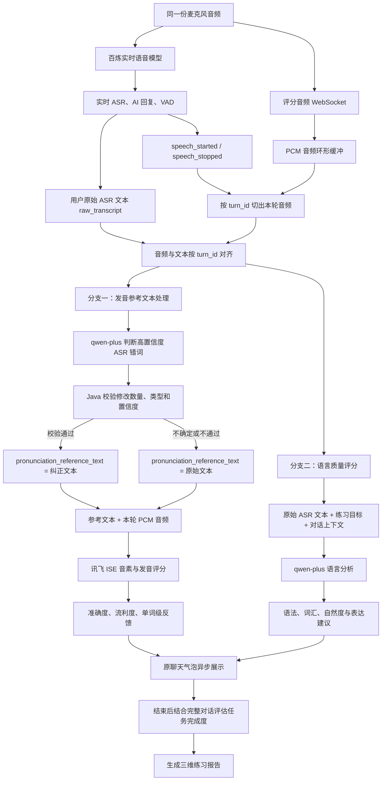

# UniSpeaking Demo 对话评分链路实现说明

## 1. 为什么建设这条链路

实时语音模型适合低延迟对话，但仅靠实时转写无法稳定完成细粒度发音和语言评价。因此，本 Demo 将“顺畅对话”和“深度评分”拆成两条并行链路：对话链路优先保证响应速度，评分链路在后台异步分析，不阻塞用户继续交流。

当前支持：

- **自由对话**：只进行实时语音对话，不启动评分。
- **评分练习**：在实时对话之外，同步采集评分音频，提供逐轮反馈和练习报告。

## 2. 当前实现的完整链路

图中的两个评分分支相互独立、并行执行：生成 `pronunciation_reference_text` 时**不会同时完成语言质量评分**。正常英语回答会分别发起一次发音参考文本请求和一次语言质量评分请求。

## 3. 音频采集与分轮

### 为什么这样做

如果浏览器分别为对话和评分申请麦克风，容易产生重复授权、设备占用和音频不一致。VAD 事件也可能比真实声音稍晚到达；若在收到 `speech_started` 后才开始保存音频，用户句首的辅音或第一个单词可能已丢失，直接影响音素评分。

### 做了什么、怎么做

1. 浏览器只申请一次麦克风权限，同一份 `MediaStream` 同时进入百炼实时对话和本地评分采集。
2. 评分音频被转换为 16 kHz、单声道、16-bit PCM，并通过 WebSocket 持续发送给 Java 后端。
3. 后端持续维护约 5 秒的环形缓冲。它只保留最近音频，避免无限占用内存，同时允许系统在 VAD 事件到达后向前补取声音。
4. 收到 `speech_started` 时，后端创建本轮音频，并从环形缓冲补入约 500 ms 前置音频；收到 `speech_stopped` 后再保留约 700 ms 尾音，以降低 VAD 跨链路延迟造成的首尾截断概率。
5. 音频、VAD 事件和最终转写使用同一个 `turn_id`。只有本轮音频和最终文本都准备完成后才开始评分，避免二者到达顺序不同造成错配。

### 达到的效果

用户只需授权一次麦克风；评分链路获得更完整的句首和句尾音频，并能将每段音频准确关联到对应的聊天气泡。

## 4. 发音参考文本与音素评分

### 为什么需要参考文本纠正

讯飞 ISE 需要“音频 + 参考文本”才能做音素和发音匹配。如果实时 ASR 把用户实际说对的单词识别错，例如把 `beach` 识别成 `peach`，直接使用错误文本会把识别错误误判成发音错误。

但参考文本也不能做普通语法润色，否则用户说出的真实错误会被掩盖。例如 `He go to school` 不能被改成 `He goes to school` 后再评分。

### 做了什么、怎么做

1. 永久保留百炼实时 ASR 返回的原始文本 `raw_transcript`。
2. 后端单独调用 `qwen-plus`，结合原始文本和附近对话上下文，判断是否存在高置信度的 ASR 识别错误。
3. 模型返回候选参考文本、逐词修改说明、错误类型和置信度。
4. Java 后端再次执行硬校验：最多修改两个词、置信度不低于 0.90、只允许单词对单词替换，并拦截冠词、助动词、时态和词形等疑似语法修正。
5. 校验通过时使用纠正文本；模型不确定、超时或校验失败时回退到原始文本。最终得到 `pronunciation_reference_text`。
6. 后端将 `pronunciation_reference_text` 与本轮 PCM 音频一起提交给讯飞 ISE，获得准确度、流利度、完整度和单词级发音结果。
7. 讯飞结果先与实际提交的 `pronunciation_reference_text` 对齐，再利用参考文本映射回原始 ASR 单词序列，使薄弱单词仍能标注在用户看到的原句上。
8. 讯飞明确返回的漏读标记为 `xfyun` 来源并使用灰色删除线；仅由序列差异造成的未匹配标记为 `Unaligned`，使用灰色点线提示“未可靠对齐”，不再直接判定用户漏读。

### 达到的效果

系统减少了“ASR 识别错误被当成发音错误”的情况，同时通过后端硬校验避免模型替用户修复真实语法问题。发音反馈最终仍对应用户原始表达。

## 5. 语言质量评分

### 为什么独立评分

发音参考文本可能包含 ASR 纠正，只适合做音频对齐；若语言评分也使用该文本，就可能无法忠实反映用户的真实表达。另外，单看一句话很难判断它是否自然、是否回答了当前问题，因此需要结合练习目标和对话上下文。

### 做了什么、怎么做

1. 后端从 `raw_transcript` 建立独立语言评分任务，**不使用** `pronunciation_reference_text`。
2. 将原始文本、练习目标、学习者等级以及最近的用户和 AI 对话上下文提交给另一次 `qwen-plus` 请求。
3. 模型按固定 JSON 结构返回语法、词汇、自然度分数，以及中文反馈、更自然的表达和一条重点建议。
4. 后端校验并保存结构化结果，再异步更新原来的用户气泡。

### 达到的效果

语言评分反映用户真正说出的内容，同时能理解这句话在当前对话中的作用，不把孤立但语法正确的句子误认为高质量回答。

## 6. 并行评分与降级

### 为什么并行和独立容错

讯飞发音评分和百炼语言评分的耗时、可用性不同。串行执行会增加等待时间，一个服务失败也可能导致整轮结果丢失。

### 做了什么、怎么做

- 发音参考文本处理与语言质量评分并行启动。
- 发音分支完成参考文本后再调用讯飞 ISE；语言分支直接分析原始文本和上下文。
- 任一分支失败时保留另一分支的有效结果，并标记为部分评分。
- 非英语回答跳过评分；1～2 个英语单词可保留发音评分，但跳过不可靠的语言评分。
- 评分过程不阻塞实时对话，结果完成后异步更新同一个聊天气泡。

### 达到的效果

用户说完即可继续下一轮，评分稍后出现；局部服务异常不会中断对话，也不会丢掉已经成功的评分维度。

## 7. 分数与会话报告

- **发音表现** = 准确度 × 60% + 流利度 × 40%
- **语言质量** = 语法 × 55% + 词汇 × 25% + 自然度 × 20%
- **单轮综合分** = 发音表现 × 55% + 语言质量 × 45%
- **任务完成度** = 目标覆盖 × 40% + 沟通有效性 × 30% + 互动完成度 × 30%
- **最终总分** = 发音表现 × 40% + 语言质量 × 35% + 任务完成度 × 25%

逐轮结果按有效英语词数加权，权重限制在 3～30 之间，避免一句简短回答与一段完整回答产生相同影响。结束练习时，系统最多等待约 45 秒，让最后一轮评分完成，再结合练习目标和完整对话单独评估任务完成度。

只有发音表现、语言质量和任务完成度均有效时才生成最终总分；维度缺失时展示已有结果，不使用零分强行补齐。

## 8. 当前整体效果与边界

当前 Demo 已实现一次录音、实时对话与异步评分并行工作的完整链路，可在原聊天气泡中展示单轮得分、薄弱单词和表达建议，并在练习结束后输出发音表现、语言质量、任务完成度及有效评分轮数。

系统已通过 Java 编译、页面交互、WebSocket 协议和后端会话接口验证。当前会话与评分结果保存在内存中，服务重启后不会保留；生产化仍需补充数据持久化、身份鉴权、监控告警以及更完整的真实语音样本回归测试。
