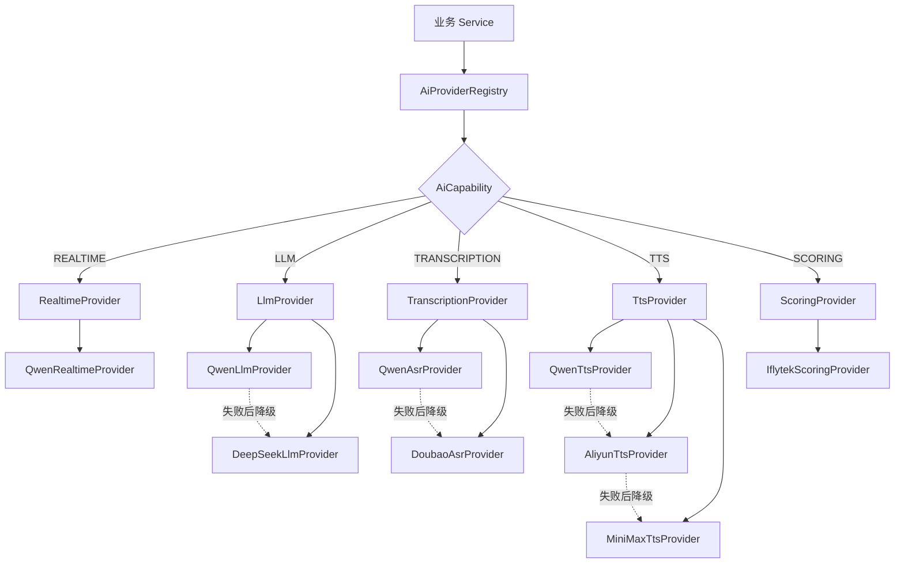

# UniSpeaking AI Provider 架构源码导读

> 仓库：`1024XEngineer/UniSpeaking`  
> 分支：`main`  
> 检查时间：2026-07-29 11:33（Asia/Singapore）  
> 最近两小时范围：约 09:33—11:33  
> 重点目录：
>
> - `backend/unispeaking-server/src/main/java/com/unispeaking/provider`
> - `backend/unispeaking-server/src/main/java/com/unispeaking/infrastructure/ai`

---

## 1. 先给结论

这次代码的核心目标，可以概括为一句话：

> **把不同 AI 厂商的调用方式统一包装成 Provider，并由一个 Registry 根据“能力类型 + 模型路由”自动选择厂商，在可恢复故障时继续尝试备用模型。**

两个重点目录的职责不同：

| 目录 | 核心职责 | 可以把它理解成 |
|---|---|---|
| `provider` | 定义统一能力、注册模型、选择厂商、执行故障转移 | AI 能力中台 / 调度中心 |
| `infrastructure/ai` | 对接各厂商真实 API，处理 HTTP、WebSocket、鉴权及响应解析 | 厂商协议适配层 |

因此，业务代码以后不应该直接了解：

- 千问的请求 JSON 怎么写；
- 豆包使用哪些请求头；
- MiniMax 音频为什么是十六进制；
- 讯飞怎样进行 WebSocket 签名；
- 哪个模型是主模型，哪个模型是备用模型。

业务层只需要表达：

- 我要调用 LLM；
- 我要进行 ASR；
- 我要生成 TTS；
- 我要进行发音测评；
- 我要交换 Realtime SDP。

剩下的工作由 `AiProviderRegistry` 和具体 Provider 完成。

---

## 2. 最近两小时修改概览

GitHub 记录显示，在本次检查前两小时内共有 **12 个相关提交**。这些提交的时间都集中在 2026-07-29 11:20 左右，比较像一次批量推送或连续提交。

### 2.1 提交顺序

以下按最新到最早排列：

| Commit | 提交说明 | 主要影响 |
|---|---|---|
| `4239a8b` | 改用 `String answerSdp`，不再依赖已删除的 AI DTO | Realtime Service 接入新的 Provider 接口 |
| `0a43914` | 删除冗余 DTO 契约 | 删除原 AI Request/Response DTO |
| `3e86dde` | 修改测试文件 | 补充 Provider、路由、异常与厂商调用测试 |
| `8a77fed` | 修改配置样例 | 增加模型路由、密钥、超时和大小限制配置 |
| `ffdb60a` | 修改各类大模型冗余代码 | 精简各能力抽象类，移除旧 DTO 方法 |
| `0c5f680` | 完善 `AiProviderRegistry`，设置可插拔式厂商 | 建立注册、路由与故障转移核心 |
| `2941f18` | 完善 `AiProvider` | 定义统一 AI 能力接口 |
| `705a82f` | 完善 `AbstractAiProvider` | 增加通用模型管理、音频转换和错误分类 |
| `f9f6fb7` | 完善多种 AI Provider | 实现多个厂商的真实 API 适配器 |
| `5f18e11` | 完善 `AliyunTtsProvider` | 实现阿里云 CosyVoice TTS |
| `b5c08c9` | `ProviderType` 添加豆包 | Realtime 厂商枚举增加 `DOUBAO` |
| `c53a0d9` | 修改 `AiModelDefinition` | 厂商标识从枚举改为通用字符串，并增加豆包 ASR |

### 2.2 这批修改实际完成了什么

这并不是单纯增加几个模型，而是一次完整的 AI 接入层重构：

1. **统一 AI 能力入口**：Realtime、LLM、ASR、TTS、Scoring 都使用统一 Provider 体系。
2. **移除旧 AI DTO**：接口改为直接传递 `String`、`Byte[]` 等基础数据。
3. **增加配置化路由**：主模型和备用模型可以通过环境变量修改。
4. **增加自动降级**：主厂商出现网络、凭证或服务异常时，可以尝试备用模型。
5. **完成多个真实厂商适配器**：千问、DeepSeek、豆包、阿里云、MiniMax、讯飞。
6. **增加安全保护**：限制可信域名、响应大小、音频大小、文本长度和超时时间。
7. **补充测试与配置样例**：测试路由、降级、端点校验和请求格式。

### 2.3 主要文件改动规模

本批提交共影响三十多个文件，最集中的改动包括：

- `AiProviderRegistry.java`：路由中心大幅扩展；
- `AiProvider.java`、`AbstractAiProvider.java`：重新定义统一契约；
- 8 个以上的厂商 Provider：从占位实现变成真实调用；
- 新增 `QwenAsrProvider`、`QwenTtsProvider`、`DoubaoAsrProvider`；
- 删除 10 个旧 AI Request/Response DTO；
- 大幅扩展 Provider 单元测试与 `.env.example`。

---

## 3. 整体架构

### 3.1 最重要的调用关系

```text
Controller / Application Service
                │
                │ 表达需要哪种 AI 能力
                ▼
        AiProviderRegistry
                │
                ├── 根据 capability 找到模型路由
                ├── 根据 modelId 找到 Provider
                ├── 记录最终使用的模型与厂商
                └── 可恢复异常时尝试下一个模型
                │
                ▼
    LlmProvider / TtsProvider / ...
                │
                ▼
  infrastructure.ai 下的具体实现
                │
       ┌────────┼────────┐
       ▼        ▼        ▼
     Qwen    DeepSeek  Doubao ...
                │
                ▼
           第三方 AI API
```

### 3.2 Mermaid 版本



---

## 4. `provider` 目录源码导读

目录：

```text
backend/unispeaking-server/src/main/java/com/unispeaking/provider
```

它是整个系统最值得先读的部分，因为它决定：

- Provider 的统一形式；
- 模型如何注册；
- 厂商如何替换；
- 模型如何降级；
- 哪些错误应该继续尝试备用厂商。

### 4.1 `AiProvider.java`

#### 一句话职责

所有 AI 厂商适配器共同遵守的顶层接口。

#### 它定义了什么

每个 Provider 必须声明：

```java
String providerId();
AiCapability capability();
Set<String> supportedModels();
```

同时统一定义五类操作：

```java
exchangeRealtimeSdp(...)
generateSpeechAudio(...)
executeLlmTask(...)
convertAudioToText(...)
evaluatePronunciation(...)
```

#### 设计特点

这些能力使用 `default` 方法，默认抛出“不支持该能力”的异常。

因此，一个 DeepSeek LLM Provider 只需要实现 `executeLlmTask()`，不需要假装实现 TTS、ASR 或 Realtime。

#### 概念理解

`AiProvider` 不是某个厂商的 SDK，而是 UniSpeaking 自己定义的“统一 AI 插座”。不同厂商只需要做不同的“插头”。

---

### 4.2 `AbstractAiProvider.java`

#### 一句话职责

为所有具体 Provider 提供共同的基础行为。

#### 主要负责

1. 规范化 `providerId`；
2. 规范化模型 ID；
3. 保存不可变的 `supportedModels`；
4. 判断当前 Provider 是否支持某个模型；
5. 在 `Byte[]` 和 `byte[]` 之间转换音频；
6. 区分“可降级异常”和“不可降级异常”。

#### 最重要的错误分类

```text
retryableFailure
    表示厂商、网络、凭证或配置出现问题
    Registry 可以继续尝试备用模型

nonRetryableFailure
    表示用户请求本身有问题，或者线程已经中断
    Registry 不应该重复调用其他厂商
```

例如：

| 异常场景 | 是否应该降级 |
|---|---:|
| 千问服务暂时不可用 | 是 |
| 千问 API Key 未配置 | 是 |
| DeepSeek 返回 500 | 是 |
| Prompt 为空 | 否 |
| 音频格式错误 | 否 |
| TTS 文本超长 | 否 |
| 调用线程被中断 | 否 |

这个分类很重要，因为不加区分的故障转移可能造成：

- 无效请求被重复发送；
- 多家厂商重复计费；
- 请求中断后仍继续执行；
- 相同错误被掩盖。

---

### 4.3 五个能力抽象类

包括：

```text
RealtimeProvider
LlmProvider
TranscriptionProvider
TtsProvider
ScoringProvider
```

这些类本身非常薄，主要作用是固定 `AiCapability`。

| 抽象类 | 固定能力 | 典型输入 | 典型输出 |
|---|---|---|---|
| `RealtimeProvider` | `REALTIME` | Offer SDP、临时 Token | Answer SDP |
| `LlmProvider` | `LLM` | Prompt | 文本内容 |
| `TranscriptionProvider` | `TRANSCRIPTION` | 音频字节 | 转写文本 |
| `TtsProvider` | `TTS` | 文本 | 音频字节 |
| `ScoringProvider` | `SCORING` | 参考文本、音频 | 测评结果 JSON |

其中 `RealtimeProvider` 比较特殊：

- 它仍保留 `ProviderType` 枚举；
- 提供 `type()`；
- 支持指定 `modelId` 的 SDP 交换。

这说明当前架构处于过渡期：大部分能力已经使用通用字符串 `providerId`，Realtime 链路为了兼容旧业务仍使用 `ProviderType`。

---

### 4.4 `AiProviderRegistry.java`

#### 一句话职责

整个 AI Provider 体系的注册中心、模型目录、路由器和故障转移执行器。

这是本轮修改中最核心的文件。

#### Spring 启动时发生什么

Spring 会把所有相应类型的 Bean 注入 Registry：

```java
List<RealtimeProvider>
List<LlmProvider>
List<ScoringProvider>
List<TtsProvider>
List<TranscriptionProvider>
```

Registry 随后完成：

```text
Provider Bean
   ↓
读取 supportedModels
   ↓
modelId → Provider 映射
   ↓
读取环境变量中的模型顺序
   ↓
生成每种能力的模型路由
```

#### 当前默认路由

| 能力 | 默认调用顺序 |
|---|---|
| Realtime | `qwen3.5-omni-flash-realtime` |
| LLM | `qwen3.5-plus` → `deepseek-v4-flash` |
| ASR | `qwen3-asr-flash` → `volc.bigasr.auc_turbo` |
| TTS | `qwen3-tts-flash` → `cosyvoice-v3-flash` → `speech-2.8-hd` |
| Scoring | `iflytek-open-ise` |

#### 环境变量覆盖

```env
AI_PROVIDER_ROUTE_REALTIME=...
AI_PROVIDER_ROUTE_LLM=...
AI_PROVIDER_ROUTE_TRANSCRIPTION=...
AI_PROVIDER_ROUTE_TTS=...
AI_PROVIDER_ROUTE_SCORING=...
```

例如：

```env
AI_PROVIDER_ROUTE_LLM=qwen3.5-plus,deepseek-v4-flash
```

含义是：

1. 先调用千问；
2. 千问出现可降级故障时调用 DeepSeek；
3. 如果请求本身非法，则不调用 DeepSeek。

#### Registry 的核心数据

```text
models
    对外可见的模型目录

modelDefinitions
    modelId → AiModelDefinition

modelRoutes
    capability → 有顺序的 modelId 列表

realtimeProviders
llmProviders
ttsProviders
scoringProviders
transcriptionProviders
    每种能力下的 modelId → Provider 映射
```

#### `RoutedResult<T>`

Registry 增加了一个内部结果结构：

```java
RoutedResult<T>(
    String modelId,
    String providerId,
    AiCapability capability,
    T response
)
```

它的价值是：业务最终仍然可以只拿到响应，但系统内部能够记录：

- 实际调用的模型；
- 实际调用的厂商；
- 本次调用属于哪种能力；
- 最终返回内容。

这对未来的以下功能很有用：

- 使用量统计；
- 厂商成本核算；
- 请求审计；
- 故障分析；
- 模型效果对比；
- 按用户计费。

#### 故障转移流程

```text
读取模型路由
   ↓
调用第一个模型
   ↓
成功 ───────────────→ 返回结果
   │
   └─ 失败
       ↓
判断异常是否允许降级
       │
       ├─ 不允许 → 直接抛出
       │
       └─ 允许
           ↓
       尝试下一个模型
           ↓
       所有模型失败 → 抛出最后一个异常
```

#### Registry 在启动时会阻止的错误

- 一个模型被多个 Provider 重复注册；
- Provider 声明的 capability 与所在列表不一致；
- 配置的路由引用了不存在的模型；
- 通过 LLM 接口调用 Realtime 模型；
- 指定的 Realtime 厂商与模型实际所属厂商不一致。

这些检查尽量把问题提前暴露在启动或调用入口，而不是等到调用第三方 API 后才失败。

---

## 5. `infrastructure/ai` 目录源码导读

目录：

```text
backend/unispeaking-server/src/main/java/com/unispeaking/infrastructure/ai
```

这里的代码可以理解为“厂商协议翻译器”。

它们通常完成相似的六个步骤：

1. 从环境变量读取 API Key、模型、Endpoint 和超时；
2. 验证业务输入；
3. 将统一输入转换成厂商请求格式；
4. 调用厂商 HTTP 或 WebSocket API；
5. 校验并解析厂商响应；
6. 将异常转换成统一的 `BusinessException`。

### 5.1 Provider 总览

| Provider | 能力 | 厂商/模型 | 通信方式 | 凭证来源 | 返回值 |
|---|---|---|---|---|---|
| `QwenRealtimeProvider` | Realtime | Qwen Omni Realtime | HTTP SDP 交换 | 临时 Bearer Token | Answer SDP |
| `QwenLlmProvider` | LLM | Qwen 3.5 Plus | HTTP JSON | 服务端 DashScope Key | 文本内容 |
| `DeepSeekLlmProvider` | LLM | DeepSeek | HTTP JSON | 服务端 DeepSeek Key | 文本内容 |
| `QwenAsrProvider` | ASR | Qwen ASR | HTTP JSON + Base64 | 服务端 DashScope Key | 转写文本 |
| `DoubaoAsrProvider` | ASR | 豆包 BigASR | HTTP JSON + Base64 | X-Api-Key 或旧双 Key | 转写文本 |
| `QwenTtsProvider` | TTS | Qwen TTS | HTTP + 下载音频 | 服务端 DashScope Key | WAV 字节 |
| `AliyunTtsProvider` | TTS | CosyVoice | HTTP + 下载音频 | 服务端 DashScope Key | 音频字节 |
| `MiniMaxTtsProvider` | TTS | Speech 2.8 | HTTP JSON | 服务端 MiniMax Key | 解码后的音频字节 |
| `IflytekScoringProvider` | Scoring | 讯飞 ISE | WebSocket | AppId/API Key/Secret | 最终原始 JSON |

---

### 5.2 `QwenRealtimeProvider`

#### 作用

完成浏览器或客户端 Offer SDP 与千问 Realtime Answer SDP 的交换。

#### 调用流程

```text
Offer SDP
   ↓
验证 SDP、模型、临时 Token
   ↓
构造百炼 WebRTC SDP Endpoint
   ↓
POST application/sdp
Authorization: Bearer <temporary-token>
   ↓
获得 Answer SDP
   ↓
原样返回给客户端
```

#### 特点

- 支持 Flash 和 Plus 两个 Realtime 模型；
- Realtime 使用短时效临时凭证，而不是直接使用长期主 Key；
- 限制 Answer SDP 最大大小；
- 日志会对 Token 进行掩码；
- Offer SDP 非法时不会切换厂商；
- 网络和厂商信令错误允许降级。

#### 与业务层的连接

`RealtimeConnectionServiceImpl` 现在通过：

```java
providerRegistry.routeRealtime(...)
```

来选择模型和 Provider，然后从 `RealtimeCredentialService` 获取该厂商凭证，再调用 SDP 交换。

---

### 5.3 `QwenLlmProvider`

#### 作用

使用百炼兼容模式调用千问文本模型。

#### 请求特点

- 使用服务端 `DASHSCOPE_API_KEY`；
- Endpoint 根据 workspace 和 region 构造；
- 请求体类似 OpenAI Chat Completions；
- 当前关闭 thinking；
- 不使用传入的 `token` 参数。

#### 返回处理

只取：

```text
choices[0].message.content
```

业务层看不到千问完整响应结构。

#### 安全处理

- 只允许 HTTPS；
- Host 必须是可信的阿里云 MaaS 域名；
- Path 必须完全匹配兼容模式接口；
- 限制响应大小；
- 非法 Endpoint 会在发送密钥前被拒绝。

---

### 5.4 `DeepSeekLlmProvider`

#### 作用

作为 LLM 路由中的备用厂商。

#### 默认路由

```text
Qwen LLM
   ↓ 可恢复故障
DeepSeek LLM
```

#### 调用特点

- Endpoint 严格限制为 DeepSeek 官方 Chat Completions 地址；
- 使用 `DEEPSEEK_API_KEY`；
- 关闭 thinking；
- 关闭流式响应；
- 同样只返回 `choices[0].message.content`；
- 网络、服务端状态码、空响应和 JSON 异常都可触发降级判断。

Qwen 与 DeepSeek Provider 的外部协议不同，但对 Registry 来说，它们都是：

```java
String executeLlmTask(String prompt, String token)
```

这正是 Provider 抽象的价值。

---

### 5.5 `QwenAsrProvider`

#### 作用

将音频转成文本，作为 ASR 主模型。

#### 调用流程

```text
Byte[] 音频
   ↓
转换为 byte[]
   ↓
Base64 Data URL
   ↓
组装 input_audio 消息
   ↓
调用百炼兼容接口
   ↓
提取 choices[0].message.content
```

#### 特点

- 默认模型 `qwen3-asr-flash`；
- 开启 ITN，即数字、日期等文本规范化；
- 限制音频大小和响应大小；
- 校验可信阿里云 Endpoint；
- 当前统一接口入口把传入音频标记成 WAV。

#### 一个值得注意的点

文件内部支持多种媒体类型映射，但公开 Provider 接口只有 `Byte[]`，没有音频格式字段，而且当前入口固定使用 `wav`。

因此目前实际业务链路更接近：

> **只支持 WAV 输入，其他格式映射代码暂时没有被统一接口真正使用。**

---

### 5.6 `DoubaoAsrProvider`

#### 作用

作为 Qwen ASR 的备用方案。

#### 鉴权方式

支持两种方式：

```text
新方式：DOUBAO_ASR_API_KEY

旧方式：
DOUBAO_ASR_APP_KEY
DOUBAO_ASR_ACCESS_KEY
```

#### 请求特点

- 音频 Base64 放入 JSON；
- 请求头携带 Resource ID；
- 每次生成 Request ID；
- 检查 HTTP 状态；
- 还会检查 `X-Api-Status-Code` 是否为成功码；
- 最终提取 `result.text`。

#### 默认降级关系

```text
Qwen ASR
   ↓ 可恢复故障
Doubao BigASR
```

---

### 5.7 `QwenTtsProvider`

#### 作用

使用 Qwen TTS 生成语音，是 TTS 路由的第一选择。

#### 两阶段调用

```text
文本
   ↓
调用 TTS 生成接口
   ↓
响应中获得音频 URL
   ↓
校验 URL 是否可信
   ↓
下载音频
   ↓
校验 RIFF/WAVE 文件头
   ↓
返回音频字节
```

#### 特点

- 默认声音 `Cherry`；
- 默认语言 `English`；
- 文本最多 5000 字符；
- 只信任阿里云域名；
- 如果厂商返回 HTTP URL，会升级成 HTTPS；
- 分别限制 JSON 响应和音频大小；
- 最终要求下载结果确实是 WAV。

---

### 5.8 `AliyunTtsProvider`

#### 作用

通过阿里云 CosyVoice 完成 TTS，是第一备用 TTS。

#### 默认配置

```text
model: cosyvoice-v3-flash
voice: loongemily_v3
format: wav
sample rate: 24000
```

#### 流程

与 Qwen TTS 类似，也是：

```text
发起合成请求 → 获得音频 URL → 下载音频
```

#### 与 Qwen TTS 的区别

- 使用百炼 Workspace 下的 SpeechSynthesizer 接口；
- 支持 `mp3`、`wav`、`pcm`、`opus`；
- 会检查下载结果是否为空；
- 当前没有像 `QwenTtsProvider` 那样强制检查 RIFF/WAVE 文件头。

---

### 5.9 `MiniMaxTtsProvider`

#### 作用

作为 TTS 路由的第二备用模型。

#### 调用特点

MiniMax 返回的不是下载 URL，而是 JSON 中的十六进制音频：

```text
文本
   ↓
请求 output_format = hex
   ↓
读取 data.audio
   ↓
HexFormat.parseHex
   ↓
得到音频字节
```

#### 主要校验

- 供应商状态码必须为 0；
- 音频十六进制必须合法；
- 音频不能为空；
- 音频不能超过配置上限；
- Endpoint 必须属于可信 MiniMax 域名；
- 文本长度必须小于 10000 字符。

---

### 5.10 `IflytekScoringProvider`

#### 作用

通过讯飞 ISE WebSocket API 完成英语发音测评。

这是当前实现中协议最复杂的 Provider。

#### 整体流程

```text
参考文本 + WAV 音频
        ↓
验证参考文本长度
        ↓
解析 WAV 文件结构
        ↓
确认 PCM / 16kHz / 16-bit / 单声道
        ↓
提取 WAV 中的 PCM data chunk
        ↓
HMAC-SHA256 生成 WebSocket 签名 URL
        ↓
发送开始帧
        ↓
按 1280 字节拆分并间隔约 40ms 发送音频帧
        ↓
发送结束帧
        ↓
等待 data.status = 2
        ↓
返回最终原始 JSON
```

#### 为什么要按帧发送

讯飞 ISE 不是一次性 HTTP 上传，而是模拟实时音频流。代码通过固定大小和固定间隔发送 PCM 数据。

#### 输入要求

- 必须是合法 WAV；
- 必须为 PCM；
- 16 kHz；
- 16-bit；
- 单声道；
- PCM 最长约五分钟；
- 参考文本和音频均有大小限制。

#### 返回处理

当前 Provider 不直接把讯飞结果解析成 UniSpeaking 自己的评分对象，而是返回最终原始 JSON。

优点是不会丢失厂商字段；缺点是业务层后续仍需要统一评分结果结构。

---

## 6. 各能力的实际调用链

### 6.1 LLM

```text
业务 Service
   ↓
registry.executeLlmTask(prompt, token)
   ↓
读取 LLM route
   ↓
QwenLlmProvider
   ↓ 发生可恢复错误
DeepSeekLlmProvider
   ↓
返回文本
```

### 6.2 ASR

```text
业务 Service
   ↓
registry.convertAudioToText(audio, token)
   ↓
QwenAsrProvider
   ↓ 发生可恢复错误
DoubaoAsrProvider
   ↓
返回转写文本
```

### 6.3 TTS

```text
业务 Service
   ↓
registry.generateSpeechAudio(text, token)
   ↓
QwenTtsProvider
   ↓ 失败
AliyunTtsProvider
   ↓ 失败
MiniMaxTtsProvider
   ↓
返回音频
```

### 6.4 发音测评

```text
业务 Service
   ↓
registry.evaluatePronunciation(text, audio, token)
   ↓
IflytekScoringProvider
   ↓
WebSocket 分帧上传
   ↓
返回最终测评 JSON
```

当前只配置讯飞一个测评 Provider，所以暂时没有实际备用厂商，但 Registry 已支持以后通过配置切换。

### 6.5 Realtime

```text
客户端 Offer SDP
   ↓
RealtimeConnectionServiceImpl
   ↓
AiProviderRegistry.routeRealtime
   ↓
RealtimeCredentialService 获取临时凭证
   ↓
QwenRealtimeProvider.exchangeRealtimeSdp
   ↓
Qwen Answer SDP
   ↓
返回客户端，建立媒体连接
```

---

## 7. 这套设计使用了哪些架构思想

### 7.1 Adapter：厂商适配器

每个 `infrastructure.ai` Provider 把不同厂商协议转换为统一接口。

例如：

```text
DeepSeek JSON
Qwen JSON
Doubao Headers
MiniMax Hex Audio
Iflytek WebSocket
```

在上层都被转换为统一方法。

### 7.2 Strategy：策略模式

LLM、ASR、TTS 等能力可以有多个可替换实现。

调用方不直接写：

```java
if (provider == QWEN) { ... }
else if (provider == DEEPSEEK) { ... }
```

而是通过模型路由选择策略。

### 7.3 Registry / Factory：注册与查找

Spring 自动发现 Provider，Registry 根据 `modelId` 查找具体实现。

### 7.4 Configurable Routing：配置化路由

更换主模型不需要修改业务代码，只需修改环境变量中的顺序。

### 7.5 Failover：自动故障转移

厂商故障时自动尝试下一个模型，但请求错误不会无意义地重复执行。

---

## 8. 当前设计做得比较好的地方

### 8.1 业务层与厂商协议解耦

业务 Service 不需要知道第三方 API 的字段和鉴权规则。

### 8.2 模型目录来自真实 Provider

模型不是只写在一份静态枚举里，而是根据实际注册的 Provider 生成，降低“目录有模型但实现不存在”的风险。

### 8.3 路由顺序可配置

主厂商和备用厂商可以在部署环境中修改。

### 8.4 明确区分可恢复与不可恢复错误

避免请求非法时重复调用多个厂商。

### 8.5 安全边界考虑较充分

多个适配器都实现了：

- Endpoint 白名单；
- 强制 HTTPS/WSS；
- 禁止用户信息、异常端口和非预期 Path；
- 响应大小限制；
- 音频大小限制；
- 超时限制；
- 服务端长期密钥不返回客户端。

### 8.6 为计费与审计留下接口

`RoutedResult` 能记录最终选中的模型和厂商，对后续用量统计很关键。

---

## 9. 当前值得注意的问题与后续优化点

下面不是说现有实现不可用，而是从后续维护角度值得关注。

### 9.1 `providerId` 与 `ProviderType` 同时存在

目前大多数能力已经改成字符串 `providerId`，但 Realtime 仍使用 `ProviderType` 枚举。

这会形成两套厂商标识：

```text
普通能力："qwen"
Realtime：ProviderType.QWEN
```

后续可以考虑统一，或者明确 `ProviderType` 只属于 Realtime 业务协议，而不是通用 AI 架构。

### 9.2 删除 DTO 后接口语义变弱

原来的 Request/Response DTO 被删掉后，接口更简单：

```java
String
Byte[]
```

优点：调用方便、Provider 依赖更少。

代价：

- 丢失 `userId`、`sessionId` 等调用上下文；
- 无法在类型中表达音频格式；
- 不同 TTS 的音频格式只能靠约定；
- 后续增加语言、音色、采样率时可能继续扩展参数列表。

更长期的方案可以是保留“厂商无关的领域请求对象”，而不是恢复厂商 DTO。

### 9.3 使用 `Byte[]` 有额外开销

音频在 Java 中通常使用 `byte[]`。`Byte[]` 会为每个字节进行装箱，内存和转换成本更高。

目前 `AbstractAiProvider` 中需要反复：

```text
Byte[] → byte[]
byte[] → Byte[]
```

后续建议统一使用 `byte[]`，除非某个序列化边界明确需要 `Byte[]`。

### 9.4 各厂商存在较多重复工具代码

多个 Provider 都重复实现了：

- `LimitedBodySubscriber`；
- `positiveDuration()`；
- `requiredText()`；
- `businessCause()`；
- HTTP 成功状态判断；
- Endpoint 解析；
- 最大响应读取逻辑。

可以提取为通用基础组件，例如：

```text
AiHttpClientSupport
LimitedBodyHandlers
ProviderValidationUtils
TrustedEndpointPolicy
```

这样会明显降低每个 Provider 的代码量和维护成本。

### 9.5 Qwen ASR 接口没有携带音频格式

内部虽然支持多个格式映射，但公开方法只有：

```java
convertAudioToText(Byte[] audio, String token)
```

当前实现固定把输入当作 WAV。

若以后要支持 MP3、M4A、Opus，应在统一领域参数中显式包含格式，而不是靠 Provider 猜测。

### 9.6 TTS 统一接口注释与实现并不完全一致

`AiProvider` 注释倾向于把 TTS 输出描述为 WAV，但：

- Aliyun Provider 支持多种格式；
- MiniMax Provider 也支持多种格式；
- Provider 的返回值只有字节，没有 format/contentType。

后续可考虑统一返回：

```java
record SpeechAudio(
    byte[] data,
    String format,
    String contentType,
    int sampleRate
) {}
```

### 9.7 Realtime 的 `aiCallId` 目前返回 `null`

最新 `RealtimeConnectionServiceImpl` 使用 `String answerSdp` 后，构造 `RealtimeConnectionResult` 时 `aiCallId` 为 `null`。

如果后续需要：

- 厂商请求追踪；
- 会话账单归属；
- Request ID 对账；
- 故障日志关联；

需要重新设计一个不依赖旧 DTO 的调用标识返回机制。

### 9.8 Realtime 方法中的 `SessionPrompt` 当前未参与 Provider 调用

`connect(...)` 接收了 `SessionPrompt prompt`，但当前展示的连接逻辑只完成 SDP 和凭证交换。

需要确认 Prompt 是否会在 DataChannel 建立后另外发送；如果没有，可能还缺少 Realtime Session 配置步骤。

### 9.9 部分辅助方法可能已经无实际用途

Qwen/DeepSeek LLM Provider 中存在解析模型内容的辅助方法，但当前主流程直接返回字符串。后续可以清理无用代码，避免让阅读者误以为还有另一条返回路径。

### 9.10 故障分类仍部分依赖错误码命名

Provider 主动使用 `retryableFailure` / `nonRetryableFailure` 时分类很明确。

但普通 `BusinessException` 仍会根据：

```text
INVALID_
UNSUPPORTED_
_INTERRUPTED
```

等错误码规则判断。

这种方式依赖命名规范。长期可以让所有 Provider 异常都携带结构化的 `retryable` 字段。

---

## 10. 新成员推荐阅读顺序

### 第一阶段：10 分钟建立概念

按以下顺序阅读：

```text
1. AiProvider.java
2. AbstractAiProvider.java
3. LlmProvider.java
4. TtsProvider.java
5. TranscriptionProvider.java
6. ScoringProvider.java
7. RealtimeProvider.java
```

目标：知道统一接口长什么样，以及每种能力对应哪个抽象类。

### 第二阶段：20—30 分钟理解调度

重点阅读：

```text
AiProviderRegistry.java
```

优先关注：

```text
构造函数
registerProviders
buildModelRoutes
defaultRoute
invokeRouteWithResult
invokeModels
shouldFailOver
requiredProvider
```

目标：理解 Provider 如何注册、模型如何选择、失败后如何切换。

### 第三阶段：30 分钟理解典型厂商

建议先读最简单且具有代表性的三个：

```text
QwenRealtimeProvider
QwenLlmProvider
DoubaoAsrProvider
```

目标：理解 HTTP 请求、鉴权、响应解析和异常映射。

### 第四阶段：理解复杂音频链路

```text
QwenTtsProvider
AliyunTtsProvider
MiniMaxTtsProvider
IflytekScoringProvider
```

其中 `IflytekScoringProvider` 最复杂，建议最后读。

### 第五阶段：通过测试确认设计意图

```text
AiProviderRegistryTest
QwenRealtimeProviderTest
SessionRealtimeConnectionTest
```

测试比逐行读工具方法更容易看出作者真正想保证的行为。

---

## 11. 以后新增一个 Provider 应该怎么做

以新增一个新的 LLM 厂商为例：

### 第一步：继承能力抽象类

```java
@Component
public class NewVendorLlmProvider extends LlmProvider {

    public NewVendorLlmProvider(...) {
        super("new-vendor", Set.of("new-model-id"));
    }

    @Override
    public String executeLlmTask(String prompt, String token) {
        // 调用新厂商
    }
}
```

### 第二步：读取服务端配置

至少包括：

```text
API Key
Endpoint
Model
Connect Timeout
Read Timeout
Max Response Bytes
```

### 第三步：实现输入校验

请求本身错误使用：

```java
nonRetryableFailure(...)
```

### 第四步：实现厂商异常映射

网络、凭证、厂商服务异常使用：

```java
retryableFailure(...)
```

### 第五步：配置路由

```env
AI_PROVIDER_ROUTE_LLM=qwen3.5-plus,new-model-id,deepseek-v4-flash
```

### 第六步：补充测试

至少覆盖：

- 模型能被 Registry 注册；
- 请求 JSON 正确；
- 密钥不会出现在请求体；
- Endpoint 不可信时拒绝发送；
- 响应过大时终止读取；
- 厂商失败时能切到下一个模型；
- 非法请求不会触发降级。

无需修改业务 Service，也无需在 Registry 中增加一串厂商 `if/else`。

---

## 12. 关键名词

| 名词 | 含义 |
|---|---|
| Provider | 对某一 AI 厂商某类能力的适配器 |
| Capability | AI 能力类型，如 LLM、TTS、ASR |
| Model ID | Registry 查找 Provider 的主要键 |
| Provider ID | 通用厂商标识，如 `qwen`、`deepseek` |
| Route | 某能力按顺序排列的模型列表 |
| Primary | 路由中的第一个模型 |
| Fallback | 主模型失败后尝试的备用模型 |
| Retryable | 可以安全尝试备用模型的错误 |
| Non-retryable | 不应继续调用其他厂商的错误 |
| Adapter | 把厂商协议翻译成统一接口的实现 |
| Registry | 负责注册、查找、路由和降级的中心对象 |

---

## 13. 最终总结

### `provider` 负责什么

```text
定义统一 AI 接口
注册所有厂商实现
建立模型目录
读取模型调用顺序
选择具体 Provider
处理自动故障转移
记录实际模型与厂商
```

### `infrastructure/ai` 负责什么

```text
读取厂商配置和密钥
校验输入
组装厂商请求
执行 HTTP / WebSocket 调用
解析厂商响应
限制响应和音频大小
把厂商错误转为统一业务错误
```

### 最值得记住的一句话

> **业务层只表达“我要什么 AI 能力”，`AiProviderRegistry` 决定“用哪个模型”，`infrastructure.ai` 决定“具体怎样调用厂商”。**

这轮重构已经把 UniSpeaking 的 AI 接入从“业务代码直接依赖厂商”推进到了“可插拔、可配置、可降级的 Provider 架构”。后续最值得继续完善的是统一调用上下文、音频领域对象、Request ID/计费链路，以及提取各厂商之间重复的 HTTP 工具代码。
