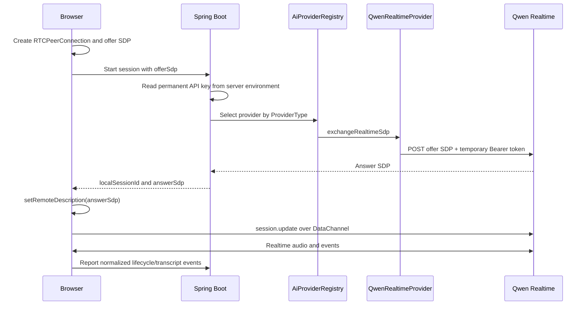

# Realtime sequence

The permanent DashScope API key stays on the Spring server. The backend first
issues a short-lived Bearer token and then passes that token to `QwenRealtimeProvider`
for the SDP exchange.
