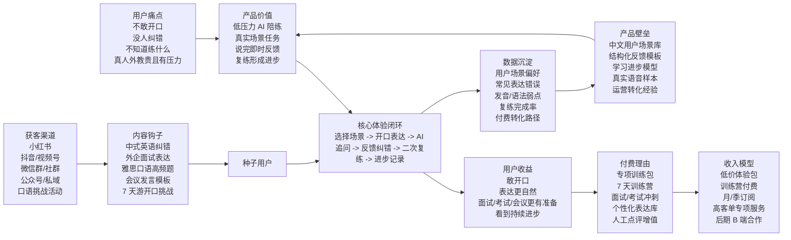
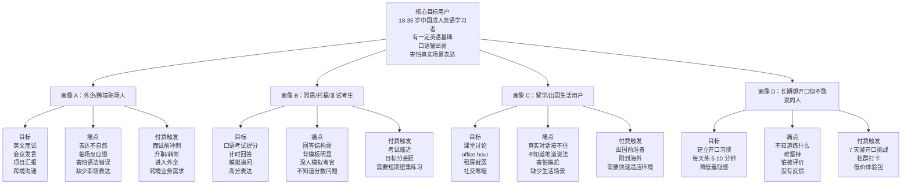
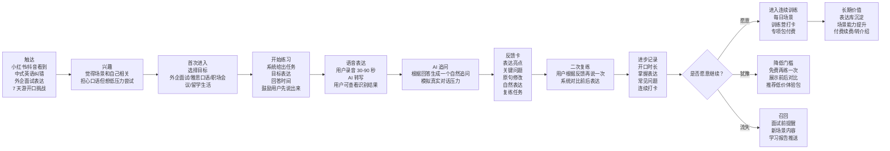
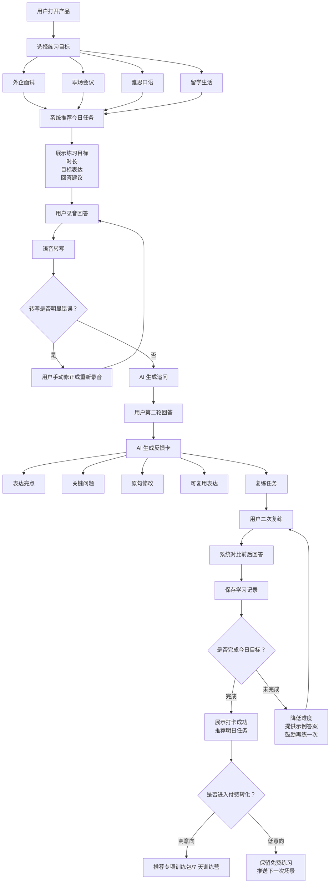
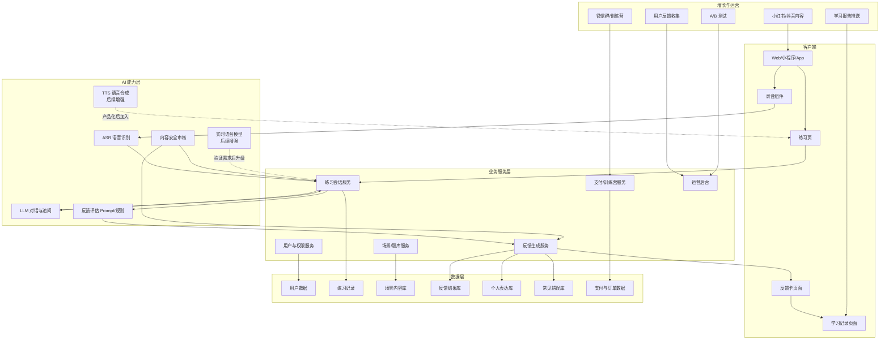
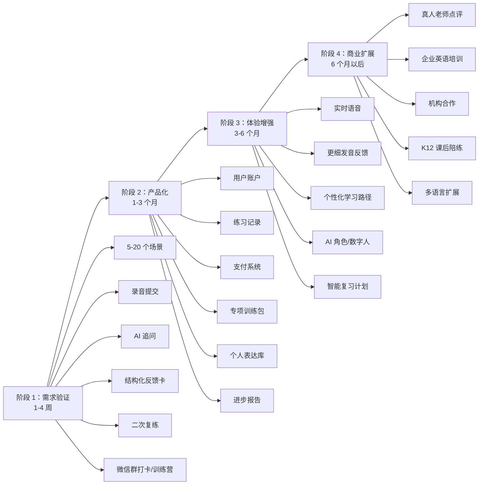

# AI 英语口语陪练产品图谱

日期：2026-07-07  
用途：用于产品汇报、需求讨论、MVP 规划和团队沟通。  
说明：以下图表使用 Mermaid 编写，可在支持 Mermaid 的 Markdown 工具中渲染。

---

## 1. 商业逻辑总览图

**核心逻辑：** 先用真实场景和反馈闭环解决“敢说和会改”，再通过训练营、专项包和订阅承接付费，而不是一开始卖“无限 AI 聊天”。

---

## 2. 用户画像图

**优先级建议：** 早期主攻“外企/跨境职场人”和“考试/复试考生”，因为目标更明确、付费理由更强、内容传播更容易。

---

## 3. 用户旅程图

**关键时刻：** 第一次反馈卡必须足够具体。用户是否觉得“它真的听懂我、能帮我改”，基本决定后续留存和付费。

---

## 4. 产品功能架构图

```mermaid
flowchart TB
    P["AI 英语口语陪练产品"]

    P --> A["场景训练层"]
    A --> A1["外企面试"]
    A --> A2["职场会议"]
    A --> A3["雅思/托福口语"]
    A --> A4["留学生活"]
    A --> A5["旅行生活"]

    P --> B["练习交互层"]
    B --> B1["语音录入"]
    B --> B2["语音转写"]
    B --> B3["AI 追问"]
    B --> B4["二次复练"]
    B --> B5["对话轮次控制"]

    P --> C["反馈评估层"]
    C --> C1["表达亮点"]
    C --> C2["语法/词汇修改"]
    C --> C3["自然表达替换"]
    C --> C4["回答结构建议"]
    C --> C5["发音清晰度提示"]
    C --> C6["复练任务生成"]

    P --> D["学习成长层"]
    D --> D1["练习记录"]
    D --> D2["连续打卡"]
    D --> D3["个人表达库"]
    D --> D4["常见错误库"]
    D --> D5["进步报告"]

    P --> E["商业转化层"]
    E --> E1["免费体验"]
    E --> E2["专项训练包"]
    E --> E3["7 天训练营"]
    E --> E4["订阅会员"]
    E --> E5["人工点评增值"]

    P --> F["运营与安全层"]
    F --> F1["内容审核"]
    F --> F2["隐私说明"]
    F --> F3["敏感话题边界"]
    F --> F4["社群打卡"]
    F --> F5["用户反馈收集"]
```

**MVP 必做：** 场景训练、语音录入、AI 追问、反馈卡、二次复练、练习记录。  
**后续扩展：** 实时语音、发音评分、数字人、真人点评、企业/机构版本。

---

## 5. 核心用户流程图

**流程重点：** 用户不是进入空白聊天框，而是从明确任务开始；每次练习必须以“复练”和“进步记录”结束。

---

## 6. 技术架构图

**早期技术路线：** 先用“录音提交 -> ASR -> LLM 追问/反馈 -> 反馈卡”的请求式架构验证需求。实时语音、TTS、数字人等放到第二阶段，避免过早增加复杂度和成本。

---

## 7. MVP 与扩展优先级图

**优先级原则：** 先验证用户是否愿意开口、复练和付费，再投入高成本技术能力。
